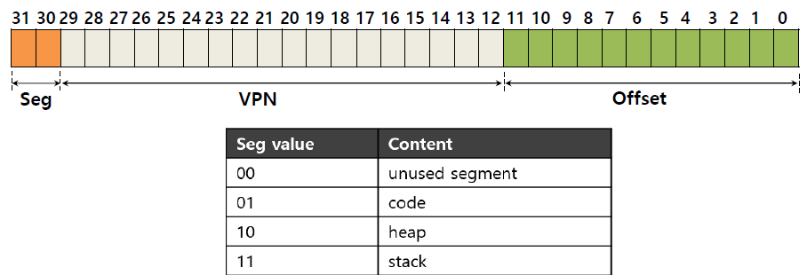
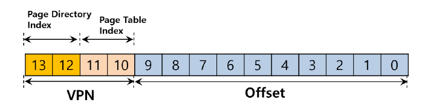

# 使页表变小

问题：

* 页表太大了
* 大量的页表项是无效的


## 1.方案1：采用更大的页

使页的大小变大，这样页表项就更少了，页表的总大小也就会随之变小


## 2.方案2：段页式地址转换

为每个段分配一个页表

例：4GB地址空间，4KB的页面大小

```c
SN = (VirtualAddress & SEG_MASK) >> SN_SHIFT
VPN = (VirtualAddress & VPN_MASK) >> VPN_SHIFT
AddressOfPTE = Base[SN] + (VPN * sizeof(PTE))
```



仍存在的问题：

* 分段本质上不够灵活，假定地址空间有使用模式
* 如果有一个大而稀疏的堆，仍然导致页表的浪费
* 人可能导致外部碎片的出现


## 3.方案3：多级页表

* 以树的形式组织页表
* 引入页目录（page directory）
* 每个页目录项（PDE）描述一个二级页表




## 4.其他方案：反向页表

从物理页帧出发，反向记录。所有进程公用


## 5.内核地址空间

* 内核有单独的页表（kernel/memlayout.h声明了内存布局的常量）
* 内核使用“直接映射”，在虚拟地址和物理内存都位于KERNBASE=0X80000000


## 6.进程地址空间

* 每个进程有单独的页表