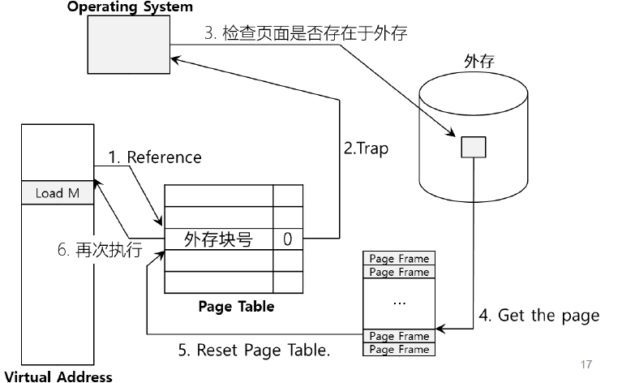

# 超越物理内存

## 1.虚拟内存

* 基本原理：OS的存储是分层级(hierarchy)的，越上层的存储越快，越底层的存储空间越大
* 解决方案：用外存(硬盘)模拟内存，达到扩大内存的效果
* 交换空间：在硬盘上开辟一部分空间用于物理页的移入和移出，交换空间以页为单位进行组织
* 实现机制：页表项新增存在位(present bit)，当页表不存在内存中，则引发页错误，陷入内核..

## 2.策略

### 2.1 页面替换策略

度量指标：平均内存访问时间（AMAT）

**𝐴𝑀𝐴𝑇 = （𝑃~𝐻𝑖𝑡~ ∗ 𝑇~𝑀~） + (𝑃~𝑀𝑖𝑠𝑠~ ∗ 𝑇~𝐷~)**

命中率：$\frac{Hits}{Hits+Misses}$

| 参数    | 含义                                                         |
| ------- | ------------------------------------------------------------ |
| T~M~    | The cost of accessing memory                                 |
| T~D~    | The cost of accessing disk                                   |
| P~Hit~  | The probability of finding the data item in the cache (a hit) |
| P~Miss~ | The probability of not finding the data in the cache (a miss) |

* 最优替换策略（OPT，optimal）：
  * 替换下次访问距当前最远的页
  * 当前留在内存里的页都比它重要
  * 理论上可以达到总体未命中数最少
  * 未来是不确定的，因此只具有参考价值
* 先入先出策略（FIFO）：
  * 进入内存时间最早的页面被淘汰
  * 页面加入时放在队列头部，每次从页面尾部淘汰页面
  * 无法反映页面的重要程度
* 随机选择（random）
* **最近最少使用策略（LRU）**
  * Least Recently Used 
  * 替换上次使用距离最远的页面
* 时钟算法（Clock）
  * 一种基于FIFO+LRU的简化算法
  * 将内存中的所有页面都通过链接指针链接成一个循环队列；当某个页面被访问时，其访问位 置1。淘汰时，检查其访问位，如果是0，就换出；若为1，则重新将它置0；再按FIFO算法检查下一个页面，到队列中的最后一个页面时，若其访问位仍为1，则再返回到队首再去检查第一个页面
  * 轮流淘汰，被访问的页面则推迟一轮淘汰