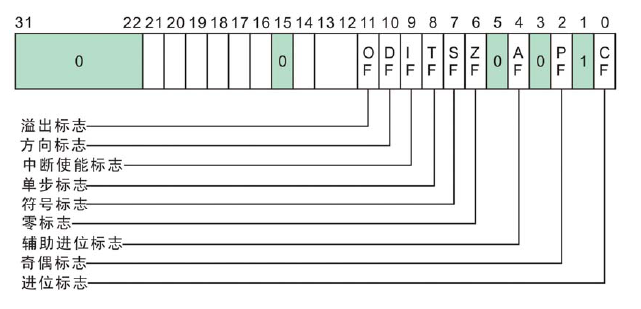

# 32位x86处理器

> 包含了Intel IA-32系列的成员和所有32位AMD处理器

## 1.操作模式

* 保护模式：
  * 处理器的原生状态，提供支持多任务环境的工作方式，建立保护机制
  * 虚拟8086模式，是保护模式的特殊情况
* 实地址模式：
  * 早期Intel处理器的编程环境，当需要直接访问系统内存和硬件设备时很有用
* 系统管理模式;
  * 提供了诸如电源管理和系统安全等功能的机制

## 2.基本程序执行寄存器

> 8个通用寄存器，6个段寄存器，1个处理器状态标志寄存器，1个指令指针寄存器，共16个

### 2.1 32位通用寄存器

> EAX,EBX,ECX,EDX的低16位在使用时可以用AX，BX，CX，DX表示，而且也可以处理8位的值，如AX寄存器高8位称为AH，低8位称为AL

主要用于算术运算和数据传输

* **EAX**：扩展累加器（extended accumulator），乘法指令默认使用，也一般用作函数返回值
* **EBX**：基地址寄存器（base）
* **ECX**：循环操作和字符串计数器（count）
* **EDX**：保存数据和计算结果的临时存储，放整数除法产生的余数
* **EBP**：引用堆栈中的函数参数和局部变量，指向栈底，栈帧指针，堆栈数据指针（extended base pointer）
* **ESP**：用于寻址堆栈数据，指向栈顶，栈顶指针，扩展堆栈指针寄存器（extended stack pointer）
* **ESI**：扩展源变址寄存器（extended source index）(字符串操作源地址指针)
* **EDI**：扩展目的变址寄存器（extended destination index）（字符串操作目的地址指针）

### 2.2 指令指针寄存器

**EIP**寄存器中包含下一跳将要执行指令的地址

### 2.3 EFLAGS寄存器

包含独立的二进制位，用于控制CPU的操作或反映操作的结果

* CF (Carry Flag）：无符号算术运算结果太大（进位）时，设置为1

* PF (Parity Flag）：低8位包含偶数个1时设置1
* AC (Auxiliary Carry Flag）：算数运算再8位操作数中产生了位3向位4的进位时设置为1
* ZF (Zero Flag）：运算结果是否为0
* SF (Sign Flag）：反映运算结果的符号位，它与运算结果的最高位相同，即负数标志为1
* OF (Overflow Flag）：反映有符号数加减运算所得结果是否溢出，如果运算结果超过当前运算位数所能表示的范围，则置为1

### 2.4 16位段寄存器

segment

| CS     | 代码段         |
| ------ | -------------- |
| **DS** | **数据段**     |
| **SS** | **堆栈段**     |
| **ES** | **附加段指针** |
| **FS** | **附加段指针** |
| **GS** | **附加段指针** |

## 3.XMM寄存器

8个128位的XMM寄存器，以XMM0到XMM7表示

主要应用：

* 浮点数运算
* 多媒体处理