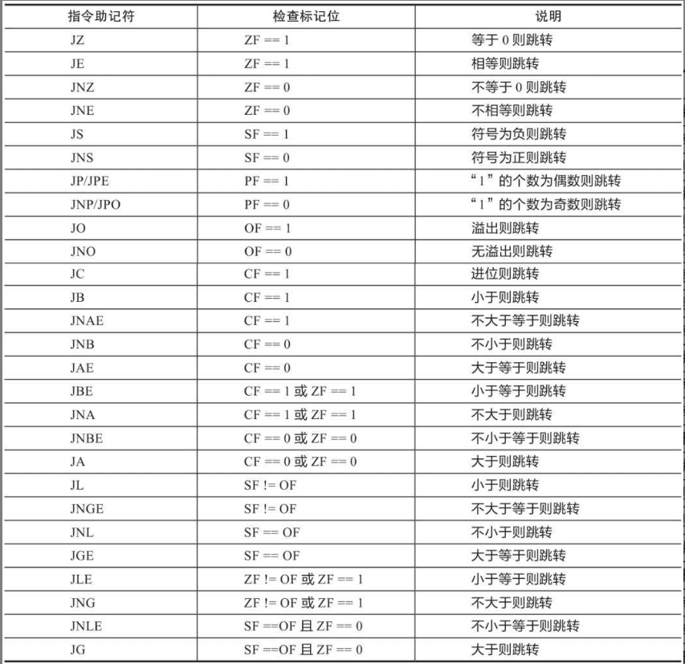

# 条件处理




## 1.条件跳转

执行一个条件语句有两个步骤，首先通过CMP，AND，SUB操作修改CPU状态标志位，再用条件跳转指令来测试标志位，并产生一个新地址的分支


## 2.Jcond指令

```assembly
Jcond destination
```

cond指的是确定一个或多个标志位状态的标志条件

| **jc**  | **如果进位则跳转**   |
| ------- | -------------------- |
| **jnc** | **如果无进位则跳转** |
| **jz**  | **如果为零则跳转**   |
| **jnz** | **如果不为零则跳转** |


## 3.条件跳转指令

### 3.1 基于特定标志位的跳转

| **助记符** | **说明**       | **标志位/寄存器** | **助记符** | **说明**       | **标志位/寄存器** |
| ---------- | -------------- | ----------------- | ---------- | -------------- | ----------------- |
| **JZ**     | **为零跳转**   | **ZF=1**          | **JNO**    | **无溢出跳转** | **OF=0**          |
| **JNZ**    | **非零跳转**   | **ZF=0**          | **JS**     | **有符号跳转** | **SF=1**          |
| **JC**     | **进位跳转**   | **CF=1**          | **JNS**    | **无符号跳转** | **SF=0**          |
| **JNC**    | **无进位跳转** | **CF=0**          | **JP**     | **偶校验跳转** | **PF=1**          |
| **JO**     | **溢出跳转**   | **OF=1**          | **JNP**    | **奇校验跳转** | **PF=0**          |

### 3.2 基于相等性的比较

| 助记符    | 说明                              |
| --------- | --------------------------------- |
| **JE**    | **相等跳转 (leftOp=rightOp)**     |
| **JNE**   | **不相等跳转 (leftOp M rightOp)** |
| **JCXZ**  | **CX=0 跳转**                     |
| **JECXZ** | **ECX=0 跳转**                    |
| **JRCXZ** | **RCX=0 跳转（64 位模式）**       |

### 3.3 无符号数的比较

| 助记符   | 说明                                      | 助记符   | 说明                                      |
| -------- | ----------------------------------------- | -------- | ----------------------------------------- |
| **JA**   | **大于跳转（若 leftOp > rightOp）**       | **JB**   | **小于跳转（若 leftOp < rightOp）**       |
| **JNBE** | **不小于或等于跳转（与 JA 相同）**        | **JNAE** | **不大于或等于跳转（与 JB 相同）**        |
| **JAE**  | **大于或等于跳转（若 leftOp ≥ rightOp）** | **JBE**  | **小于或等于跳转（若 leftOp ≤ rightOp）** |
| **JNB**  | **不小于跳转（与 JAE 相同）**             | **JNA**  | **不大于跳转（与 JBE 相同）**             |

### 3.4有符号数的比较

| 助记符   | 说明                                      | 助记符   | 说明                                      |
| -------- | ----------------------------------------- | -------- | ----------------------------------------- |
| **JG**   | **大于跳转（若 leftOp > rightOp）**       | **JL**   | **小于跳转（若 leftOp < rightOp）**       |
| **JNLE** | **不小于或等于跳转（与 JG 相同）**        | **JNGE** | **不大于或等于跳转（与 JL 相同）**        |
| **JGE**  | **大于或等于跳转（若 leftOp ≥ rightOp）** | **JLE**  | **小于或等于跳转（若 leftOp ≤ rightOp）** |
| **JNL**  | **不小于跳转（与 JGE 相同）**             | **JNG**  | **不大于跳转（与 JLE 相同）**             |


## 4.条件循环指令

```
LOOPZ destination;为0跳转
LOOPR destination;相等跳转
LOOPNZ destination;非0跳转
LOOPNE destination;不等跳转
```

