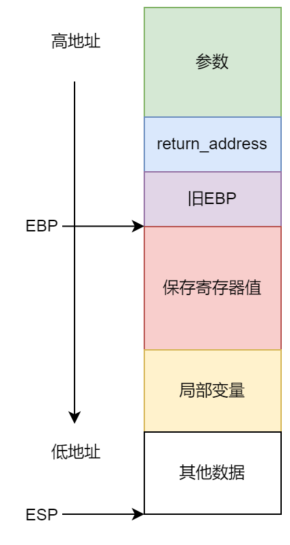

# 堆栈帧


## 1.栈帧

* 定义：栈帧是堆栈中的一个单元，每个函数调用在堆栈上分配一个栈帧，用于存储该函数的局部变量、参数、返回地址和一些额外的状态信息
* 栈帧结构：

  ```assembly
  push args
  call function : push next_eip
  				jmp func
  
  push ebp
  mov ebp esp
  sub esp num
  .
  .
  .
  leave :	mov esp ebp
  		pop ebp
  ret (pop eip)
  ```
* 创建步骤：
  * 被传递的实际参数，如果有则压入堆栈
  * 当子程序被调用时，使该子程序的返回地值压入堆栈
  * 子程序开始执行，EBP被压入堆栈
  * 设置EBP等于ESP
  * 如果有局部变量，修改ESP为这些变量预留空间
  * 如果需要保存寄存器，将他们压入堆栈



## 2.参数入栈的类型及方式

注意：**参数入栈的顺序与定义的顺序是相反的**

```
AddTwo(A,b) //先将B入栈，再将A入栈
```

* 值参数（变量和常量的值）：
  * 该值的副本会被压入堆栈
* 引用参数（变量的地址）：
  * 对象的地址入栈
* 传递数组：
  * 把数组的首地址压入栈


## 3.局部变量

* 定义：单一子程序内新建，使用和撤销的变量被称为局部变量
* 每个堆栈项默认为32位，因此变量的存储大小都要向上取整保存为4的倍数
* 通常通过局部变量相较EBP的偏移量来赋值


## 4.引用参数

* 引用参数通常是由基址-偏移量寻址方式进行访问（EBP）


## 5.相关指令

### 5.1 LEA指令

LEA指令返回间接操作数的地址（“load effective address”的缩写），简单的说，lea指令可以用来将一个内存地址直接赋给目的操作数，例如：

```assembly
lea eax,[ebx+8];就是将ebx+8这个值直接赋给eax，而不是把ebx+8处的内存地址里的数据赋给eax
mov eax,[ebx+8];则是把内存地址为ebx+8处的数据赋给eax
```

注意：不能使用OFFSET获得堆栈参数的地址，因为OFFSSET只适用于编译时已知的地址

### 5.2 ENTER，LEAVE指令

* ENTER：为被调用过程自动创建堆栈

  ```assembly
  ENTER numbyters，nestinglevel;第一个常数定义为局部变量保存的堆栈空间字节数（向上舍为4的倍数），第二个定义了过程的词法嵌套级
  ```

  * 把EBP入栈push ebp
  * EBP设置为栈帧的基址mov ebp，esp
  * 为局部变量保存空间sub sep，numbytes

* LEAVE：结束一个过程的栈帧