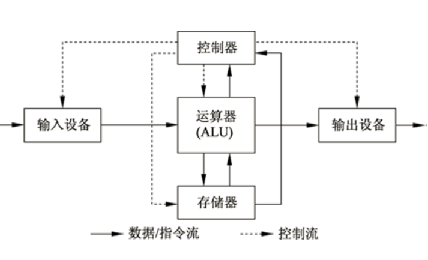
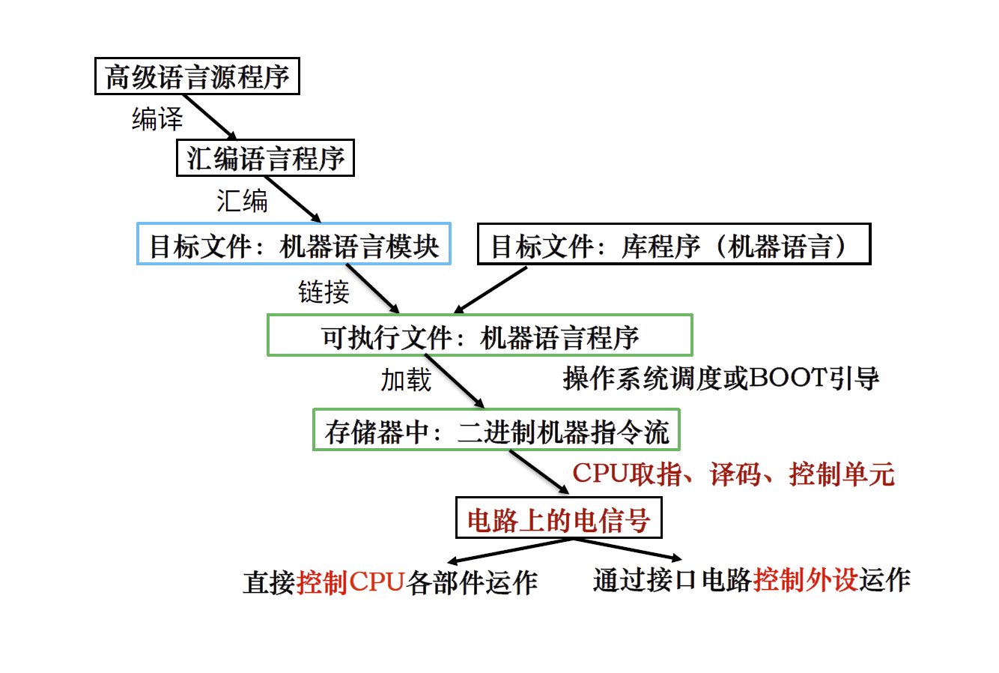
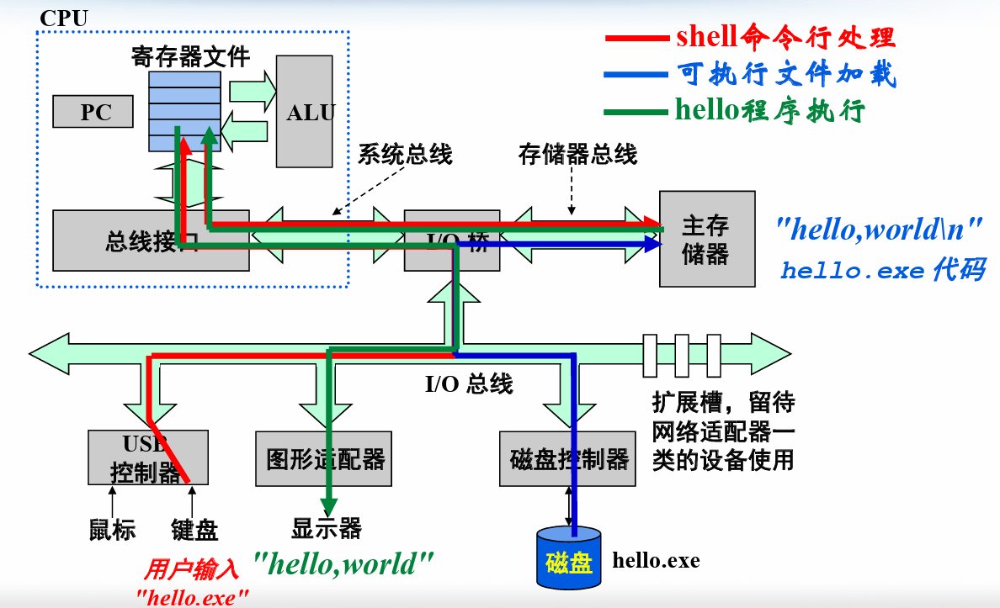
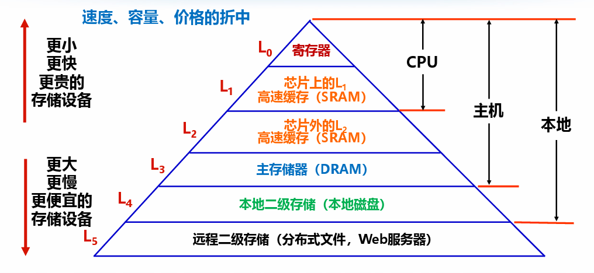

# 计算机体系结构

## 1.计算机体系结构设计的伟大思想

1. 面向摩尔定律的设计（已不再准确）
2. 使用**抽象**简化设计：隐藏低层细节以提供给高层一个更简单的模型，提高硬件软件开发效率
3. 加速**大概率事件**：远比优化小概率事件提升性能
4. 通过**并行**提高性能：多核处理器
5. 通过**流水线**提高性能：pipelining，一种重要的并行技术
6. 通过**预测**提高性能：也体现了加速大概率事件的思想
7. **存储器层次**：金字塔模型，通过存储层次以缓解对存储器需求的矛盾
8. 通过**冗余**提高可靠性

## 2.存储程序原理

### 2.1 存储程序原理

* 将描述计算机的解题过程的程序 

* 将程序对应的指令序列事先设计好 以二进制形式存储 

* 计算机工作时自动有序 在机器中 地从机器中逐条取出指令加以执行

### 2.2 ENIAC VS 存储程序原理计算机

* ENIAC：通过修改硬件来该改变功能
* 存储程序原理计算机：编制程序，通过指令序列来改变功能

### 2.3 冯·诺依曼计算机框架

冯诺依曼体系结构的五大组成部分包括：输入设备、输出设备（IO设备）、存储器、运算器（中央处理器）和控制器

## 3.程序从高级语言到可执行代码

* 其实在正式编译前还有**预处理**这一步

## 4.计算机基本硬件组成

* 信息从一个地方传到另一个地方，复制的开销减缓了程序的真正执行
* CPU从磁盘读取一个字的时间开销比从主存（主存储器/内存）读取大1000万倍 
* 从寄存器读数据比主存快近
* 为了使信息传递的尽可能快，使用**缓存**技术

## 5.计算机的层次结构

### 5.1 简单的软硬件层次化结构

* 同心圆环状，最内层是`hardware`，然后是`systems software`，最外层是`application software`
* 每一层都向上一层隐藏了自己的技术细节（抽象）

### 5.2 系统软件

> 提供公共服务程序

* 操作系统：程序与硬件的接口，处理基本的操作（输入输出，分配存储空间，文件管理）
* 语言处理程序：
  * 编译器：高级语言翻译成汇编语言
  * 汇编器：将汇编语言中的符号翻译成计算机能够识别的二进制指令

## 6.计算机应用的发展

* 现代计算机的分类：
  * 个人计算机
  * 服务器
  * 嵌入式计算机
* 后PC时代：
  * 以公元2000年作为一个分水岭
  * 主要是指将计算机，通信，消费产品的技术结合起来，以3C产品的形式通过Internet进入家庭
  * 标志：个人移动设备，云计算
