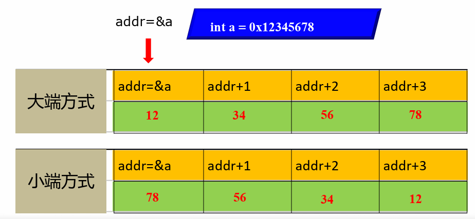

# 信息的二进制表示与存储

 

## 1.进制的表示和转换

基本表示：

* 十进制

* 二进制
* 十六进制

## 2.数据的存储顺序(内存中按字节存储)

按一个字节（8位）为一个存储单元

**按字节存储，按字节编址**

C语言中数据类型的典型大小（字节）：

| 有符号数  |      无符号数      | 32位机器 | 64位机器 |
| :-------: | :----------------: | :------: | :------: |
|   char    |   unsigned char    |    1     |    1     |
|   short   |   unsigned short   |    2     |    2     |
|    int    |    unsigned int    |    4     |    4     |
|   long    |   unsigned long    |  ==4==   |  ==8==   |
| long long | unsigned long long |    8     |    8     |
|   float   |         \          |    4     |    4     |
|  double   |         \          |    8     |    8     |
|   bool    |         \          |    1     |    1     |
|   指针    |         \          |  ==4==   |  ==8==   |

注意：

* Linux下long是8字节，Windows下是4字节
* 大小是大多数情况下的通用规则，但它们不是固定不变的。不同的编译器和不同的系统架构可能会有所不同。因此，最准确的方法是使用 `sizeof` 运算符在特定的编译器和系统上直接检查每种类型的大小

### 2.2 最低/高有效位（LSB/MSB）

* LSB：二进制数字的最低位
* MSB：二进制数字的最高位

### 2.3 大小端

* 大端：内存从高有效字节到低有效字节的顺序存储对象
* 小端：内存从低有效字节到高有效字节的顺序存储对象
* 大小端可能产生的影响：
  * 程序移植造成影响，导致不同系统之间的不兼容
  * 对部分数据访问造成影响，小端（gif），大端（JPEG）

- 常见处理器的大小端模式：

  - 小端：intel x86

  - 大端：Motorola 6800

  - 双端可供选择：ARM （只可自行选择一端）

