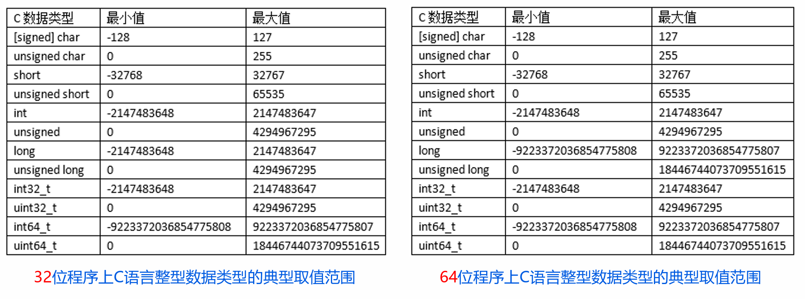
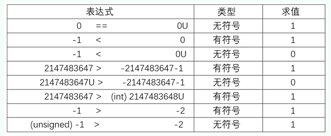

# 整数的表示

## 1.无符号数

n位二进制表示范围：$0\le X\le2^n-1$​

n位二进制数LSB是第0位，MSB是第n-1位

| 二进制    | 十进制    |
| --------- | --------- |
| 000...000 | 0         |
| 000...001 | 1         |
| ......    | ......    |
| 111...111 | $2^{n}-1$ |

## 2.有符号数

### 2.1 真值

* 数据的真实二进制表示，带正负号

### 2.2 原码 

* 最高位表示符号**0正1负**，数值部分与真值数值部分相同，高位补0

* 0的原码表示不唯一：1000 0000或0000 0000

* 表示范围：$-(2^{n-1}-1)\le X\le 2^{n-1}-1$

* | 二进制    | 十进制         |
  | --------- | -------------- |
  | 000...000 | 0              |
  | 000...001 | 1              |
  | ......    | ......         |
  | 011...111 |                |
  | 100...000 | 0              |
  | 100...001 | -1             |
  | ......    | ......         |
  | 111...111 | $-(2^{n-1}-1)$ |

### 2.3 反码

* 对于负数，需将原码数值按位取反，正数同原码

* 0的反码表示不唯一：1111 1111或0000 0000

* 表示范围：$-(2^{n-1}-1)\le X\le 2^{n-1}-1$

* | 二进制    | 十进制         |
  | --------- | -------------- |
  | 000...000 | 0              |
  | 000...001 | 1              |
  | ......    | ......         |
  | 011...111 | $2^{n-1}-1$    |
  | 100...000 | $-(2^{n-1}-1)$ |
  | 100...001 | $-(2^{n-1}-2)$ |
  | ......    | ......         |
  | 111...111 | 0              |

### 2.4 补码

* 计算机存储数据都是以补码形式存储的

* 负数的反码再加1，正数同原码

* 0的补码表示唯一：0000 0000

* 表示范围：$-(2^{n-1})\le X\le 2^{n-1}-1$​

* 已知一个数的补码，如何求其相反数的补码？

  对该数的补码，按位取反再加1，就能得到该数相反数的补码

* | 二进制    | 十进制                   |
  | --------- | ------------------------ |
  | 000...000 | 0                        |
  | 000...001 | 1                        |
  | ......    | ......                   |
  | 011...111 | $2^{n-1}-1$              |
  | 100...000 | $-(2^{n-1})$（人为规定） |
  | 100...001 | $-(2^{n-1}-1)$           |
  | ......    | ......                   |
  | 111...111 | -1                       |

## 3.整数类型之间的转换

**机器中的位值（位模式）不变，改变解释这些位的方式**

### 3.1 有符号数 $\rightleftharpoons $​​ 无符号数

* C语言创建无符号常量，可加上后缀字母`U`或`u`
* C语言中，如逻辑运算中有一个运算数是有符号数而另一个是无符号数， C语言将**隐式地将有符号数强制类型转换为无符号数**

* 有符号数$\longrightarrow $无符号数：
  * 最高位为0表示大小相同
  * 最高位为1时，它表示一个负数，当转化成无符号数时，最高位就不会看作是符号位而是数据的一部分
* 无符号数$\longrightarrow $有符号数：存储的二进制位串不发生改变知识改变翻译方式

### 3.2 长数 $\rightleftharpoons $ 短数

* 短数$\longrightarrow $长数：

  * 无符号数扩展：高位全补0

  * 有符号数扩展：高位全补符号位

  * 扩展后的数最大程度保持扩展前数据的值，忠于原创

* 长数$\longrightarrow $短数：

  * 截断：**只需要把高位去掉，保留低位就行**

