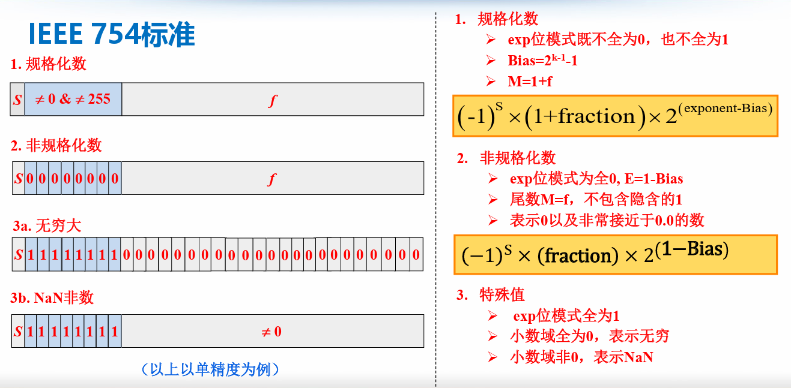
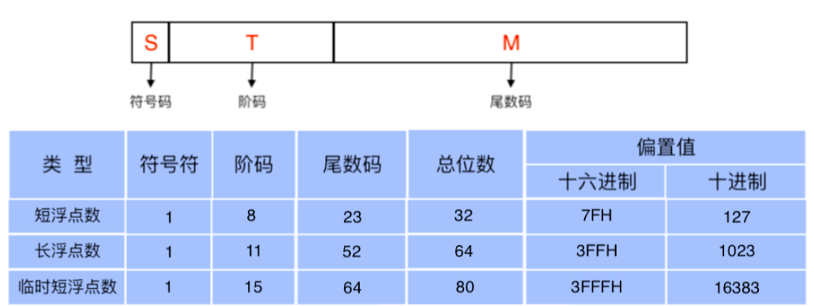

# 浮点数的表示

## 1.IEEE浮点数表示（IEEE754标准）

> 标准规定，浮点数以二进制科学计数法存储，分为符号sign，指数exponent，分数fraction（采用原码表示）三部分
>
> 

### 1.1 浮点数类型

float和double分别对应IEEE754的单精度浮点数和双精度浮点数

### 1.2 表示

> 分类由阶码决定

*  实数的二进制**规格化**表示：
   *  Exp位模式既不全为0，也不全为1		
   *  移码$Bias=2^{k-1}-1$​​​ , k为Exp的位数
   *  小数字段没有必要表示出1，采用了隐藏位策略
   *  单精度规格化数中，尾数23位，还有1位隐藏，故最多可表示24位有效数字，故不能表示的最小正整数值为$2^{24}+1$
   *  float的范围为$-2^{127}\sim +2^{127}$， double的范围为$-2^{1023}\sim +2^{1023}$
   *  计算公式：

$$
(-1)^S \times (1+frac) \times 2^{Exp-Bias}
$$

* **非规格化数**：
  * Exp位模式全为0
  * 表示0（阶码和小数字段全为0）以及非常接近于0.0的数：
  * 计算公式：

$$
(-1)^S \times (frac) \times 2^{1-Bias}
$$

* **特殊值**：
  * Exp位模式全为1的时候

  * frac全为0，表示无穷大

  * frac非0，表示NaN（非数）
    * eg：${\sqrt{-1}}\quad,{\infty-\infty}$

## 2.浮点数的舍入

> 由于浮点数 `位数有限`，不可能精确表示所有实数，浮点运算必然存在精度损失

* 就近舍入：舍入为最近可表示的数（01舍，11入，10强迫结果为整数（最低位为0则舍掉多余位，最低位为1则进位1、使得最低位仍为0（偶数）））（大于超出规定最低位的一半进1）
* 朝正无穷方向舍入：ceil
* 朝负无穷方向舍入：floor
* 朝0方向舍入：截断
