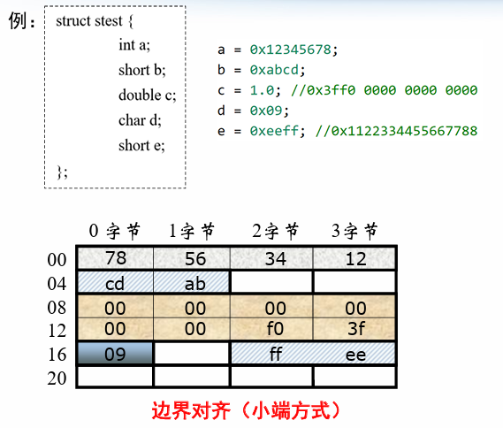

# 数据集合的表示和存储

## 1.数组

* 特点：数据的元素类型相同
* 数据类型T，整型常数N，声明：T  A[N]
  * 内存中分配$L\times N$字节的**连续空间**，L为T的大小
  * 数组起始地址是$X_{A}$
* 对于嵌套数组，**行优先**（编写代码时如果按照列优先则会影响速度）

## 2.结构体

* 特点：数据的元素类型不同
* struct内部元素在内存中分配一段连续的空间，按一定顺序排列
* 结构体内部对齐，可能会需要一些填充

