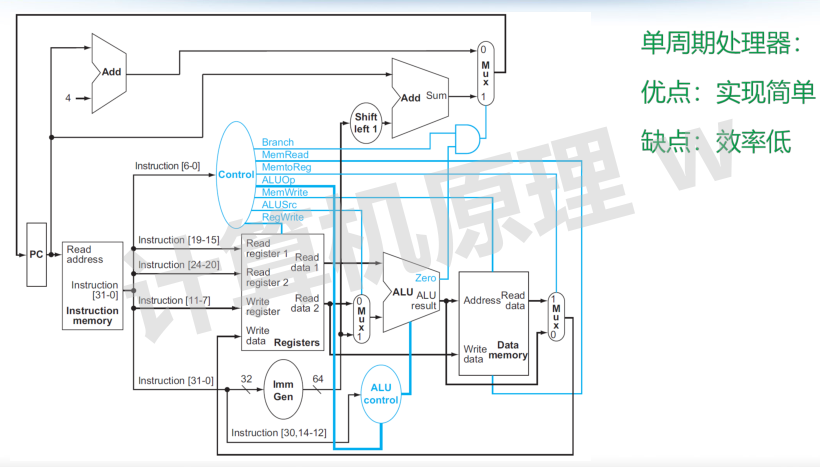

# 单周期处理器

## 1.基本概念

- CPI：Cycle Per Instruction，单位指令时钟周期数
- Cycle Time：周期时间，处理器完成一个周期所需的时间，需要在出厂时设定，属于物理极限
- 执行时间 = 指令数目 x CPI x Cycle Time
- 性能 = 1 / 执行时间

## 2.单周期处理器

以指令为单位，对于每条指令而言，都需要耗费 1 个时钟周期，CPI = 1， cycle time 一般取决于耗时最长的指令

