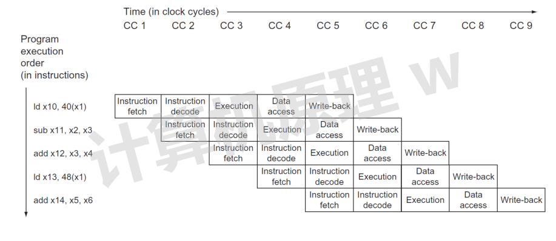

#  流水线处理器

## 1.流水线

* 把一个大任务切分为多个串行的小任务，实现并行执行
* 提高了吞吐量（单位时间内执行指令的数目）
* **流水线周期**为执行时间最长的一个阶段

## 2.流水线处理器 

每一条指令拆分为 5 个阶段： 

* **IF**（Instruction Fetch，指令获取）
* **ID**（Instruction Decode，指令解码）
* **EX**（Execution，指令执行）
* **MEM**（Memory Access，内存读写）
* **WB**（Write Back to Register，写回寄存器）

