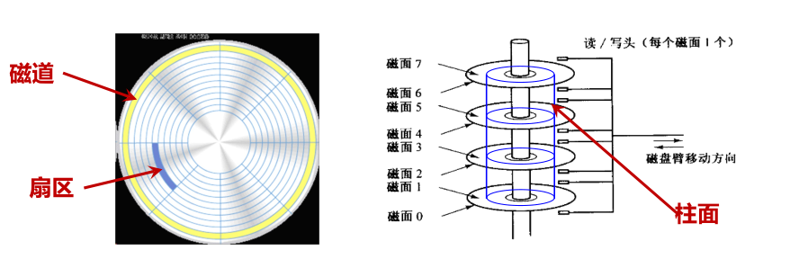

# 磁盘存储

> 磁存储是将数据存储在磁化介质上。磁存储在可磁化材料中使用不同的磁化模式来存储数据，是一种非易失性存储器。使用一个或多个读/写头访问信息

## 1.磁盘构造

* 磁面/盘面：由于盘片正反都可以涂上磁性物质，故一个盘片可能会有两个盘面
* 磁头：所有的磁头都是连在同一个磁臂上，因此所有磁头只能共进退

* 磁道：每个记录面划分为许多个同心圆，每个同心圆轨迹称为一个磁道
* 扇区：每个磁道被分成若干大小相同的圆弧，各个扇区存放的数据量相同。最内侧磁道上扇区面积最小，因此数据密度最大
* 柱面：多个盘面位于同一半径的磁道构成的一个圆柱

## 2.磁盘存储

### 2.1 记录密度

单位长度或面积磁表面存储的二进制信息数

* 道密度：
  * 在垂直于磁道方向上单位长度磁介质所容纳的磁道数
  * 单位：tpm( tracks per millimeter )，tpi( tracks per inch )
* 位密度：（通常指的是最内圈, 内圈磁道位密度高）
  * 单位长度磁道上所能记录的二进制信息位数
  * 单位：bpm，bpi
  * 外圈磁道位密度低，记录信息出错概率小，常用于存储操作系统等重要信息
* 面密度：
  * 单位面积上记录的二进制信息位数
  * 单位：bpm^2^，bpi^2^
  * **面密度 = 道密度 $\times$ 位密度**

### 2.2 磁盘容量

* 磁表面存储器所能记录的二进制信息总量
* 单位：B，MB，GB
* rps （转/秒）或 rpm （转/分）
* 磁盘格式化：根据记录格式的要求，对磁道**划分扇区**，留出各种间隙并写入各种标志信息，地址信息和其他控制类信息
  * 非格式化容量
    * 完全从记录密度考虑的容量
    * $非格式化容量C_n=数据传输率\times转一圈时间\times磁面数\times磁道数$
    * $非格式化容量C_n=π\times最内圈直径\times位密度\times磁面数\times磁道数$
  * 格式化容量
    * 格式化后所能记录的信息量，从扇区容量考虑
    * 通常，格式化容量是非格式化容量的 0.7~0.9 倍
    * $格式化容量C_f = 扇区存储大小\times每条磁道扇区数\times每面磁道数\times记录面数$

### 2.3 存取时间

当磁头从当前所在位置移动到目标扇区，并完成读写所需时间 t~a~，访问磁盘的时间主要开销是寻道时间和旋转延迟

* 寻道时间 t~s~
* 旋转等待时间 t~w~
* 数据传输时间 t~wr~

* 平均存取时间 $(\mathbf{t}_\mathrm{smax}+\mathbf{t}_\mathrm{smin})/2+(\mathbf{t}_\mathrm{wmax}+\mathbf{t}_\mathrm{wmin})/2=\bar{\mathbf{t}}_\mathrm{s}+\bar{\mathbf{t}}_\mathrm{w}$
* 数据传输率，单位：位/秒，字节/秒，KB/秒，MB/秒 

  $f=位密度\times周长/转一圈时间$

### 2.4 误码率

读数据出错位数占总位数的比例

* 软错误：随机偶然性错误
* 硬错误：突发错误，永久性错误

## 3.访问磁盘

* CPU使用一种称为内存映射I/O(memory-mapped I/O)的技术向I/O设备发送命令

* CPU将命令，地址写道磁盘控制器相关联的端口，发起一个操作，磁盘控制读扇区，并执行到主存的DMA传输，DMA传输完成时，磁盘控制器用中断方式通知CPU

  （DMA传输：一个设备可以自己执行读或者写总线事务，而不需要CPU干预的数据传输方式）
  
   

## 4.固态硬盘

SSD，Solid State Disk 是基于闪存技术、拥有硬盘接口的硬件

SSD 封装 (package)插到 I/O 总线上标准磁盘插槽(通常是 USB or SATA)中，处理来自 CPU 读写逻辑磁盘块的请求

* 优点
  *  没有移动(机械)部件，随机访问时间快、能耗低、更紧固
*  缺点
  *  读写不均衡，读比写快，写需要先擦除
  *  反复写之后，闪存块容易磨损
  *  价格贵：SSD 每字节比磁盘大约贵 30 倍，常用的存储容量比磁盘小 100 倍