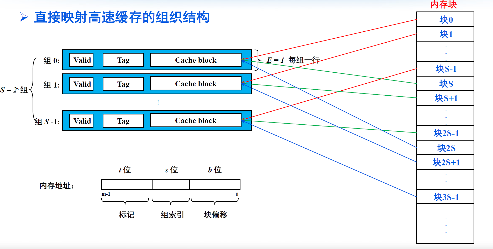

# 高速缓存

## 1.局部性原理

程序访问局部性分类：

* 时间局部性：刚被访问过的存储单元不久又被访问
* 空间局部性：刚被访问过的存储单元不久临近单元也被访问

## 2.存储层次结构

## 3.高速缓存

> 数据总是以块为单位在存储结构中来回复制

### 3.1 通用高速缓存存储器组织架构

* 每个cache被划分成一个或多个set组

* 每个set包含一个或多个 cache line

* 每个 cache line 中都包含
  * 有效位:1bit,表示数据是否有效
  * 标记:表示当前的数据是否存储在cache line 中
  * 数据块:一小部分数据内存的副本

### 3.2 三种映射关系

> 直接映射：唯一映射(只有一个可能的位置)
> 全相联映射：任意映射(每个位置都可能)
> N-路组相联映射：N-路映射(有N个可能的位置)

#### 3.2.1 直接映射

* 组选择,行匹配,字抽取
* 替换策略：用新取出的行替换当前行
* cache容量指所有cache block加起来的大小,但实际容量还要包含valid和tag位
	

#### 3.2.2 全相联高速缓存

#### 3.2.3 组相联高速缓存

组相联高速缓存必须搜索组中的每一行进行标记匹配

## 4.高速缓存参数

* 关联度:主存块映射到Cache时，可能存放的位置个数
  * 直接映射关联度为1
  * 全相联映射关联度为行数
  * N路组相连映射关联度为N
  * Cache大小和块大小一定的情况下,提高关联度通常能够降低缺失率；但可能增加命中时间

* 缓存命中(cache hit):要访问的信息在Cache中
  * Hit Rate(命中率p)：在Cache中的概率
  * Hit Time (命中时间Tc) ：访问Cache所需时间，包括：判断时间+ Cache访问

* 缓存不命中(cache miss):要访问的信息不在Cache中,替换策略
  * Miss Rate (失靶率/失效率1－p)= 1-(Hit Rate)
  * Miss Penalty (失效损失Tm)：从主存将一块信息替换到Cache所需时间，包括访问主存块，向上逐层传输块直至将数据块放入发生缺失的那一层所需时间

**平均访问时间= p×Tc+ (1-p) ×(Tm+Tc)=Tc+ (1-p) ×Tm**

**提高平均访问速度，必须提高命中率**

## 5.哈佛结构

* 将程序指令存储和数据存储分开的存储器结构
* 只保存指令的高速缓存i-cache，只保存数据的高速缓存d-cache
* 主要目的是减少指令流水线冲突