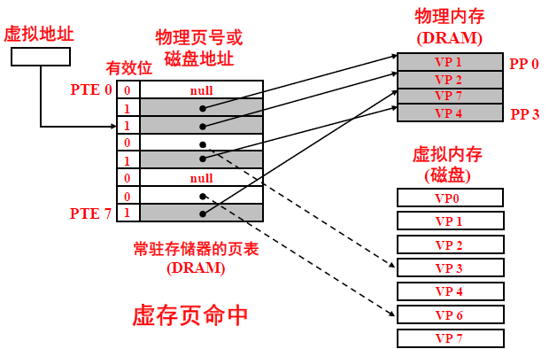

# 虚拟内存

> **CPU通过生成一个虚拟地址来访问主存，MMU（Memory Management Unit，内存管理单元）是一种硬件模块**，用于在**CPU和内存之间实现虚拟内存管理**

## 1.页

* 固定大小的块，作为磁盘和主存之间传输数据的基本单元
* 虚拟内存划分为虚拟页VP
* 物理内存划分为物理页PP，或称作页帧
* 虚拟地址的状态：
  * 未分配的：无任何指向
  * 缓存的：虚拟地址指向物理内存
  * 未缓存的：虚拟地址指向磁盘
* 虚拟页的状态：
  * 未分配的：虚拟页还没分配磁盘空间
  * 缓存的：虚拟页缓冲或映射在了物理页
  * 未缓存的：虚拟页分配了磁盘空间，但没有在物理页上缓冲
* **页命中，缺页（引发替换）**

## 2.地址翻译

**页表基址寄存器(PTBR）**

每个进程都有自己的页表，CPU执行某个进程时，会先把该进程的一级页表起始地址存储到页表基址寄存器，这样CPU查找一级页表起始地址可以直接从寄存器查找，加快了查找效率

虚拟地址(VA)组成：

* VPO: 虚拟页内偏移(Virtual page offset)
* VPN:虚拟页号(Virtual page number)

物理地址(PA)组成：

* PPO:物理页内偏移(Physical page offset)
* PPN:物理页号(Physical page number)

页内偏移量(page offset)的值不会随转换结果而变化,**VPO = PPO**

## 3.页表

page table （PT）

* 页表键虚拟页映射到物理页
* 页表内容由操作系统维护
* 页表是存放在物理内存当中的一个数据结构
  * 页表是一个**页表条目（page table entry，PTE）**构成的数组
  * 虚拟地址空间中每个页在页表中有一个固定偏移量处都有一个PTE
  * PTE由一个有效位和一个n位地址字段组成

## 3.页面命中

## 4.缺页处理

## 5.利用TLB加速地址翻译

* TLB：Translation Lookaside Buffer，快表
* 地址翻译需要两次存储器访问，非常低效。第一次是查询内存中的页表，第二次是访问物理页框
* TLB集成与MMU中，仿照cache技术，进行缓存，访问TLB，就可以得到虚拟页对应的物理页

