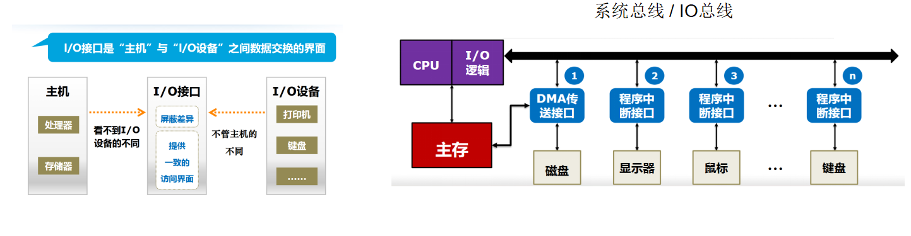
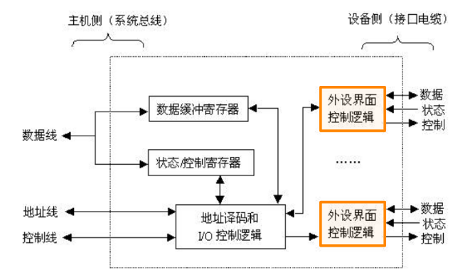

# IO 接口

> I/O 接口，或者是 `I/O 控制器`，是 `主机和外设之间地交接界面`，通过接口可以 `实现主机和外设之间地信息交换`。主机和外设具有各自工作特点，它们在信息形式和工作速度具有很大地差异，接口就是为了解决这些差异而设置的
>
> 传输信息通路：IO接口，总线
>
> 对外设进行区分，使CPU访问：端口，编制

## 1.功能

* 主机和外设的通信联系控制
* 地址译码和设备选择
* 数据缓冲
* 信号格式转换
* 传送控制指令和状态信息

## 2.IO 端口

接口电路中可被 CPU 直接访问的寄存器，主要有数据端口、状态端口和控制端口，若干端口加上相应的控制逻辑电路组成接口；一般 CPU 只能对数据端口执行读写操作、状态端口只能执行读操作、控制端口只能执行写操作

## 3.IO 端口编址

* 统一编制：将 I/O 设备地址 **看成是内存地址的一部分**，CPU 可以直接用取数、存数等指令对 I/O 设备进行访问
  * 优点：不需要单独的 IO 指令，访问方便，灵活，有较大的编址空间
  * 缺点：内存容量变小，数据输入输出等操作变慢
  * 如IBM公司处理器
* 独立编制：在内存地址之外额外开辟一块地址空间作为单独外设空间。为了区分对内存、外设的操作，需要设置专门的 I/O 指令来操作外设
  * 优点：使用专门的 I/O 指令，程序编制清晰，易于理解
  * 缺点：控制复杂
  * 如Intel公司处理器

## 4.总线

* 数据线（Data Bus），用来传输实际的数据信息
* 地址线（Address Bus），用来确定到底把数据传输到哪里去，是内存的某个位置，还是某一个 I/O 设备
* 控制线（Control Bus），用来控制对于总线的访问

