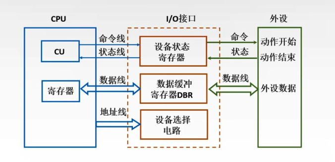
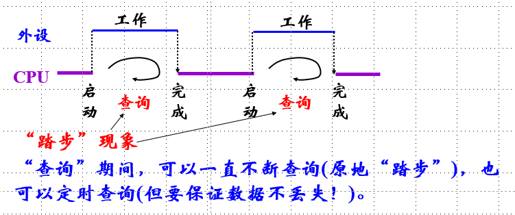
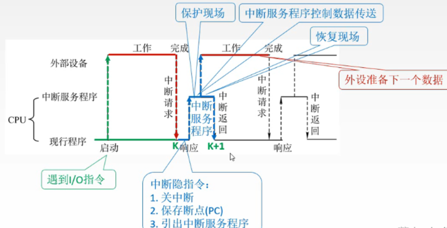
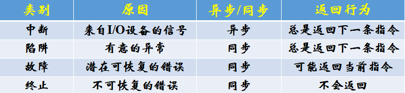
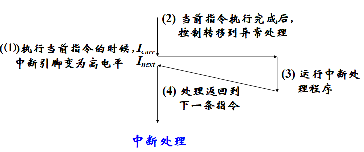
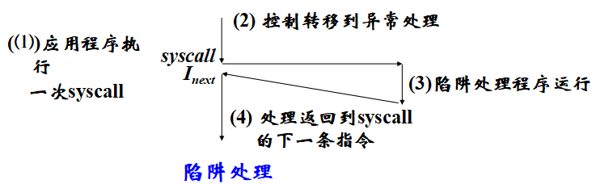
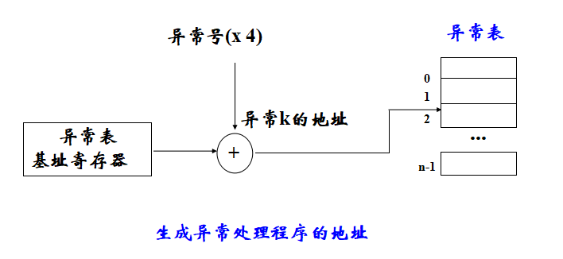
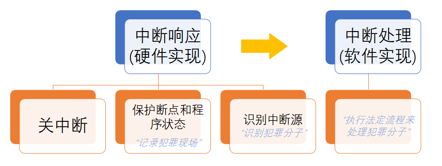
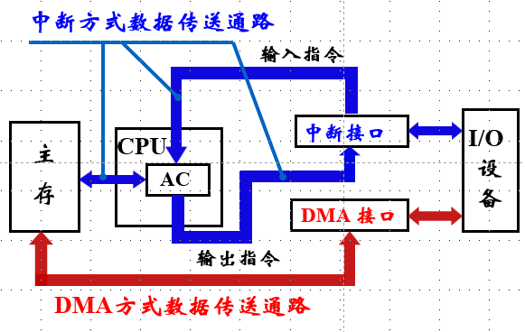

# IO 控制方式

## 1.IO Polling（程序轮询方式）

* 概述：CPU 定时对各种设备主动轮流询问一遍有无处理要求（I/O 设备(包括 I/O 接口)将自己的状态放到一个状态寄存器中）。轮流询问之后，有要求的，则加以处理。在处理 I/O 设备的要求之后，CPU 返回继续工作

* 特点：
  * IO操作完全处于CPU的指令控制之下
  * 软件只需要一条 IO 指令
  * 传送数据前需要查询外设的工作状态
  * 硬件简单只需要一个数据缓冲寄存器
  * 受‘踏步’影响大，对 CPU 打扰大，效率低，很少使用

## 2.IO Interrupt（中断控制方式）

* 概述：外设准备好时，便向 CPU 发中断请求，CPU 响应后，中止现行程序的执行，转入一个“中断服务程序”进行输入/出操作，实现主机和外设接口之间的数据传送，并启动外设工作。 “中断服务程序”执行完后，返回原被中止的程序断点处继续执行。此时，外设和 CPU 并行工作

### 2.1 异常

* 基本概念：
  * RISC-V 下，中断时一种特殊的异常，而异常是控制流中的突变，一般由“事件”引起，用来响应处理器状态中的某些变化
  * 异常由硬件和 OS 协同实现
  * 处理器通过“异常表(exception table)”进行跳转，OS 专门设计用来处理这类事件的“异常处理程序(exception handler)”
* 常见的异常：虚拟内存缺页、算术运算溢出、除以零、外部定时器产生中断
* 异常处理：CPU 检测到异常后，会通过异常表，进行一个间接过程调用，到一个专门的异常处理程序
* 异常处理完成后，可能有三种结束方式：
  * 返回到 Icurr(即重新执行引起异常的指令)
  * 返回到 Inext
  * 终止被中断的程序执行

### 2.2 异常的分类

* 同步异常：执行一条指令的直接产物

* 异步异常：由处理器外部的 I/O 设备中的事件产生

#### 2.2.1 中断

> 来自外部 IO 的异步信号，整个过程中两次关中断两次开中断

#### 2.2.2 陷阱

> 执行指令的“有意”的结果，用户态陷入内核，特权切换

背景：计算机有两种运行模式：用户态，内核态。 其中操作系统运行在内核态，在内核态中，操作系统具有对所有硬件的完全访问权限，可以使机器运行任何指令；相反，用户程序运行在用户态，在用户态下，软件只能使用少数指令，它们并不具备直接访问硬件的权限

#### 2.2.3 故障

> 由错误情况引起，可能被修正：
>
> * 能修正：返回到引起故障的指令，重新执行该指令
> * 不能修正：返回到内核的 abort 例程，终止引起故障的应用程序继续执行

典型：缺页异常（指令引用一个虚拟地址，但该虚拟页不在内存，则产生缺页故障）

#### 2.2.4 中止

> 不可恢复的致命错误结果，终止处理程序从不会把控制权返回给应用程序

### 2.3 异常的处理

> 首先：关中断！即：中断允许标志清 0

* **保护断点和程序状态：**

  * **将返回原程序执行的断点和程序状态保存到堆栈或特殊寄存器中**     
  * PC => 堆栈 或 EPC；PSWR => 堆栈 或 EPSWR(注：PSW(Program Status Word)：程序状态字 , PSWR(PSW 寄存器)：用于存放程序状态的寄存器。如，X86 的 Flag

* **识别异常事件：**

  * 软件识别(RISC-V 采用，轮询) ：设置异常状态寄存器(RISC-V 中为 Cause 寄存器)，用于记录异常原因。操作系统采用统一的异常处理程序(RISC-V 的入口为 0x1C00 0900) ，按该程序中的优先级顺序查询并识别出异常事件
  * 硬件识别(向量中断)(80x86 采用)：用专门的硬件查询电路按优先级顺序识别异常，并得到一个“中断类型号”，据此进入中断向量表读取对应的中断服务程序的入口地址（链式查访（菊花链），独立请求（并行优判））

* **切换到具体的异常处理程序执行**：

  * 确定异常号（异常表的索引，异常表是一个跳转表，每条表目包含异常的处理程序代码的地址）（异常基址寄存器：CPU 中的一个特殊寄存器，用来存放异常表在内存的起始地址）

    

  * **触发异常，执行间接过程调用**

### 2.3 中断的响应和处理

处理流程：

* 中断准备：保护现场及旧屏蔽字，查明中断原因，设置新屏蔽字，开中断
* 中断处理：根据中断向量表来执行
* 中断恢复：关中断，恢复现场及旧屏蔽字，开中断，中断返回

### 2.4 多重中断

在执行中断服务程序过程中，有新的中断请求产生，新中断优先级高于正在执行的中断，应该立即终止正在执行的中断服务程序，转取处理新的中断，这种情况称作多重中断，也称作中断嵌套

### 2.5 中断优先级

#### 2.5.1 响应优先级

* 由硬件排队线路决定
* 反映了多个中断同时请求时该选择哪个中断响应

#### 2.5.2 处理优先级

* 由软件设置屏蔽码决定
* 反映本中断与其他中断之间的关系

### 2.6局限性

* 不适合高速外设，对于IO的请求响应慢 ，会使主机处于频繁的中断和返回过程中，加重了与中断有关的额外负担
* 数据传输速度慢，同时也可能会发生丢失数据

## 3.DMA

> 直接存储器存取，Direct Memory Access

### 3.1 简介

DMA（Direct Memory Access）即直接存储器访问，借助内部的控制器来实现内存和外设之间的数据传输。有了DMA，CPU 可以专注于内存数据的存取；数据的搬运过程完全可以交由DMA硬件完成。有了DMA以后，不代表完全不需要CPU了，只是不会像中断那样频繁向CPU发送请求。

### 3.2 DMA方式的特点

* 外围设备的访问请求可以直接发往主存
* 不需要CPU进行保存现场和恢复现场等操作
* DMA开始与结束时，需要处理机进行管理：
  * 开始前，对DMA控制器进行初始化，传送主存缓冲区的首地址，设备地址，数据块长度等，并启动设备开始工作
  * 结束后，向CPU申请中断，对数据缓冲区进行后处理
* **DMA执行中，数据传送过程不需要CPU干预**

### 3.3 DMA数据传送方式

由于DMA接口和CPU共享主存，所以可能出现两者争用主存的现象，故需要数据传输策略

* **CPU停止法**（成组传送）
  * 概念：DMA传输时，DMA控制器发送一个停止信号给CPU，CPU放弃对总线的使用权，停止访问主存，直到DMA传送一块数据结束
  * 优点：控制简单，适于传输率高的外设实现成组数据传输
  * 缺点：CPU工作受影响，主存周期没有被充分利用
  
* **周期挪用法**（单字传输）
  * 概念：DMA传输时，CPU让出一个总线事务周期，由DMA控制总线来访问主存，传送完一个数据后立即释放总线
  * 优点：能及时响应IO请求
  * 缺点：每次DMA访存都要申请总线控制权，占用总线进行传送，释放总线，因此，会增加传输开销
  * 备注：**IO设备要求DMA传送时可能CPU同时要访问主存，一般规定DMA总线的优先权比CPU高**
  
* **交替分时访问法**
  * 概念：每个存储周期分为两个时间片，一个给CPU一个给DMA

### 3.4 DMA数据传送过程

* 准备阶段：
  * DMA控制器的初始化：
    * 配置 DMA 内存缓冲区的首地址（即告诉DMA把数据放到哪）
    * 配置 DMA 传输方向（是向外设传数据，还是从外设读数据）
    * 配置 DMA 交换量（设置数据传输的上限）
  * 接口的初始化：IO设备的寻址信息
* 传输请求：
  * 设备接口 => DMA 控制器：设备接口向DMA控制器发送 “ DMA请求 ” ，即请求使用 DMA 进行数据传输
  * DMA 控制器 => CPU：DMA 控制器向CPU申请 “ 总线占用 ”，DMA控制器和 CPU 只能有一个占用总线
  * CPU => DMA 控制器：CPU 批准使用总线，此时CPU会让出一个或者多个总线周期用于数据传输。在DMA数据传输期间，CPU 停止访问内存，无法执行需要占用总线的指令
  * DMA 控制器 => 设备接口：DMA 批准设备请求，此时 DMA控制器将掌握总线控制权。如果是单字节传送，一个总线周期后，DMA归还总线控制权；如果是块传送，连续占用若干个总线周期后，DMA才会归还总线控制权
* 数据传送
* 善后处理

注意：CPU只用于DMA的预处理和后处理阶段，数据传送时不需要CPU

## 4.CPU用于外设IO时间占比计算

$ IO占比=\frac{处理IO的时钟周期数}{电脑时钟周期数（主频）} $
