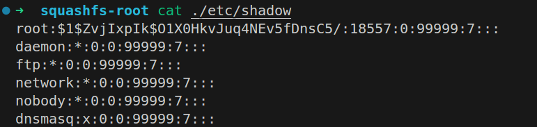
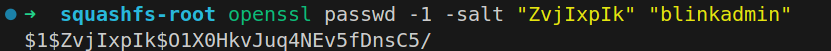

# Hardcoded Credentials in BL-AC3600 Routers

BUG_Author: waiwai

Vendor：[Blink](https://www.b-link.net.cn/)

Product: [BL-AC3600](https://www.b-link.net.cn/product_29_177.html)

Affected Version: V1.0.22 and earlier 

Vulnerability Files: `/etc/shadow`

## Description

[BL-AC3600 V1.0.22](https://www.b-link.net.cn/download/BL-AC3600/BL-AC3600(V1.0.22)%E5%8D%87%E7%BA%A7%E5%9B%BA%E4%BB%B6.html) contains hardcoded credentials stored in /etc/shadow which are easily guessable.

## POC

Contents of /etc/shadow：



Cracked passwords:

```
root:blinkadmin
```

Verification:

