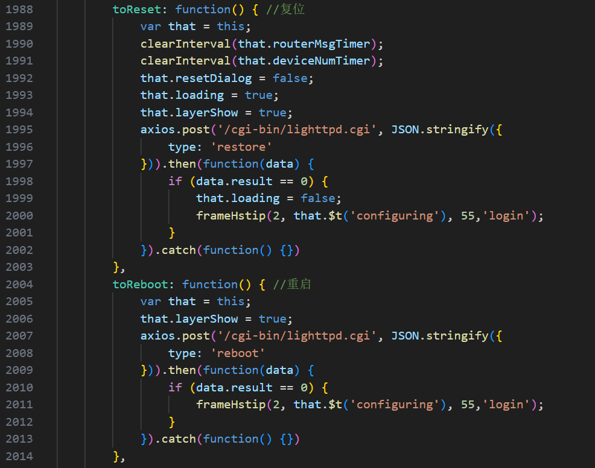
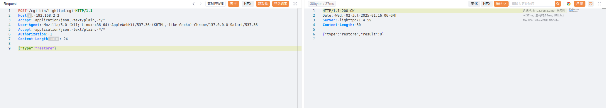
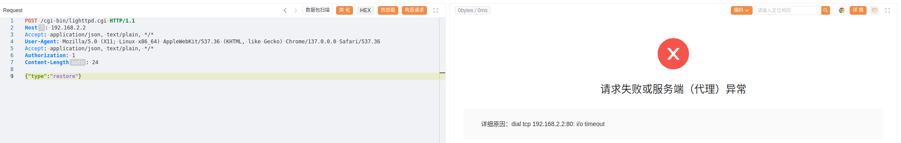

# Privilege Control Defect in Blink Router Web Interface Permits Arbitrary Sensitive Operation Execution

BUG_Author: waiwai

Vendor：[Blink](https://www.b-link.net.cn/)

Product: Multiple routers using libblinkapi.so component, including BL-AX5400P V1.0.19, BL-AX1800 V1.0.19, BL-AC3600 V1.0.22, BL-WR9000 V2.4.9, BL-AC1900 V1.0.2, BL-AC2100_AZ3 V1.0.4.

Vulnerability Files: libblinkapi.so

## Description

The Blink router's Web management interface contains a serious vulnerability of **unverified identity permissions for sensitive operations**. This vulnerability is not about bypassing existing authentication mechanisms, but rather the failure to verify the requester's identity and permissions when handling specific sensitive operations. Attackers can execute sensitive operations such as restart and factory reset through simple HTTP requests, leading to network service interruption and configuration data loss.

**Vulnerable API Endpoints**

- `POST /cgi-bin/lighttpd.cgi` - `{"type":"reboot"}` (System Reboot)
- `POST /cgi-bin/lighttpd.cgi` - `{"type":"restore"}` (Factory Settings Restore)

Vulnerable frontend code here, and correspondingly, the backend CGI performs no verification

## POC

The router service is offline and is waiting for a restart

## Impact

Immediate Consequences:

- **Network Service Outage:** System reboot results in complete network connectivity loss
- **Configuration Data Loss:** Factory restoration eliminates all personalized settings
- **Credential Loss:** WiFi passwords, port forwarding configurations permanently deleted
- **Access Control Compromise:** Administrative credentials reverted to factory defaults

Secondary Effects:

- **Operational Disruption:** Network-reliant business operations experience downtime
- **Security Exposure:** Post-reset default settings may introduce security weaknesses
- **Recovery Overhead:** Complete network reconfiguration required"