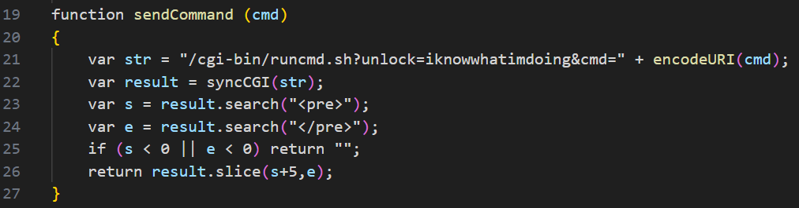
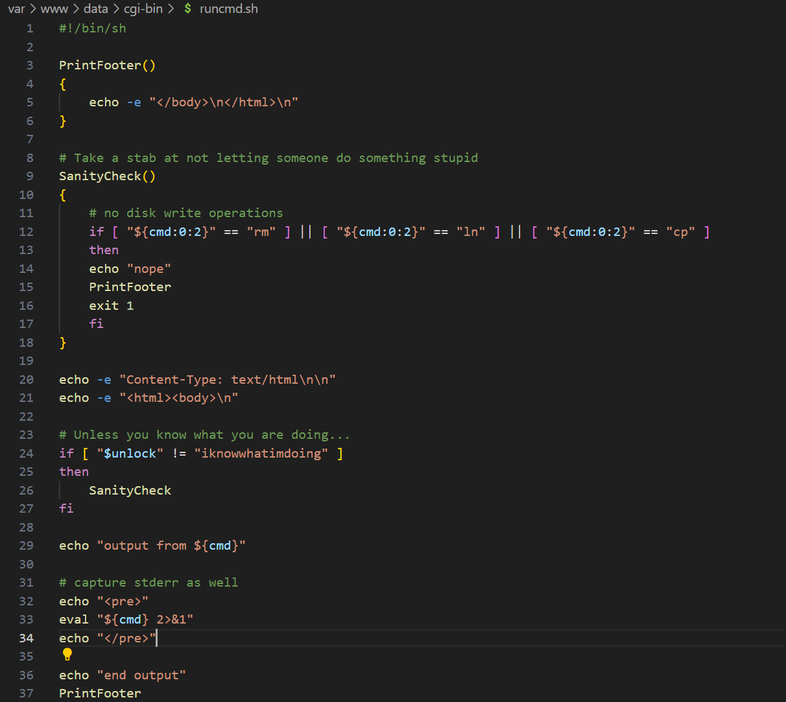

# Command Injection Vulnerability in Developer Backdoor Page

BUG_Author: waiwai

Vendor：FLIR

Product: FLIR FB-Series O

Affected Version: [FLIR FB-Series O all version](https://www.flir.com/support/products/fb-series-o/#Downloads)

Vulnerability Files: Production.html

## Description

The built-in `sendCommand()` function in the production.html page is intended to call the backend `runcmd.sh` script to execute arbitrary commands, with a hardcoded backdoor password. Although this functionality is currently disabled due to server CGI configuration errors, it is essentially a "time bomb" waiting to be activated.

Client-Triggered Entry Point:

Process：

