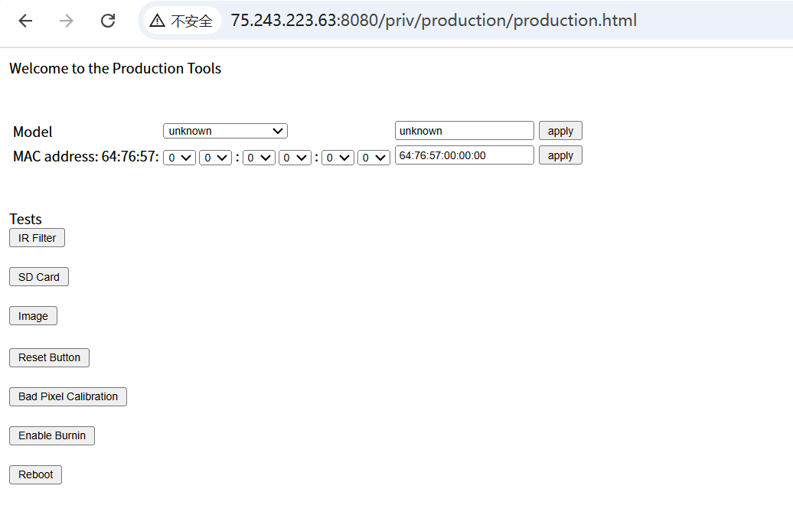

# Production.html Management Backend Unauthorized Access

BUG_Author: waiwai

Vendor：FLIR

Product: FLIR FB-Series O

Affected Version: [FLIR FB-Series O all version](https://www.flir.com/support/products/fb-series-o/#Downloads)

Vulnerability Files: Production.html

## Description

This is a powerful management backend designed for internal production and debugging purposes. Its design intent is clearly private (evident from the directory name "priv"), but due to server misconfiguration, it is exposed on the public network, allowing any attacker who knows its URL to directly access it without any authentication. This vulnerability combines unauthorized access, information disclosure, and potential remote code execution into a complete, high-risk attack entry point.

## POC

