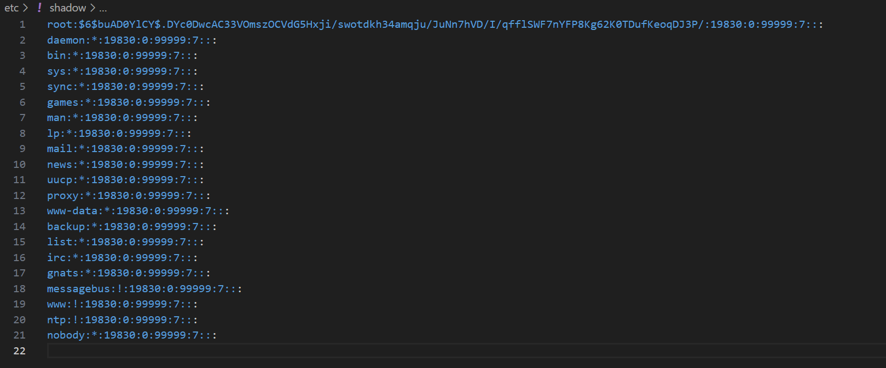
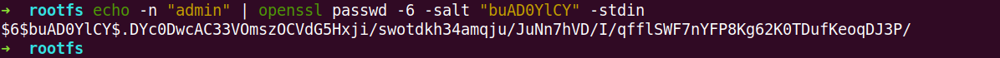

# Root User with Hardcoded Weak Password

BUG_Author: waiwai

Vendor：FLIR

Product: FLIR FB-Series O

Affected Version: [FLIR FB-Series O all version](https://www.flir.com/support/products/fb-series-o/#Downloads)

Vulnerability Files: /etc/shadow

## Description

The system's highest privileged user root uses an extremely weak and easily guessable default password.

Password Hash:`root:$6$buAD0YlCY$.DYc0DwcAC33VOmszOCVdG5Hxji/swotdkh34amqju/JuNn7hVD/I/qfflSWF7nYFP8Kg62K0TDufKeoqDJ3P/:19830:0:99999:7:::`

## POC

