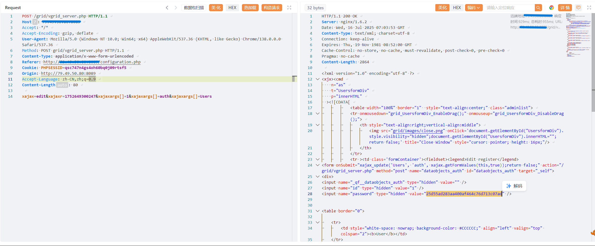
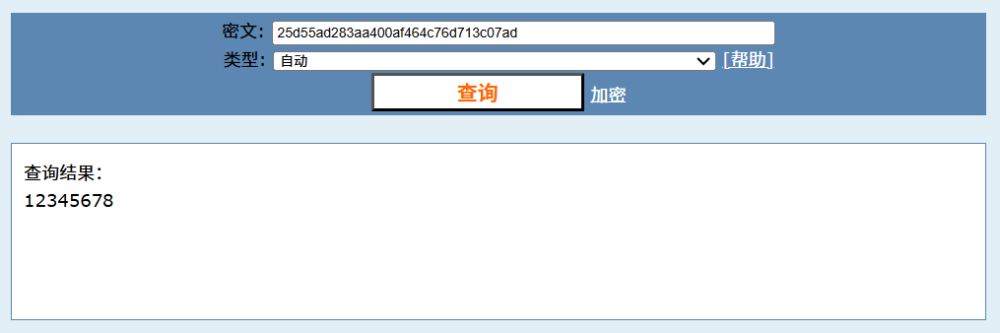

# Unauthorized Access Leads to Sensitive Information Leakage in Vaelsys V4 Platform

BUG_Author: waiwai

Affected Version: v4.1.0 

Vendor：[Vaelsys](https://vaelsys.com/)

Product: Vaelsys V4 

Vulnerability Files: /grid/vgrid_server.php

## Description

In the `vgrid_server.php` interface of the Vaelsys V4 Platform, there exists a serious unauthorized access vulnerability. Attackers can exploit this vulnerability to obtain MD4 password hash values of all system users, and this encryption is insecure.

## POC

xAJAX parameter description: xajaxargs[]=1: The first user (usually the admin user). Through enumeration, it's possible to obtain the MD4-encrypted hash values of all users' passwords.

