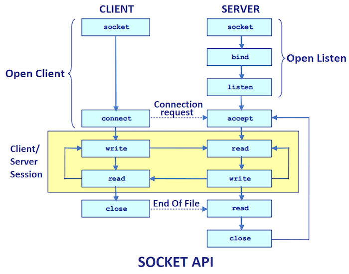

# 网络编程



## 1.基本函数及结构体

socket 函数用于创建一个 socket 描述符来唯一表示一个 socket

- domain：协商域/协议族，决定了 socket 的地址类型，常用的有 AF_INET（使用 32 位 ipv4 地主之和 16 位端口号的组合）、AF_INET6、AF_LOCAL（或称 AF_UNIX，Unix 域 socket，使用一个绝对地址路径）、AF_ROUTE 等等
- type：指定 socket 类型，常用的有 SOCK_STREAM、SOCK_DGRAM、SOCK_RAW、SOCK_PACKET、SOCK_SEQPACKET 等等
- protocol：协议，常用的有 IPPROTO_TCP、IPPTOTO_UDP、IPPROTO_SCTP、IPPROTO_TIPC 等等，当 protocol 为 0 时，会自动选择 type 类型对应的默认协议

```c
int socket(int domain, int type, int protocol);
```

bind 函数用于把一个地址族中的特定地址赋值给 socket

- sockfd：即 socket 描述字，通过 socket 函数创建
- addr：一个 const struct sockaddr* 指针，指向要绑定给 sockfd 的协议地址
- addrlen：对应地址长度

```c
int bind(int sockfd, const struct sockaddr *addr, int addrlen);
```

listen 函数用于监听 socket

- sockfd：要监听的 socket 描述字
- backlog：相应 socket 可以排队的最大连接个数

```c
int listen(int sockfd, int backlog);
```

accept 函数用于监听指定的 socket 地址

- sockfd：服务器的 socket 描述字
- addr：用于返回客户端的协议地址
- addrlen：协议地址的长度

```c
int accept(int sockfd, struct sockaddr *addr, socklen_t *addrlen);
```

connect 函数用于建立连接

- sockfd：客户端的 socke 描述字
- addr：服务器的 socket 地址
- addrlen：sizeof(addr)

```c
int connect(int sockfd, const struct sockaddr *addr, socklen_t addrlen);
```

close 函数用于关闭相应的 socket 描述字，注意：close 操作只是使相应 socket 描述字的引用计数-1，只有当引用计数为 0 时，才会触发终止连接

```c
#include <unistd.h>
int close(int fd);
```

sockaddr 结构体的类型定义如下：

```c
struct sockaddr {
  sa_family_t sa_family;
  char     sa_data[14];
}
```

sockaddr_in 结构体的类型定义如下：

```c
struct sockaddr_in {
	sa_family_t     sin_family;     /* AF_INET */
	in_port_t       sin_port;       /* Port number */
	struct in_addr  sin_addr;       /* IPv4 address */
};
```

addrinfo 结构体的类型定义如下：

```c
struct addrinfo {
	int              ai_flags;
	int              ai_family;
	int              ai_socktype;
	int              ai_protocol;
	socklen_t        ai_addrlen;
	struct sockaddr *ai_addr;
	char            *ai_canonname;
	struct addrinfo *ai_next;
};
```

getaddrinfo：

```c
#include <sys/types.h>
#include <sys/socket.h>
#include <netdb.h>

int getaddrinfo(const char *restrict node,
                const char *restrict service,
                const struct addrinfo *restrict hints,
                struct addrinfo **restrict res);

void freeaddrinfo(struct addrinfo *res);
```


## 2.select 非阻塞 IO 多路复用

Unix 下的 5 种 IO 模型：阻塞 IO 模型，非阻塞 IO 模型，IO 多路复用模型（一个线程可以监视多个描述符），信号驱动 IO 模型，异步 IO 模型

| **特性**       | **select**                                                   | **poll**                                                     | **epoll**                                                    |
| -------------- | ------------------------------------------------------------ | ------------------------------------------------------------ | ------------------------------------------------------------ |
| **时间复杂度** | $O(n)$                                                       | $O(n)$                                                       | $O(1)$                                                       |
| **工作原理**   | **无差别轮询**。内核只通知“有”事件，应用需遍历所有FD来查找。 | **无差别轮询**。与 `select` 基本相同，只是数据结构不同。     | **事件驱动**。内核直接通知应用哪些FD已就绪。                 |
| **数据拷贝**   | 每次调用都需要把整个FD集合从用户空间拷贝到内核空间。         | 每次调用都需要把整个FD集合从用户空间拷贝到内核空间。         | 首次注册时拷贝一次，之后通过共享内存，无需重复拷贝。         |
| **核心缺点**   | 1. 性能随连接数增加而线性下降。 2. 有最大连接数限制（通常是1024）。 3. 内核/用户空间数据拷贝开销大。 | 1. 性能随连接数增加而线性下降。 2. 内核/用户空间数据拷贝开销大。 | 平台局限性，是 Linux 特有的实现。                            |
| **核心优点**   | 跨平台兼容性好。                                             | 解除了最大连接数的限制。                                     | **效率极高**，性能不随连接总数增加而下降，只与活跃连接数相关。 |

select 函数用于 “阻塞等待” 多个 fd 中任意一个就绪（如可读、可写），或超时 / 出错后返回

- nfds：必须是监听所有 fd 中最大值+1
- readfds，writefds，exceptfds：监听可读/可写/异常事件的 fd 集合，若为 NULL，则表示不监听
- timeout：阻塞超时时间：NULL 则代表永久阻塞；0 代表非阻塞立即返回；非 0 值则代表阻塞指定时间
- 返回值为正数表示就绪的 fd 总数，0 表示都超时，-1 表示调用失败

fd_set 是一个文件描述符（fd，通常最大是 1024）的集合，本质是内核维护的位图（或数组），用于标记 “需要监听的 fd”。该类型不透明（用户无需关心内部实现），只能通过下方 4 个专用宏操作，不能直接赋值或修改

| 宏定义                        | 功能说明                                                     | 注意事项                                                   |
| ----------------------------- | ------------------------------------------------------------ | ---------------------------------------------------------- |
| FD_ZERO(fd_set *set)          | 清空 set 集合，将所有位设为 0。                              | 必须在初始化 fd_set 时第一步调用，否则集合可能残留脏数据。 |
| FD_SET(int fd, fd_set *set)   | 将 fd 加入 set 集合，标记为 “需要监听”。                     | fd 必须是合法的（已打开且未关闭），且不能超过 FD_SETSIZE。 |
| FD_CLR(int fd, fd_set *set)   | 将 fd 从 set 集合中移除，不再监听。                          | 常用于 fd 关闭后，避免监听无效描述符。                     |
| FD_ISSET(int fd, fd_set *set) | 判断 fd 是否在 set 集合中（即是否就绪），返回非 0 表示就绪，0 表示未就绪。 | 仅在 select 返回后调用，用于遍历判断哪个 fd 触发了事件。   |

```c
#include <sys/select.h>

typedef /* ... */ fd_set;

int select(int nfds, fd_set *_Nullable restrict readfds,
           fd_set *_Nullable restrict writefds,
           fd_set *_Nullable restrict exceptfds,
           struct timeval *_Nullable restrict timeout);

void FD_CLR(int fd, fd_set *set);
int  FD_ISSET(int fd, fd_set *set);
void FD_SET(int fd, fd_set *set);
void FD_ZERO(fd_set *set);
```


## 3.epoll 多路复用

epoll 相较于 select 的优点是无需通过轮询就可以找到 IO 事件的连接，并且没有描述符个数限制，它在内核初始化的时候向内核注册了一个文件系统，用于存储上述被监控的 socket，所以无需轮询所有的 socket 连接，有点类似空间换时间


## 4.粘包拆包问题

socket 粘包 / 拆包问题仅存在于 TCP 协议中，核心原因是 TCP 是 “面向字节流” 的传输协议（无消息边界），会将数据按缓冲区大小拆分 / 合并；而 UDP 是 “面向数据报” 的协议（有天然消息边界），不存在此问题

粘包：发送端连续发送的多个小数据包，被 TCP 合并为一个数据包传输，接收端一次读取到多个消息的混合数据

拆包：送端发送的一个大数据包，超过 TCP 发送缓冲区或 MSS（最大分段大小），被 TCP 拆分为多个小数据包传输，接收端需多次读取才能获取完整消息

简单场景通常用 “定长包 / 分隔符” 的方法来解决此问题