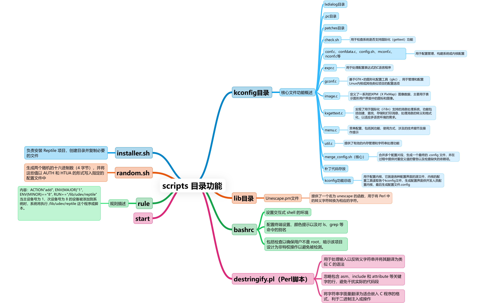
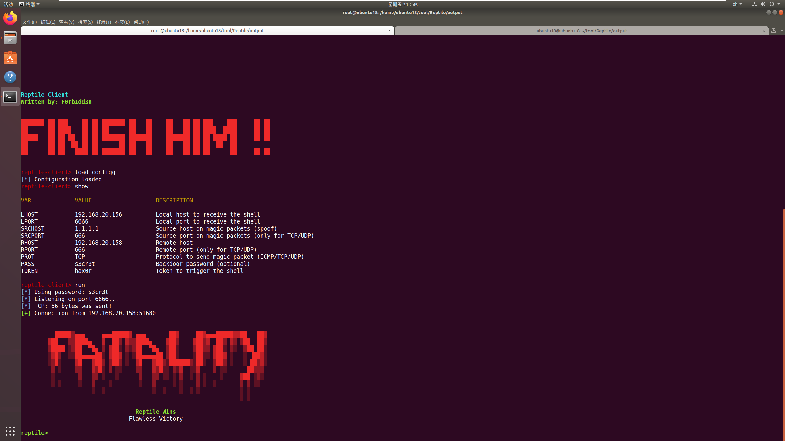
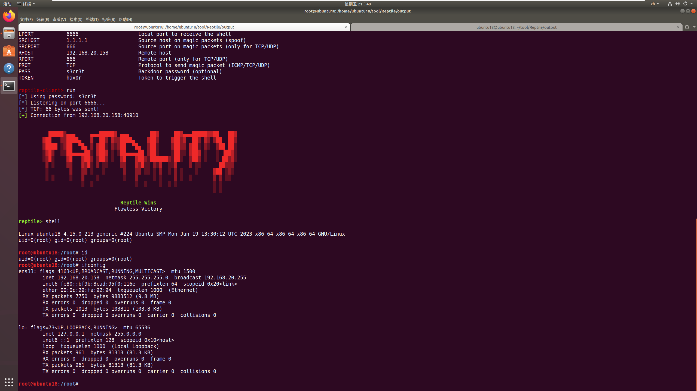

# Reptile介绍

## 1.background

apt组织，高隐藏、高持久化攻击

## 2.concept

* `rootkit`:控制目标计算机或网络的未授权恶意软件，也可理解为恶意软件用来隐藏自己的一种手段（固件（firmware）rootkit、虚拟化rootkit、内核级rootkit、库级rootkit、应用程序级rootkit等）
* `trogan`:将通信流量伪装成互联网上最常见的https流量，从而有效防止流量被检测和干扰,绕过GFW
* `LKM`:Loadable Kernel Modules,可加载内核模块程序.主要作用是用来扩展linux的内核功能。可以动态地加载到内存中，无须重新编译内核。故常被用在rootkit技术上

## 3.functions

- Give root to unprivileged users
- Hide files and directories
- Hide processes
- Hide himself
- Hide TCP/UDP connections
- Hidden boot persistence
- File content tampering
- Some obfuscation techniques
- ICMP/UDP/TCP port-knocking backdoor
- Full TTY/PTY shell with file transfer
- Client to handle Reptile Shell
- Shell connect back each X times (not default)

## 4.foundation

[khook](https://github.com/milabs/khook)：内核钩子框架

[kmatryoshka](https://github.com/milabs/kmatryoshka)：动态的模块加载器

参考

- https://github.com/mncoppola/suterusu
- https://github.com/David-Reguera-Garcia-Dreg/enyelkm.git
- https://github.com/creaktive/tsh
- https://github.com/brenns10/lsh


## 5.source code

代码库中，主要包含以下目录和文件：

1. **configs** : 存放默认配置文件。
2. **kernel** : 存放内核模块的源代码，包括各种功能模块（如 `backdoor.c`，`dir.c`，`file.c`等）和辅助文件（如 `encrypt`目录下的加密模块 `encrypt.c`）。
3. **Makefile** : 包含项目的构建规则。
4. **scripts** : 存放脚本文件，如配置脚本 `config.sh`，安装脚本 `installer.sh`等。
5. **userland** : 存放用户空间应用程序的源代码，如客户端 `client.c`，传输模块 `pel.c`等。




## 6.使用

> 分为被控端和控制端，简单来说，**被控端**需要配置、编译，**控制端**只需要编译就可以

### 6.1 被控端

```bash
apt install build-essential libncurses-dev linux-headers-$(uname -r)
```

```bash
make menuconfig #配置
make
make install
```

Backdoor configuration：

    password 是连接密码
    source port of magic packets 是控制端主动连被控端时，发送的交流包中的源端口
    magic value 控制端的token

Reverse shell：

```
第一个 Host 是控制端的ip
第二个是控制端与被控端的通信端口
第三个是反弹shell的请求间隔时间
```

### 6.2 控制端

编译即可，**output** 目录产生有三个可执行文件

```bash
make client
```

#### 6.2.1 反向连接

listener ：就是监听反向连接的工具，用法如下：

```bash
Usage: ./listener [ -p port ] [ -s secret ]
# -p是本地监听端口
# -s是被控端配置的password
```

#### 6.2.2 正向连接

用到 **client** 文件，执行后会进入像 msfconsole 的配置界面，`show` 命令可以看配置参数

```bash
Reptile Client
Written by: F0rb1dd3n

	help		Show this help
	set		Set value to a variable
	unset		Unset value to a variable
	show		Show the current configuration
	run		Run the listener and send the magic packet
	export		Export a configuration to a file
	load		Load a configuration from a file
	exit		Exit this shell

Type: "help <command>" to see specific help

reptile-client> show

VAR		VALUE			DESCRIPTION

LHOST		      			Local host to receive the shell
LPORT		      			Local port to receive the shell
SRCHOST		      			Source host on magic packets (spoof)
SRCPORT		      			Source port on magic packets (only for TCP/UDP)
RHOST		      			Remote host
RPORT		      			Remote port (only for TCP/UDP)
PROT		      			Protocol to send magic packet (ICMP/TCP/UDP)
PASS		      			Backdoor password (optional)
TOKEN		      			Token to trigger the shell
```

* LHOST、LPORT是控制端（也就是本地）的ip、port
* SRCHOST、SRCPORT是控制端连接被控端时，首个tcp会话的请求数据包的源地址、源端口，也就是说我配置成SRCHOST=1.1.1.1、SRCPORT=666，那么就会像这里显示这个样子
* RHOST、RPORT是被控端的ip、port。
* PROT是通信流量的协议。
* PASS是被控端配置的password。
* TOKEN是前面那个 magic value

配置完成后，执行 `run`，就可以拿到正向shell

### 6.3 实操

控制端：192.168.20.156

被控端：192.168.20.158

## 3.实操

控制端：192.168.20.156

被控端：192.168.20.158



