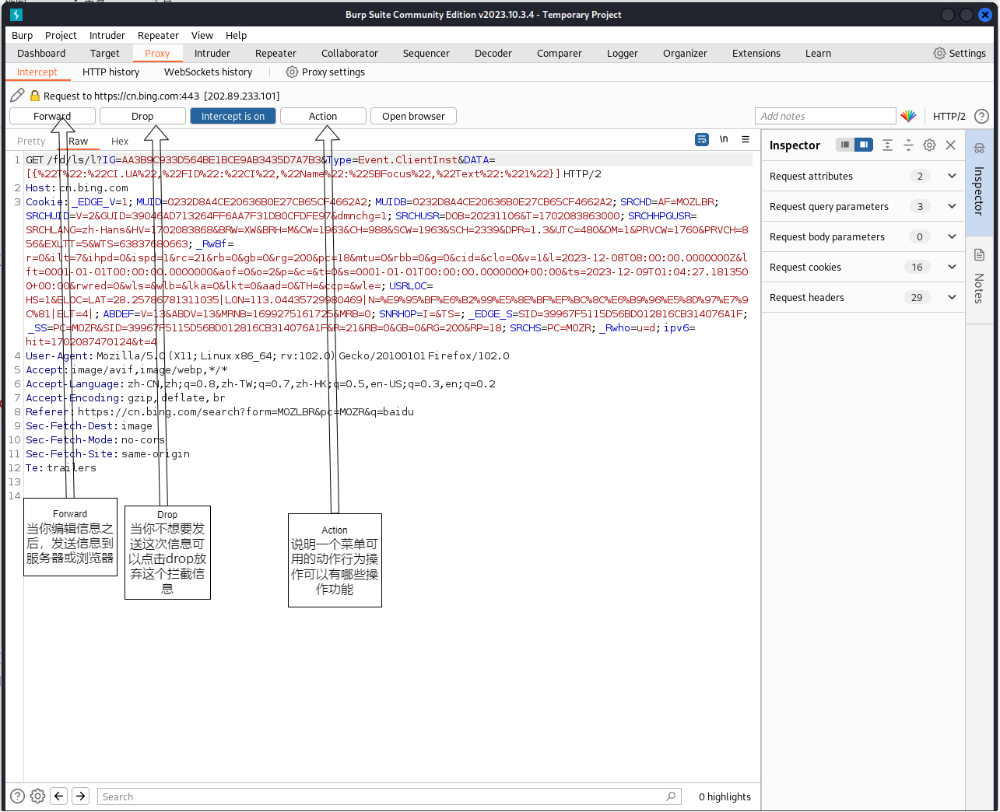
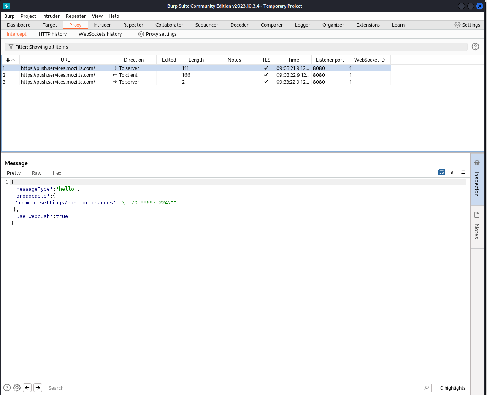

# Burpsuite

[TOC]


## 一. 代理和VPN

不论是代理服务器还是VPN，人们使用它的目的都是一致的，最终效果也基本一致，那就是：**向目标网站或服务器隐藏IP**。 当你浏览一个网站的时候，网站所在的服务器可以根据你的IP地址来推断你所在的位置。而代理和VPN则可以用它们的IP替代你的，从而达到掩盖你的真实IP的效果。

当你不使用代理时，你发送给网站的请求会直接进入网站。但是，当你使用代理时，情况就不同了。当你发送一个请求时，它首先会转到代理服务器，由代理服务器修改它(如果需要用另一个IP地址替换你的真实IP地址)，然后发送请求到你的请求网站。之后，响应又被发送到代理，再由代理将响应返回给你

Burp Suite是一个用于Web应用程序渗透测试的工具，它需要通过代理来拦截和修改HTTP请求和响应。代理允许Burp Suite截获浏览器和Web服务器之间的数据流，以便对数据进行分析、修改和攻击。如果没有代理，Burp Suite将无法拦截HTTP请求和响应，无法进行渗透测试。因此，使用Burp Suite一定要加代理

## 二. Proxy模块

> Proxy代理模块作为BurpSuite的核心功能，拦截HTTP/S的代理服务器，作为一个在浏览器和目标应用程序之间的中间人，允许你拦截，查看，修改在两个方向上的原始数据流。

### 2.1 Intercept（拦截）

用于显示和修改HTTP请求和响应，通过你的浏览器和Web服务器之间。在BurpProxy的选项中，可以配置拦截规则来确定请求是什么和响应被拦截(例如，范围内的项目，与特定文件扩展名，项目要求与参数，等)



raw中参数解释：

* 第一行分为三部分（三部分中间为空格）：
  * GET请求方式
  * url（页面？查询参数（字符串））
  * http协议版本
* host：完整url中的主机名称，代表服务器
* cookie：向服务端发一些其他的参数，用于识别用户的参数
* user-agent：消息头，提供了客户端的一些相关信息，识别游览器是什么
* accept：服务器所接受的资源
* referer：发出请求的原始url

```
服务器有问就有答，如何抓取反馈的数据包？

在action中选择do intercept - response to this request
```


### 2.2 HTTP History

这个选项是来显示所有请求产生的细节，显示的有目标服务器和端口，HTTP 方法，URL，以及请求中是否包含参数或被人工修改，HTTP 的响应状态码，响应字节大小，响应的 MIME类型，请求资源的文件类型，HTML 页面的标题，是否使用 SSL，远程 IP 地址，服务器设置的 cookies，请求的时间

- raw：这里显示的是纯文本形式的消息。在文本窗口的底部提供了一个搜索和加亮功能，可以用它来快速地定位出消息中的感兴趣的字符串，如错误消息。在搜索的左边有一个弹出项，让你来处理大小写问题，以及是使用简单的文本搜索还是正则表达搜索。
- hex：这里允许你直接编辑消息的原始二进制数据。如果在文本编辑器里修改，某些传输类型(例如，使用 MIME 编码的浏览器请求的部分)包含的二进制数据可能被损坏。为了修改这些类型的消息，应使用十六进制。


- Host主机 - The protocol and server hostname.
- Method请求方式 - The HTTP method.
- URL请求地址 - The URL file path and query string.
- Params参数 - Flag whether the request contains any parameters.
- Edited 编辑- Flag whether the request or response were modified by the user.
- Status code状态码 - The HTTP status code of the response.
- Length响应字节长度 - The length of the response in bytes.
- MIME type - The MIME type of the response.
- Extension地址文件扩展名 - The URL file extension.
- Title页面标题 - The page title (for HTML responses).
- Notes注释 - Any user-applied note.
- TLS - Flag whether TLS is used.
- IP - The IP address of the destination server.
- Cookies - Any cookies that were set in the response.
- Time - The time the request was made.
- Listener port - The listener port on which the request was received.

The HTTP history is always updated, even if Intercept is off. This enables you to browse without interruption while you monitor key details about application traffic.

### 2.3 WebSockets history

这个选项主要用于记录WebSockets的数据包，是HTML5中最强大的通信功能，定义了一个全双工的通信信道，只需Web上的一个 Socket即可进行通信，能减少不必要的网络流量并降低网络延迟

