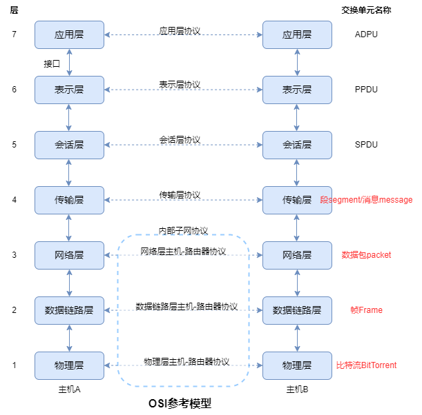

# 计算机网络概述

## 1.计算机网络分类

### 1.1 分类标准

* 按传输速率/介质
* 按数据传输方式：广播式和点到点式
* 按拓扑结构
* 按网络距离（规模）
* 按网络的用途：教育，科研，商业，企业

### 1.2 按距离分类

#### 1.2.1 个域网（PAN）

* Personal Area Network

* 围绕个人而搭建的计算机网络
* 特点：
  * 主要传输文件，照片等
  * 覆盖范围一般小于10m
* 典型案例：
  * USB，蓝牙（Bluetooth）

#### 1.2.2 局域网（LAN）

* Local Area Network
* 特点：
  * 覆盖范围：几公里~几十公里
  * 数据传输效率较高，延迟低，误码率低
  * 由某单位单独拥有，使用，维护
* 典型案例：
  * 以太网（Ethernet），令牌环网（Token-Ring）

#### 1.2.3 城域网（MAN）

* Metropolitan Area Network

#### 1.2.4 广域网（WAN）

* Wide Area Network

#### 1.2.5 互联网

## 2.网络体系结构

### 2.1 分层模型

* 一种更为模块化的设计
* 常用的开发网络系统的方法

### 2.2 协议和接口

* 协议：protocol 控制和管理网络中不同主机中对等层实体之间数据 通信过程的一组规则和约定
* 接口：interface 相邻层之间是接口，定义了下层向上层提供的原语操作和服务
* 协议的层次结构：**每一层的目的都是向上一层提供特定的服务，而把服务的细节对上一层隐蔽**

### 2.3 网络服务

> 每一层可以向上一层提供两种类型的服务：面向连接和无连接的服务

#### 2.3.1 面向连接服务

* 类似电话服务

* 面向连接服务的数据传输过程必须经过连接建立、连接维护（数据传输）与连接撤销的三个过程 
* 面向连接服务的数据单元在数据传输过程中，各分组可以不携带目的结点的地址 
* 面向连接数据传输的收发数据顺序不变，传输可靠性好，但是协议复杂，通信效率不高

#### 2.3.2 面向无连接的服务

* 类似邮政服务
* 没有连接建立、连接维护与连接撤销的三个过程
* 无连接服务的每个分组都携带完整的目的结点地址，各分组在系统中是独立传送的
* 数据分组传输过程中，目的结点接收的数据分组可能出现乱序、重复与丢失的现象
* 无连接服务的可靠性不好，但是协议相对简单，通信效率较高

### 2.4 服务和协议的关系

* 服务：定义了该层能够代表用户执行哪些操作，但不涉及操作如何实现，**垂直的**
* 协议：规定同一层上对等实体之间交换数据包或消息的格式和含义，**水平的**

## 3.网络参考模型

### 3.1 ISO/OSI参考模型

> 由国际标准化组织（International Standards Organization ，ISO）开发的提案，被称为OSI（Open System Interaction，开放系统互联），分层设计的思想，有利于标准化，规范化的发展，但是太复杂，难以完全实现

#### 3.1.1 物理层（Physical Layer）

* 功能：完成相邻节点之间原始**比特流**的传输
* 举例：EIA RRS-232-C，RJ-45，USB接口

#### 3.1.2 数据链路层（Data Link Layer）

* 功能：完成相邻节点之间数据的可靠传输
* 协议：
  * **帧**
  * 差错控制
  * 流量控制
* LAN的数据链路层又分为两个子层：
  * 介质访问子层MAC
  * 逻辑链路子层LLC

#### 3.1.3 网络层（Network Layer）

* 功能：完成任意两台主机之间的报文传输
* 协议：
  * **报文（分组）**
  * 网络互联
  * 路由控制
  * 拥塞控制

#### 3.1.4 传输层（Transport Layer）

* 功能：完成任意两台主机上的**应用进程**之间的数据传输/负责**端到端**的信息传输
* 协议：
  * **段/消息**
  * 进程寻址
  * 流量控制
  * 差错控制
  * 服务质量QoS（Quality of Service）
  * 多路复合和分解
* 举例：TCP（可靠的，面向连接的协议）/UDP（不可靠，无连接的协议），XTP，RPT

#### 3.1.5 会话层（Session Layer）

* 功能：完成用户进程之间的会话管理
* 协议：
  * 同步
  * 令牌管理
  * 安全认证

#### 3.1.6 表示层（Presentation Layer）

* 功能：
  * 数据格式转换
  * 数据加密/解密，压缩/解压

#### 3.1.7 应用层（Application Layer）

* 功能：提供访问网络的各种接口和应用层协议，直接向用户提供服务

* 举例：

  * E-mail

  * Telnet：虚拟终端协议

  * SSH：Secure Shell 安全外壳协议

  * FTP：文件传输协议

  * HTTP：获取WWW的页面

  * DNS：域名解析系统

### 3.2 TCP/IP参考模型

> OSI模型的简化版

#### 3.2.1 网络接口层

#### 3.2.2 网络层

#### 3.2.3 传输层

#### 3.2.4 应用层

注意：OSI模型的网络层同时支持无连接和面向连接的通信，**TCP/IP模型的网络层只有无连接通信一种模式，但在传输层上支持两种连接方式**

## 4.everything over IP和IP over everthing

* TCP/IP协议可以为各式各样的应用提供服务(所谓的 everyhing over ip)
* 允许IP协议在各式各样的网络构成的互联网上运行(所谓的ip over everything)