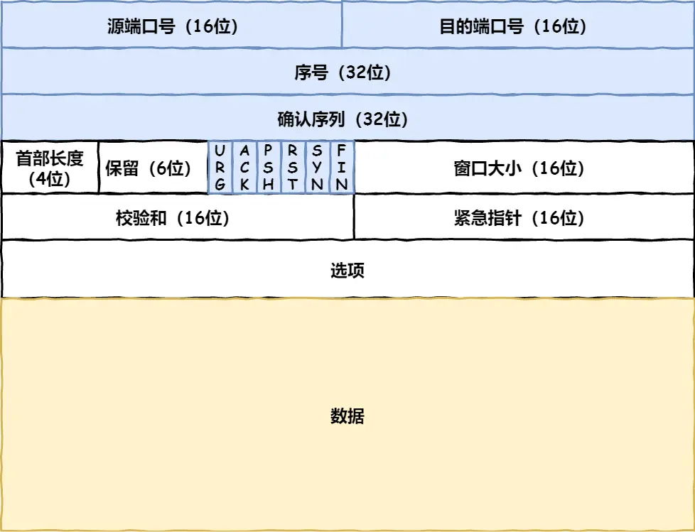
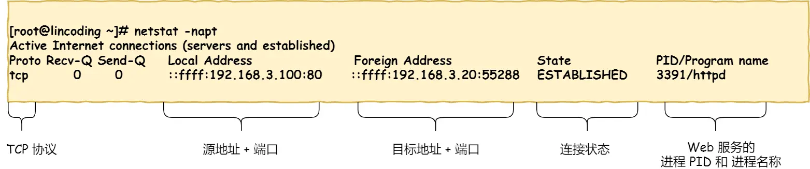
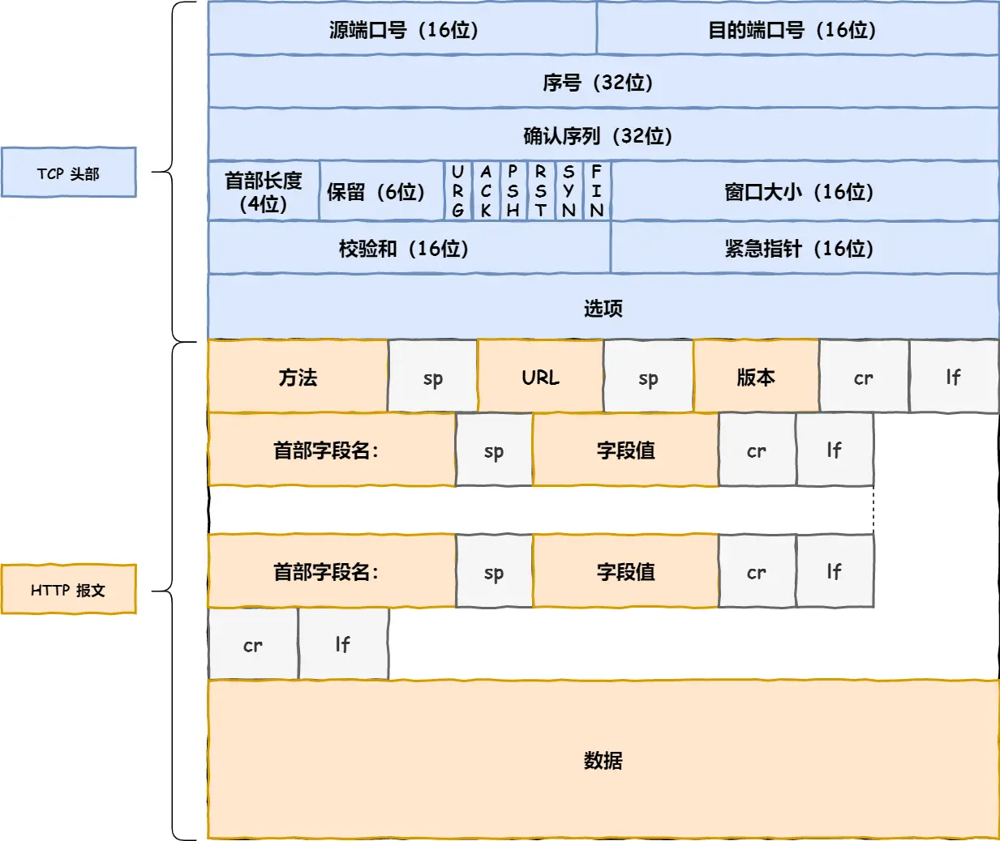
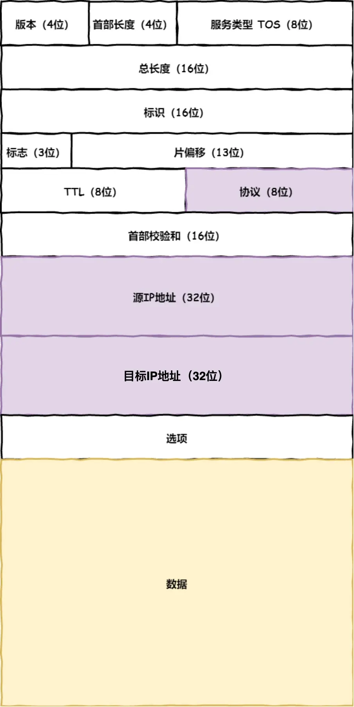
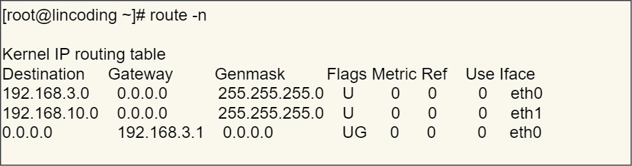
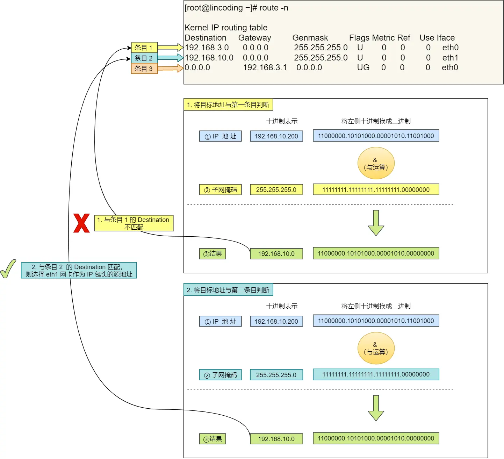
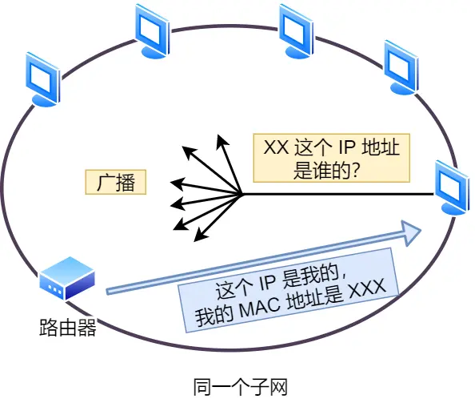
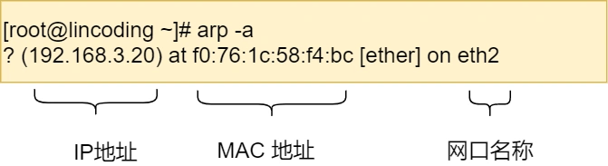
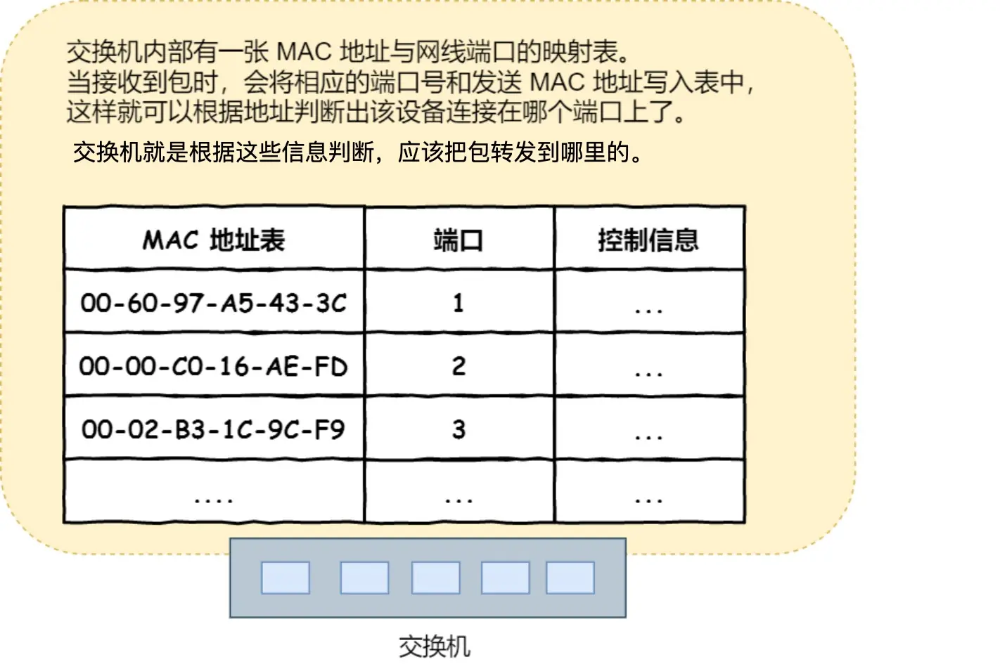

# 网址到网页

## 1.孤独小弟——HTTP

> 游览器做的第一步工作是解析URL，从而生成放松给`web`服务器的请求信息

## 2.真实地址查询——DNS

* 浏览器解析 URL 并生成 HTTP 消息后，需要委托操作系统将消息发送给 `Web` 服务器。但在发送之前，还有一项工作需要完成，那就是查询服务器域名对应的 IP 地址，因为委托操作系统发送消息时，必须提供通信对象的 IP 地址。所以，有一种服务器就专门保存了 `Web` 服务器域名与 `IP` 的对应关系，它就是 `DNS` 服务器,这类似于电话通信录

###  域名的层级关系：

  * DNS中域名都是通过句点来分隔的，句点代表了不同层级之间的界限，**越靠右的位置表示层级越高**

  * 域名的层级关系类似一个树状结构：

    * www.server.com.
    * 根 DNS 服务器（.）
    * 顶级域 DNS 服务器（.com）
    * 权威 DNS 服务器（server.com）
    * 

    * 因此，客户端只要能够找到任意一台 DNS 服务器，就可以通过它找到根域 DNS 服务器，然后再一路顺藤摸瓜找到位于下层的某台目标 DNS 服务器。

### 域名解析的工作流程

  * 客户端发出一个DNS请求，问www.server.com的IP是啥，并发给本地DNS服务器（也就是客户端的 TCP/IP 设置中填写的 DNS 服务器地址）
  * 本地域名服务器收到客户端请求后，如果缓存的表格能找到www.server.com，则直接返回IP地址，否则，本地DNS会去问他的根域名服务器
  * 根DNS收到请求后，发现后置是.com，说这个域名归.com区域管理，然后把.com顶级域名服务器地址发给本地DNS
  * 本地DNS收到后问它www.server.com的IP地址
  * 顶级域名服务器说，我给你负责 www.server.com 区域的权威 DNS 服务器的地址，你去问它
  * 于是本地DNS转问权威DNS服务器，这对应的IP是啥？server.com 的权威 DNS 服务器，它是域名解析结果的原出处。为啥叫权威呢？就是我的域名我做主
  * 权威 DNS 服务器查询后将对应的 IP 地址 X.X.X.X 告诉本地 DNS
  * 本地 DNS 再将 IP 地址返回客户端，客户端和目标建立连接
  * 
  
* 但并非每次域名解析都要经过这么多步骤，游览器会先看自己有没有对这个域名的缓存，如果有，就直接返回，没有，就去问操作系统，操作系统也会先去看自己的缓存，若果有，就直接返回，没有，就再去hosts文件看，也没有，才回去问`本地DNS服务器`

## 3.指南好帮手——协议栈

> 通过DNS获取到IP后，就可以把HTTP的传输工作交给操作系统中的协议栈
>
> 协议栈的内部分为几个部分，分别承担不同的工作。上下关系是有一定的规则的，上面的部分会向下面的部分委托工作，下面的部分收到委托的工作并执行。

* 应用程序（游览器）通过调用socket库，来委托协议栈工作。协议栈上半部分有两块，分别是收发数据的TCP和UDP协议，下面一半是用IP协议控制网络包收发操作
* IP中还包含ICMP协议和ARP协议：
  * ICMP：告知网络包传送过程中产生的错误以及各种控制信息
  * ARP：根据IP地址查询相应的以太网MAC地址

* IP下面的网卡驱动负责控制网卡硬件，最下面的网卡负责完成实际的收发操作，也就是对网线中的星号执行发送和接受数据

## 4.可靠传输——TCP

HTTP是基于TCP协议传输的，所以先了解一下TCP协议

### TCP报文头部的格式

* 首先，**源端口号**和**目标端口号**是必不可少的，如果没有，数据就不知道发给哪个应用
* 包的**序号**是为了解决包乱序的问题
* **确认号**目的是确认发出去对方是否有收到，如果没有收到就应该重新发送，知到送达，这是为了解决丢包的问题
* 接下来还有一些**状态位**。例如 `SYN` 是发起一个连接，`ACK` 是回复，`RST` 是重新连接，`FIN` 是结束连接等。TCP 是面向连接的，因而双方要维护连接的状态，这些带状态位的包的发送，会引起双方的状态变更
* **窗口大小**：TCP要做流量控制，通信双方各声明一个窗口（缓存大小），标识自己当前能够处理的能力，别发的太快，撑死我，也别太慢，饿死我
* 除了做流量控制以外，TCP还会做**拥塞控制**，对于真正的通路堵车不堵车，它无能为力，唯一能做的就是控制自己，也即控制发送的速度。不能改变世界，就改变自己嘛

### 三次握手

在HTTP传输数据前，首先要TCP建立连接，TCP连接的建立，通常称为**三次握手**

所谓的连接，是双方激素那几里维护的一个状态机，在连接建立的过程中，双方变化时序图如下：

① SYN(synchronous建立联机)

② ACK(acknowledgement 确认)

③ PSH(push传送)

④ FIN(finish结束)

⑤ RST(reset重置)

⑥ URG(urgent紧急)

* 一开始，客户端和服务端都处于`CLOSED`状态，先是服务端主动监听某个端口，处于`LISTEN`状态
* 然后客户端主动发起连接`SYN`,之后处于 `SYN-SENT` 状态
* 服务端收到发起的连接，返回 `SYN`，并且 `ACK` 客户端的 `SYN`，之后处于 `SYN-RCVD` 状态。
* 客户端收到服务端发送的 `SYN` 和 `ACK` 之后，发送对 `SYN` 确认的 `ACK`，之后处于 `ESTABLISHED` 状态，因为它一发一收成功了。
* 服务端收到 `ACK` 的 `ACK` 之后，处于 `ESTABLISHED` 状态，因为它也一发一收了。
* 所以三次握手目的是**保证双方都有发送和接收的能力**。

查看TCP的连接状态，在 Linux 可以通过 `netstat -napt` 命令查看

### TCP分割数据

如果http请求消息比较长，超过了MSS的长度，这就需要分割数据了

### TCP报文生成

TCP协议里面有两个端口，一个是游览器监听的端口（通常是随机生成的），一个是web服务器监听的端口（HTTP默认80，HTTPS默认443）

双方建立了连接后，TCP 报文中的数据部分就是存放 HTTP 头部 + 数据，组装好 TCP 报文之后，就需交给下面的网络层处理

## 5.远程定位——IP

### IP包头格式

* 源地址IP，即是客户端输出的 IP 地址；
* 目标地址，即通过 DNS 域名解析得到的 Web 服务器 IP
* 因为 HTTP 是经过 TCP 传输的，所以在 IP 包头的**协议号**，要填写为 `06`（十六进制），表示协议为 TCP

### 源IP的选择

当存在多个网卡时，在填写源地址 IP 时，就需要判断到底应该填写哪个地址，这个时候就需要根据**路由表**规则，来判断哪一个网卡作为源地址 IP

在 Linux 操作系统，我们可以使用 `route -n` 命令查看当前系统的路由表

根据上面的路由表，我们假设 Web 服务器的目标地址是 `192.168.10.200`

第三条目比较特殊，它目标地址和子网掩码都是 `0.0.0.0`，这表示**默认网关**，如果其他所有条目都无法匹配，就会自动匹配这一行。并且后续就把包发给路由器，`Gateway` 即是路由器的 IP 地址

### IP报文生成

## 6.两点传输——MAC

### MAC包头格式

MAC头部是以以太网使用的头部，它包含了接受双方的MAC地址等信息

一般在 TCP/IP 通信里，MAC 包头的**协议类型**只使用：

- `0800` ： IP 协议
- `0806` ： ARP 协议

### 获取对方的MAC地址

**发送方**的 MAC 地址获取就比较简单了，MAC 地址是在网卡生产时写入到 ROM 里的，只要将这个值读取出来写入到 MAC 头部就可以了

**接收方**的 MAC 地址需要 `ARP` 协议帮我们找到路由器的 MAC 地址

如果对方和自己处于同一个子网中，那么通过上面的操作就可以得到对方的 MAC 地址。然后，我们将这个 MAC 地址写入 MAC 头部，MAC 头部就完成了

### ARP缓存

在后续操作系统会把本次查询结果放到一块叫做 **ARP 缓存**的内存空间留着以后用，不过缓存的时间就几分钟。

也就是说，在发包时：

- 先查询 ARP 缓存，如果其中已经保存了对方的 MAC 地址，就不需要发送 ARP 查询，直接使用 ARP 缓存中的地址。
- 而当 ARP 缓存中不存在对方 MAC 地址时，则发送 ARP 广播查询

### 查看ARP缓存

在 Linux 系统中，我们可以使用 `arp -a` 命令来查看 ARP 缓存的内容

### MAC报文生成

## 7.出口——网卡

网络包只是存放在内存中的一串二进制数字信息，没办法直接发送给对方。因此，我们需要将**数字信息转换为电信号**，才能在网线上传输，也就是说，这才是真正的数据发送过程。

负责执行这一操作的是**网卡**，要控制网卡还需要靠**网卡驱动程序**。

网卡驱动获取网络包之后，会将其**复制**到网卡内的缓存区中，接着会在其**开头加上报头和起始帧分界符，在末尾加上用于检测错误的帧校验序列**。

- 起始帧分界符是一个用来表示包起始位置的标记
- 末尾的 `FCS`（帧校验序列）用来检查包传输过程是否有损坏

最后网卡会将包转为电信号，通过网线发送出去

## 8.送别者——交换机

交换机的设计是将网络包**原样**转发到目的地。交换机工作在 MAC 层，也称为**二层网络设备**

### 交换机的包接受操作

* 首先，电信号到达网线接口，交换机里的模块进行接收，接下来交换机里的模块将电信号转换为数字信号
* 然后通过包末尾的 `FCS` 校验错误，如果没问题则放到缓冲区
* 计算机的网卡本身具有 MAC 地址，并通过核对收到的包的接收方 MAC 地址判断是不是发给自己的，如果不是发给自己的则丢弃；相对地，交换机的端口不核对接收方 MAC 地址，而是直接接收所有的包并存放到缓冲区中。因此，和网卡不同，**交换机的端口不具有 MAC 地址**
* 将包存入缓冲区后，接下来需要查询一下这个包的接收方 MAC 地址是否已经在 MAC 地址表中有记录了
* 交换机的 MAC 地址表主要包含两个信息：
  - 一个是设备的 MAC 地址
  - 另一个是该设备连接在交换机的哪个端口上

### MAC 地址表找不到指定的 MAC 地址

* 可能是因为具有该地址的设备还没有向交换机发送过包，或者这个设备一段时间没有工作导致地址被从地址表中删除了
* 这种情况下，交换机无法判断应该把包转发到哪个端口，只能将包转发到除了源端口之外的所有端口上，无论该设备连接在哪个端口上都能收到这个包，发送之后目设备会做出响应，只要返回了响应包，交换机就可以把他的地址写入MAC地址表，下次就不用发送到所有的端口了
* 如果接收方MAC地址是一个广播地址，那么交换机就会把包发送到除源端口之外的所有端口
* 以下两个属于广播地址：
  - MAC 地址中的 `FF:FF:FF:FF:FF:FF`
  - IP 地址中的 `255.255.255.255`

## 9.出境的大门——路由器

### 路由器与交换机的区别

* 网络包经过交换机之后，现在到达了**路由器**，并在此被转发到下一个路由器或目标设备。

* 这一步转发的工作原理和交换机类似，也是通过查表判断包转发的目标

* 不过在具体的操作过程上，路由器和交换机是有区别的。
  - 因为**路由器**是基于 IP 设计的，俗称**三层**网络设备，路由器的各个端口都具有 MAC 地址和 IP 地址；
  - 而**交换机**是基于以太网设计的，俗称**二层**网络设备，交换机的端口不具有 MAC 地址。

### 路由器基本原理

* 路由器的端口具有 MAC 地址，因此它就能够成为以太网的发送方和接收方；同时还具有 IP 地址，从这个意义上来说，它和计算机的网卡是一样的

* 当转发包时，首先路由器端口会接收发给自己的以太网包，然后**路由表**查询转发目标，再由相应的端口作为发送方将以太网包发送出去

### 路由器的包接受工作

- 首先，电信号到达网线接口部分，路由器中的模块会将电信号转成数字信号，然后通过包末尾的 `FCS` 进行错误校验。
- 如果没问题则检查 MAC 头部中的**接收方 MAC 地址**，看看是不是发给自己的包，如果是就放到接收缓冲区中，否则就丢弃这个包。
- 总的来说，路由器的端口都具有 MAC 地址，只接收与自身地址匹配的包，遇到不匹配的包则直接丢弃

### 查询路由表确定输出端口

* 完成包接收操作后，路由器就会去掉包开头的MAC头部

* MAC头部的作用就是将包送达路由器，其中的接收方MAC地址就是路由器端口的MAC地址

* 接下来，路由器会根据MAC头部后方的IP头部中的内容进行包的转发操作

* 转发操作的几个步骤：

   

  * 首先查询**路由表**判断转发目标

  * 具体的工作流程根据上图，举个例子。

    假设地址为 `10.10.1.101` 的计算机要向地址为 `192.168.1.100` 的服务器发送一个包，这个包先到达图中的路由器。

    判断转发目标的第一步，就是根据包的接收方 IP 地址查询路由表中的目标地址栏，以找到相匹配的记录。

    路由匹配和前面讲的一样，每个条目的子网掩码和 `192.168.1.100` IP 做 **& 与运算**后，得到的结果与对应条目的目标地址进行匹配，如果匹配就会作为候选转发目标，如果不匹配就继续与下个条目进行路由匹配。

    如第二条目的子网掩码 `255.255.255.0` 与 `192.168.1.100` IP 做 **& 与运算**后，得到结果是 `192.168.1.0` ，这与第二条目的目标地址 `192.168.1.0` 匹配，该第二条目记录就会被作为转发目标。

    实在找不到匹配路由时，就会选择**默认路由**，路由表中子网掩码为 `0.0.0.0` 的记录表示「默认路由」

### 路由器的发送操作

首先，我们需要根据**路由表的网关列**判断对方的地址。

- 如果网关是一个 IP 地址，则这个IP 地址就是我们要转发到的目标地址，**还未抵达终点**，还需继续需要路由器转发。
- 如果网关为空，则 IP 头部中的接收方 IP 地址就是要转发到的目标地址，也是就终于找到 IP 包头里的目标地址了，说明**已抵达终点**。

知道对方的 IP 地址之后，接下来需要通过 `ARP` 协议根据 IP 地址查询 MAC 地址，并将查询的结果作为接收方 MAC 地址。

路由器也有 ARP 缓存，因此首先会在 ARP 缓存中查询，如果找不到则发送 ARP 查询请求。

接下来是发送方 MAC 地址字段，这里填写输出端口的 MAC 地址。还有一个以太类型字段，填写 `0800` （十六进制）表示 IP 协议。

网络包完成后，接下来会将其转换成电信号并通过端口发送出去。这一步的工作过程和计算机也是相同的。

发送出去的网络包会通过**交换机**到达下一个路由器。由于接收方 MAC 地址就是下一个路由器的地址，所以交换机会根据这一地址将包传输到下一个路由器。

接下来，下一个路由器会将包转发给再下一个路由器，经过层层转发之后，网络包就到达了最终的目的地。

在网络包传输的过程中，**源 IP 和目标 IP 始终是不会变的，一直变化的是 MAC 地址**，因为需要 MAC 地址在以太网内进行**两个设备**之间的包传输。

> 数据包通过多个路由器道友的帮助，在网络世界途经了很多路程，最终抵达了目的地的城门！城门值守的路由器，发现了这个小兄弟数据包原来是找城内的人，于是它就将数据包送进了城内，再经由城内的交换机帮助下，最终转发到了目的地了。数据包感慨万千的说道：“多谢这一路上，各路大侠的相助！”

## 10.互相扒皮——服务器与客户端

数据包抵达了服务器，服务器高兴的不得了，于是开始扒数据包的皮

- 数据包抵达服务器后，服务器会先扒开数据包的 MAC 头部，查看是否和服务器自己的 MAC 地址符合，符合就将包收起来。
- 接着继续扒开数据包的 IP 头，发现 IP 地址符合，根据 IP 头中协议项，知道自己上层是 TCP 协议。
- 于是，扒开 TCP 的头，里面有序列号，需要看一看这个序列包是不是我想要的，如果是就放入缓存中然后返回一个 ACK，如果不是就丢弃。TCP 头部里面还有端口号， HTTP 的服务器正在监听这个端口号。
- 于是，服务器自然就知道是 HTTP 进程想要这个包，于是就将包发给 HTTP 进程。
- 服务器的 HTTP 进程看到，原来这个请求是要访问一个页面，于是就把这个网页封装在 HTTP 响应报文里。
- HTTP 响应报文也需要穿上 TCP、IP、MAC 头部，不过这次是源地址是服务器 IP 地址，目的地址是客户端 IP 地址。
- 穿好头部衣服后，从网卡出去，交由交换机转发到出城的路由器，路由器就把响应数据包发到了下一个路由器，就这样跳啊跳。
- 最后跳到了客户端的城门把守的路由器，路由器扒开 IP 头部发现是要找城内的人，于是又把包发给了城内的交换机，再由交换机转发到客户端。
- 客户端收到了服务器的响应数据包后，同样也非常的高兴，客户能拆快递了！
- 于是，客户端开始扒皮，把收到的数据包的皮扒剩 HTTP 响应报文后，交给浏览器去渲染页面，一份特别的数据包快递，就这样显示出来了！
- 最后，客户端要离开了，向服务器发起了 TCP 四次挥手，至此双方的连接就断开了
