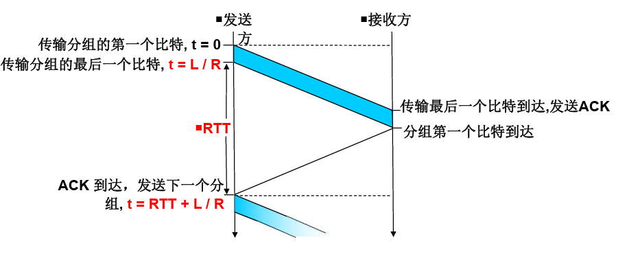
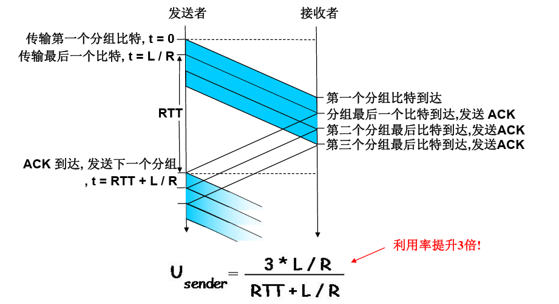
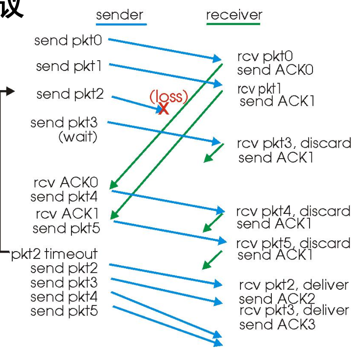
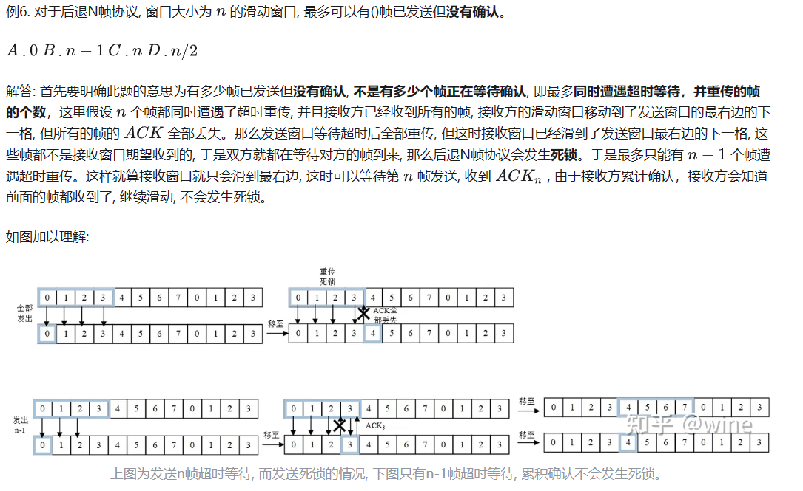
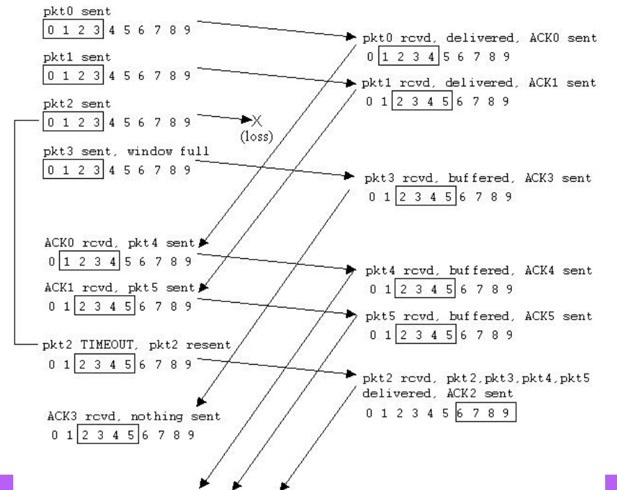

# 可靠传输协议

> 由于数据在传输过程中, 由于信道受干扰等各种原因, 发送方发送的数据可能会中途丢失、出错。造成发送的数据与收到的数据顺序或内容不一致, 由此我们制定一系列协议, **保证接收到的数据与发送的内容一致**, 这就是可靠传输
>
> 可靠传输协议在数据链路层和运输层均有提及。其中, 数据链路层是指对**帧**的可靠传输, 运输层是指对**TCP分组**的可靠传输, 两者在细节上有些差别, 但大致分项相同
>
> 一般情况下，有线链路的误码率比较小，不要求数据链路层向上提供可靠传输服务，即使有误码，问题也由上层解决。无线链路容易受干扰，因此要求提供可靠传输服务

## 1.停止等待协议 SW

* 原理：停止—等待协议就是当发送发发送一段数据后，会停下来等到接收方返回消息，确认收到(ACK或NAK)或没有收到数据(超时重传)

* 出现差错的情况：

  * 超时重传（针对发送方出现差错的情况）：
    * 发送方发送过程中数据丢失或差错, 此时接收方不会收到数据帧或者丢弃收到的数据帧, 总之,接收方不会发送确认
    *  发送方会一直等待, 但**不会超过设置的等待时间（通常会设置一个超时计时器，其值应略大于从发送方到接收方的平均往返时间）**，发送方重传该数据帧

  * 确认丢失和确认迟到（针对接收方出现差错的情况）：
    * 确认丢失：若接收方在回复确认时确认出现丢失, 则发送方会一直等待, 也不会超过设置的等待时间。发送方重传该数据帧。且接收方**会丢掉重复的数据帧。重传ACK确认**
    * 确认迟到：若接受方在回复确认时确认很久才到, 则发送方也会一直等待, 同样也不会超过设置的等待时间。发送方重传该数据帧，重传将是冗余的，但序号的使用已经处理了该情况 ，接收方必须定义被确认的分组序号。且接收方**也会丢掉重复的数据帧。重传ACK确认。**于是接收方正常收到来自重传的确认, 但是后面又收到迟到的相同的确认,A **收下但什么也不做。**

  * 若接收方检测到误码，则丢弃该分组，并给发送方发送否认分组，简称为**NAK**，发送方收到对所发送数据分组的否认分组后，立刻重传该数据分组。**发送方发送一个数据分组后，并不能立刻将该分组从缓存中删除，只有在收到针对该数据分组的确认分组后，才能将其从缓存中删除，并发送下一个分组**

* “往返时延”（Round-Trip Time）：RTT为两倍的传播时延

* 利用率 $U_{sender}$​​：发送方用于 发送时间 的比率

  由公式可知信道的利用率比较低
  $$
  U_{sender}=\frac{L/R}{RTT+L/R}
  $$

## 2.流水线协议

发送方允许发送多个、“传输中的”,还没有应答的报文,提高资源利用率

* 序号的范围必须增加  
* 发送方和/接收方设有缓冲

（下图假设ACK长度为0）

### 2.1 回退N帧法 Go-Back-N(GBN)

* 发送方：
  * 窗口大小$1\le W_{T} \le 2^{n}-1$
* 接收方：
  * 窗口大小$W_{R}=1$​

### 2.2 选择性重传 Selective Repeat (SR)

解决GBN的不必要重传问题，发送方只需要重传没有收到ACK的分组，但接收方要确定每个ACK

$发送方窗口大小 \le 2^{n-1}$​

* 发送窗口大小 = 接收窗口大小
* 发送窗口大小 + 接收窗口大小 <= 2^n

