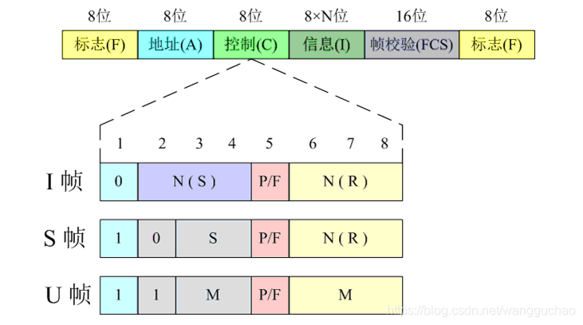
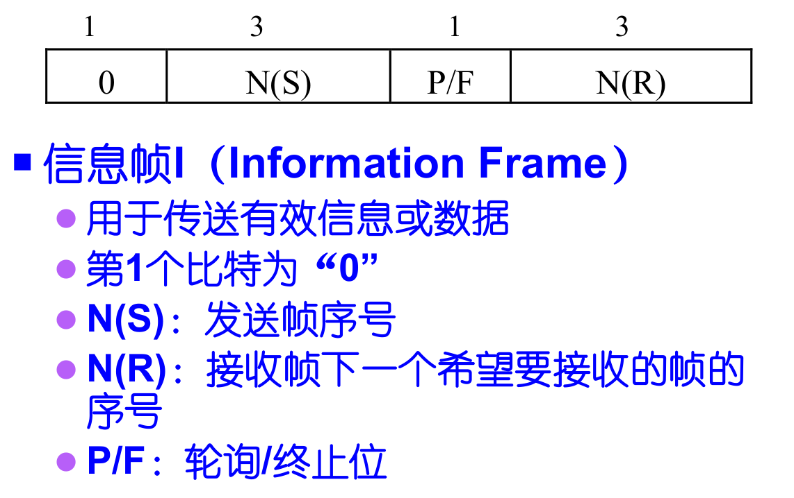
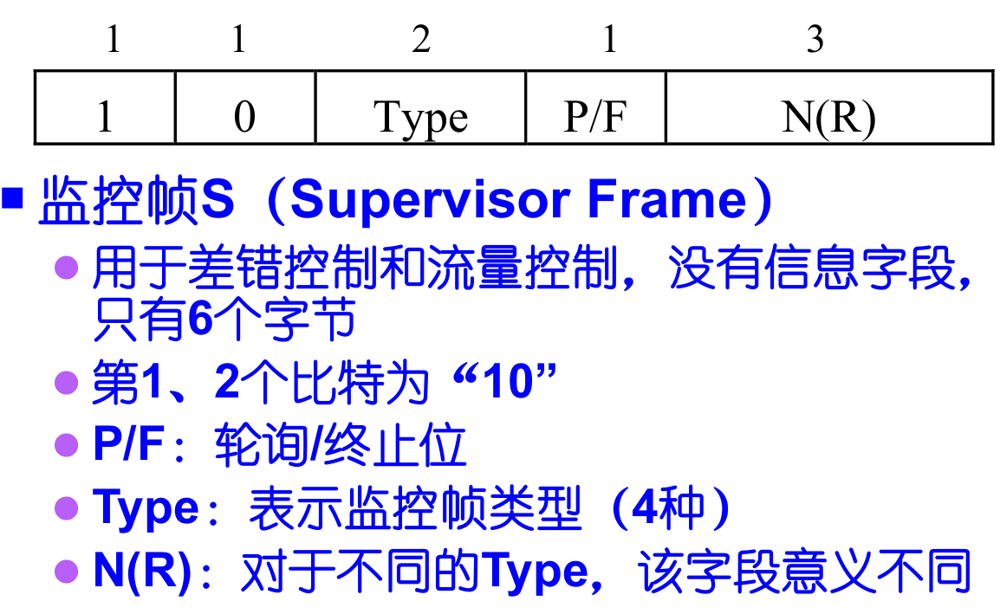
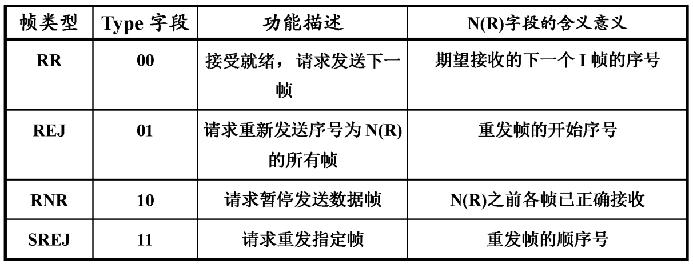
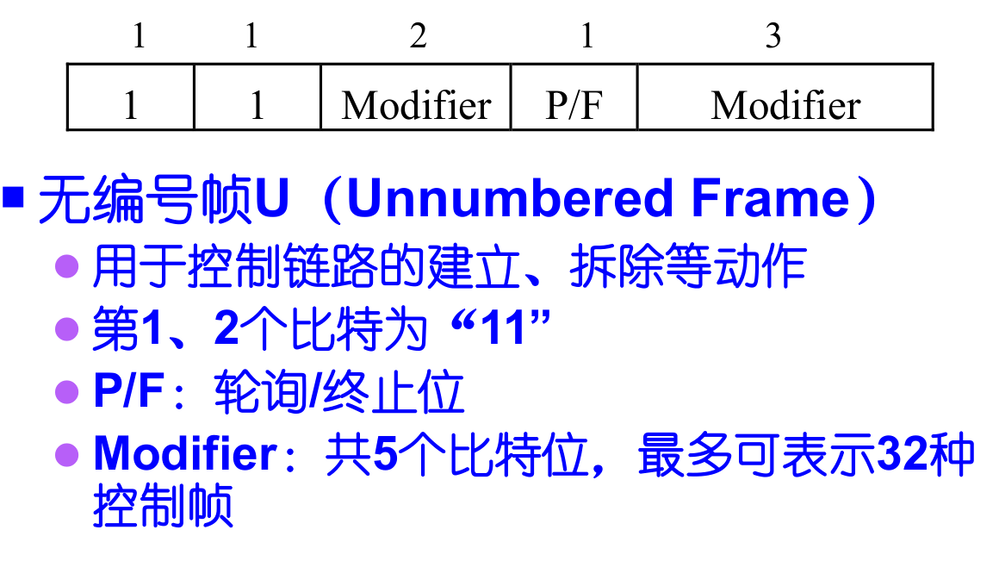

# HDLC协议

> High-level Data Link Control,高级数据链路控制，简称HDLC,是一种面向比特的链路层协议。使用点到点链路连接，只支持同步传输线路，既可工作在点到点线路方式，也可工作在点到多点线路方式，既适用于半双工线路，也适用于全双工线路，用于广域网中的传输

## 1.HDLC帧格式

最小数据帧的设计原因和以太网电缆长度有关，为的是让两个相距最远的站点能够感知到双方的数据发生了碰撞;最远两端数据的往返时间就是争用期，以太网的争用期是51.2微妙，正好发送64byte数据

## 2.HDLC帧控制字段

### 2.1 信息帧I（Information frame）

### 2.2 监控帧S （Supervisor frame）

### 2.3 无编号帧U （Unnumbered frame）

