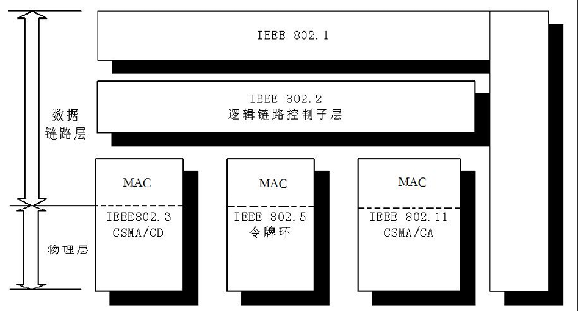

# 局域网参考模型

## 1.局域网特点

* 覆盖范围小：<25km
* 高传输速率
* 低误码率
* 一个单位拥有，一般不对外提供服务

## 2.参考模型

## 3.LAN的数据链路层

### 3.1 逻辑链路控制子层(Logical Link Control,   LLC）

* 与硬件和拓扑无关
* 建立/释放逻辑连接，差错控制，帧序号处理， 保证站点之间的数据传输的正确性

### 3.2 介质访问子层(Media  Access  Control,   MAC)

* 与硬件和拓扑相关，一般封装在网卡中
* 成帧/拆帧， 寻址，解决多个站点对共享信道的 访问问题