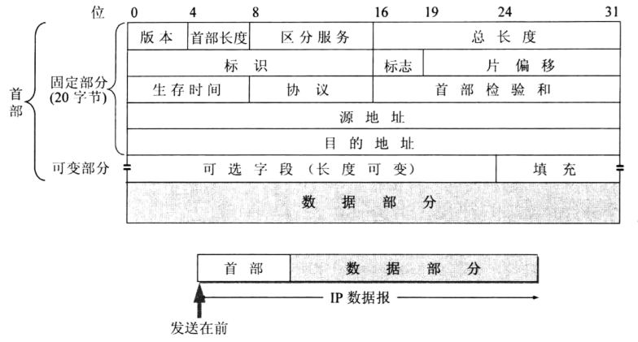

# IP报文

## 1.字段解释

* 版本：IP协议的版本号，为一个四位字段，常用的版本为 IPV4 和 IPV6
* 头部长度：最小**20字节**，最大60字节（一定是4字节的整数倍）
* 服务类型：实际上一直未被使用过
* 总长度：指**首部和数据之和的长度**，单位为字节，因此数据报的最大长度为 65535 字节。总长度必须不超过最大传送单元 MTU（最大传输单元MTU（Maximum Transmission Unit，MTU，数据链路层提供给上层的最大一次传输数据的大小），是指网络能够传输的最大数据包大小，以字节为单位）
* 标识：用于判断分片属于哪个分组
* **标志**：占3位，只有2位有意义
* **分片偏移：用来说明分片后某片在原分组中的相对位置（偏移量以8字节为单位**）
* 生存期：用于限制分组生命周期的计时器 **TTL** (Time To Live)，是数据报可经过的路由器数量的上限。发送方在初始发送时设定某个值（建议为64,、128或255），每台路由器再转发时都将其减一，当字段达到0时，该数据报被丢弃，并使用一个ICMP消息通知发送方
* 协议：表明IP 数据报中的数据部分所使用的的协议类型，TCP/UDP/IPv6
* 头部校验和：仅对头部进行校验
* 源地址
* 目的地址
* 选项：用于扩充协议功能。例如安 全性，记录路由，时间戳等 , 可选

## 2.IP分片和重组

### 2.1 背景

在一个异构的网络集合中，每种网络技术都定义了自己分组的大小，不同的链路层有不同的**MTU**（最大传输单元）：

* 以太网分组最大长度可为 1500字节
* FDDI 分组最大长度可为 4500字节 
* ATM 的信元固定为 48 字节

### 2.2 策略

当 IP 数据报对某一网络技术来说太大时，提供一种方法将分组分片和重组

* 当 MTU < Datagram 时，需要进行分片 
* 尽可能避免在源主机上进行分片，一般是在连接两个网络的路由器上进行分片
* 数据报在多个网络中传递时，有可能被再次分片，分片成的每个分组都是一个独立的 IP 数据报
*  **在目的主机上进行分片的重组，而不是在路由器上进行重组** 
* IP 不恢复丢失的分片

### 2.3 IP报文中的标志段

占 3 位：

* 第一位未使用，其值为 0
* 第二位称为 DF（不分片Don't Fragment）：
  * 取值为 1 时，表示不可分片
  * 取值为 0 时，表示可分片
* 第三位称为 MF（更多分片More Fragment）：表示是否还有分片正在传输
  * 设置为 0 时，表示没有更多分片需要发送，也就是最后的分组片
  * 设置为 1时，表示不是最后的分组片

> - 当DF位被设置为1时，表示数据包在传输过程中不允许被分片。如果数据包的大小超过了网络的最大传输单元（MTU），那么数据包将被丢弃，并且发送一个ICMP消息给发送方，告知其数据包过大无法传输。
> - 当DF位被设置为0时，表示数据包在传输过程中可以被分片。如果数据包的大小超过了MTU，中间的路由器会将数据包分割成更小的片段，以便它们能够通过网络。
>
> DF位的主要作用是确保数据包的完整性，特别是对于某些需要保持数据包完整性的应用，如视频会议或实时音频传输。然而，如果网络中存在MTU限制，设置DF位可能会导致数据包丢失，因此需要谨慎使用。
