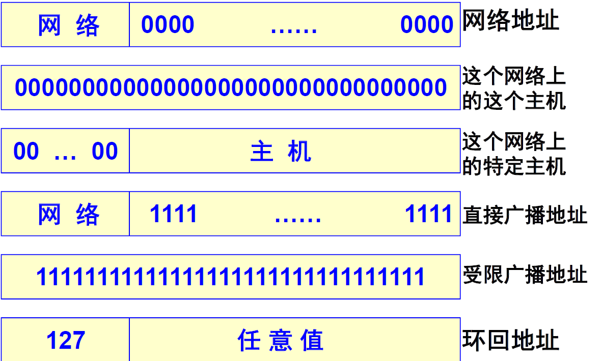
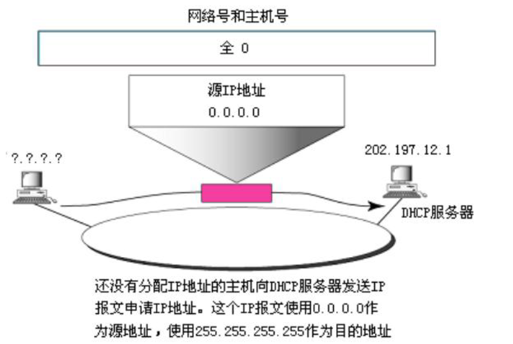

# IP地址

## 1.IP地址分级

分为**网络地址**和**主机地址**两个层次，好处：

* 对外：IP地址管理机构在分配IP地址时只分配网络号，剩下的主机号单位自行分配，这方便了IP地址的管理
* 对内：路由器仅根据目的主机所连接的网络号来转发分组

## 2.IP地址格式

> 共有A，B，C，D，E五类地址，只有前三类地址才分为网络号和主机号两部分地址
>
> 对于常见的localhost，其实是一个域名，默认指向127.0.0.1，但是是可以修改的

### 2.1 A类地址

* 范围：1.0.0.0~127.255.255.255
* 特殊用途地址：
  * 0.x.y.z：0.0.0.0并不是一个真实的的IP地址，它表示本机中所有的IPV4地址，监听0.0.0.0，就表示监听本机中所有的IP端口
  * 10.x.y.z：常用于局域网
  * 127.x.y.z：**回环地址（Loop back address）**，其所在的回环接口一般被理解为虚拟网卡，并不是真正的路由器接口，也就是说发送的数据包主机自己接收传不出去
* 数量：可用的A类网络有$2^7-2$个，每个网络可容纳$2^{24}-2$个
* 应用：A类地址分配给规模特别大的网络使用

### 2.2 B类地址

* 范围：128.0.0.0~191.255.255.255
* 数量：其中172.16~172.31共16块地址作为私有地址，可分配的B类网络有$2^{14}-16$个，，每个网络可容纳$2^{16}-2$个
* 应用：B类地址一般分配给中性网络

### 2.3 C类地址

* 范围：192.0.0.0~223.255.255.255
* 其中192.168.0~192.168.255共256块地址 作为私有地址
* 数量：可分配的C类网络有$2^{21}-256$个，每个网络可容纳$2^{8}-2$个
* 应用：C类地址一般分配给小型网路，如一般的局域网和校园网，它连接的主机数量比较少，把用户分为若干段进行管理

### 2.4 D类地址

* 范围：224.0.0.0~239.255.255.255
* 不分网络号和主机号，只有一块， 用于分配给指定的通信组

### 2.5 E类地址

* 范围：240.0.0.0~247.255.255.255
* 地址不分网络号和主机号，只有一块， 作为保留地址

## 3.特殊的IP地址

* 主机号全0，用于表示网络地址，主要用于路由器查找路由表
* 主机号全1，直接广播地址
* 127.x.y.z，环回地址
  * 当主机号与网络号全1时，即255.255.255.255，表示使用受限广播地址（计算机不知道自己IP地址的时候）向本网络所有主机发送IP报文，路由器会组织这种报文使其只限于本地网络

## 4.私有地址和NAT

IP地址分为共有地址和私有地址，共有地址由IANA统一分配，用于连接互联网；私有地址可以自由分配，用于私有网络内部通信

私有地址：

| 类 | 网络号                   | 地址块 |
| -- | ------------------------ | ------ |
| A  | 10                       | 1      |
| B  | 172.16 ～ 172.31         | 16     |
| C  | 192.168.0 ～ 192.168.255 | 256    |

* NAT（Network Address Translation，网络地址转换）
* NAT的主要作用：解决IP地址数量紧缺。当大量的内部主机只能使用少量的合法的外部地址，就可以使用NAT把内部地址转化成外部地址。NAT还可以防止外部主机攻击内部主机（或服务器）
* 报文离开私网进入Internet时，将源IP替换为公网地址，通常是出口设备的接口地址。一个对外的访问请求在到达目标以后，表现为由本组织出口设备发起，因此被请求的服务端可将响应由Internet发回出口网关。出口网关再将目的地址替换为私网的源主机地址，发回内部，NAT网关也维护着一张NAT映射表
* 网络被分为私网和公网两个部分，NAT网关设置在私网到公网的路由出口位置，双向流量必须都要经过NAT网关
* **一般使用私网ip作为局域网内部的主机标识，使用公网ip作为互联网上通信的标识**
* **网络访问只能先由私网侧发起，公网无法主动访问私网主机**
