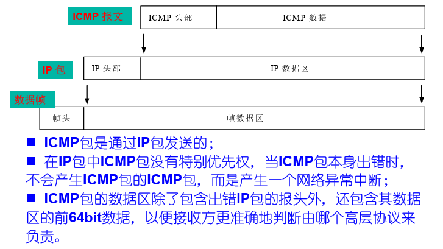
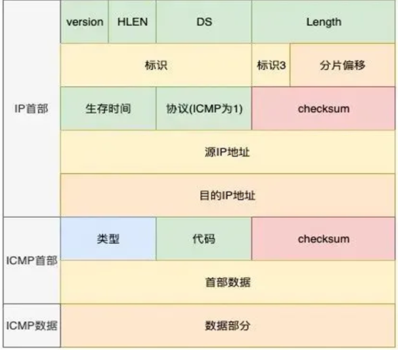

# ICMP协议

>  Internet Control Message Protocol 的缩写，即网络控制消息协议

## 1.概述

由于 IP 层不提供可靠传输，如果包丢了，当通信介质或路由器出现故障、目的端主机不可到达、 报文生存定时器超时、路由器或通信线路拥塞等问题出现时， IP 包都无法正常到达目的主机，因为IP协议并不能通知传输层是否丢包以及丢包的原因，故源主机却无法判断发送失败的原因，故需要使用ICMP

TYPE占一字节，CODE占一字节

| TYPE | CODE | Description                                                  | Query | Error |
| ---- | ---- | ------------------------------------------------------------ | ----- | ----- |
| 0    | 0    | Echo Reply——回显应答（Ping应答）                             | x     |       |
| 3    | 0    | Network Unreachable——网络不可达                              |       | x     |
| 3    | 1    | Host Unreachable——主机不可达                                 |       | x     |
| 3    | 2    | Protocol Unreachable——协议不可达                             |       | x     |
| 3    | 3    | Port Unreachable——端口不可达                                 |       | x     |
| 3    | 4    | Fragmentation needed but no frag. bit set——需要进行分片但设置不分片比特 |       | x     |
| 3    | 5    | Source routing failed——源站选路失败                          |       | x     |
| 3    | 6    | Destination network unknown——目的网络未知                    |       | x     |
| 3    | 7    | Destination host unknown——目的主机未知                       |       | x     |
| 3    | 8    | Source host isolated (obsolete)——源主机被隔离（作废不用）    |       | x     |
| 3    | 9    | Destination network administratively prohibited——目的网络被强制禁止 |       | x     |
| 3    | 10   | Destination host administratively prohibited——目的主机被强制禁止 |       | x     |
| 3    | 11   | Network unreachable for TOS——由于服务类型TOS，网络不可达     |       | x     |
| 3    | 12   | Host unreachable for TOS——由于服务类型TOS，主机不可达        |       | x     |
| 3    | 13   | Communication administratively prohibited by filtering——由于过滤，通信被强制禁止 |       | x     |
| 3    | 14   | Host precedence violation——主机越权                          |       | x     |
| 3    | 15   | Precedence cutoff in effect——优先中止生效                    |       | x     |
| 4    | 0    | Source quench——源端被关闭（基本流控制）                      |       |       |
| 5    | 0    | Redirect for network——对网络重定向                           |       |       |
| 5    | 1    | Redirect for host——对主机重定向                              |       |       |
| 5    | 2    | Redirect for TOS and network——对服务类型和网络重定向         |       |       |
| 5    | 3    | Redirect for TOS and host——对服务类型和主机重定向            |       |       |
| 8    | 0    | Echo request——回显请求（Ping请求）                           | x     |       |
| 9    | 0    | Router advertisement——路由器通告                             |       |       |
| 10   | 0    | Route solicitation——路由器请求                               |       |       |
| 11   | 0    | TTL equals 0 during transit——传输期间生存时间为0             |       | x     |
| 11   | 1    | TTL equals 0 during reassembly——在数据报组装期间生存时间为0  |       | x     |
| 12   | 0    | IP header bad (catchall error)——坏的IP首部（包括各种差错）   |       | x     |
| 12   | 1    | Required options missing——缺少必需的选项                     |       | x     |
| 13   | 0    | Timestamp request (obsolete)——时间戳请求（作废不用）         | x     |       |
| 14   |      | Timestamp reply (obsolete)——时间戳应答（作废不用）           | x     |       |
| 15   | 0    | Information request (obsolete)——信息请求（作废不用）         | x     |       |
| 16   | 0    | Information reply (obsolete)——信息应答（作废不用）           | x     |       |
| 17   | 0    | Address mask request——地址掩码请求                           | x     |       |
| 18   | 0    | Address mask reply——地址掩码应答                             |       |       |

## 2.主要作用

- 确认IP包是否成功到达目标地址

- 通知在发送过程中IP包被丢弃的原因

  

## 3.ICMP协议实现--ping/traceroute

* ping：**查询报文**的应用，验证网络的连通性，统计响应时间和TTL(Time-To-Live(生存时间值)，该字段指定IP包被路由器丢弃之前允许通过的最大网段数量，即当一个ip数据包每经过一个路由器时，该TTL的值就会减1。ping locahost可以看到本机系统TTL的默认开始值，不同系统一般不同)
  1. 向目的服务器执行ping命令，发送回显请求(主机回构建一个ICMP回显请求消息数据包)
  2. 目的服务器发送回显应答
  3. 源服务器显示相关数据
* traceroute：**差错报文**的应用（win下是tracert），用来显示IP数据包所走的路径（经过的设备） 