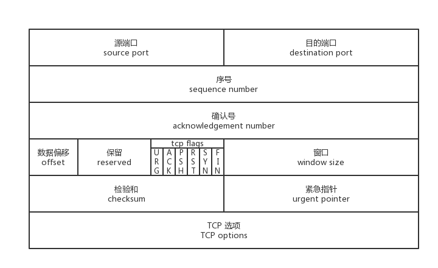
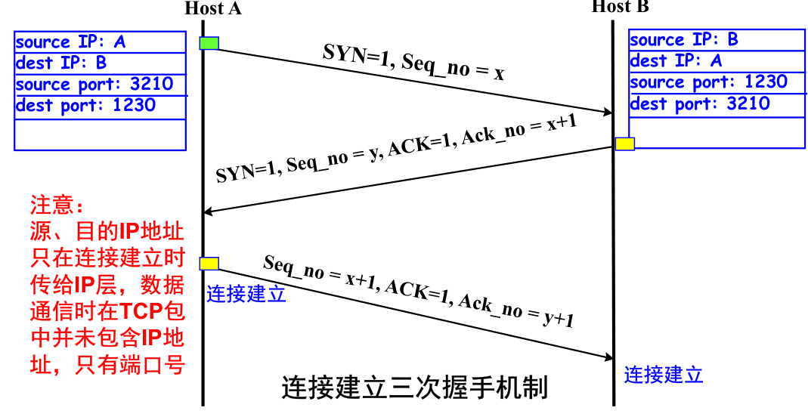
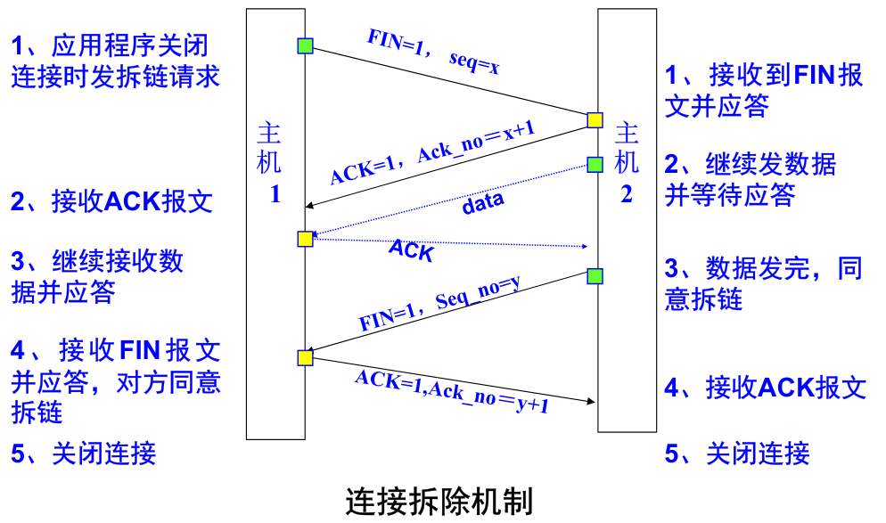
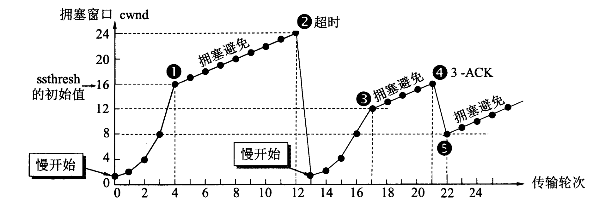

# TCP协议

> *Transmission Control Protocol* 

## 1.服务特性

* 面向连接服务
* 全双工通信
* 支持报文分组
* 支持报文差错控制，顺序控制，应答与重传机制
* 提供**流量控制**（不会淹没接收方）
* 提供**报文拥塞控制**（不会淹没路由器）

## 2.TCP报文格式

* 源端口：16bit
* 目的端口：16bit
* **seq序号**：4bytes，表示**本报文段所发送数据的第一个字节在发送方本次连接上发送数据流中的位置**（以字节编号）。在TCP连接建立时，双方各自随机选择一个初始序列号（ISN）。随后**传输的每个报文段的序号将基于这个初始值递增，其增量为该报文段所携带的数据量（字节数）**

> 例如，如果一个报文段被赋予了序号100，并且它包含100字节的数据，那么这个报文段就代表了从序号100到199的数据。随后的报文段将继续这个序列。继续上面的例子，下一个报文段可能会开始于序号200，如果它包含50字节的数据，那么它就代表了从序号200到249的数据

* **ack确认号**：4bytes，表示已确认收到的数据序号，告诉对方希望**下一次接受的字节序号**。当接收端接收到 TCP 包并检验确认后，将发送序号加上数据长度产生一个确认序号，附在下一个数据包中捎带给对方或送出专门的确认包，这样发送端就知道刚才的包已经被成功接收到了

* 数据偏移：表示TCP报文头部的长度

* 保留：6位保留未用

* 标志位

  | 名称 | 说明                                                         |
  | ---- | ------------------------------------------------------------ |
  | URG  | 表示本报文段中发送的数据是否包含紧急数据：URG=1 时表示有紧急数据。当 URG=1 时，后面的紧急指针字段才有效 |
  | ACK  | 表示前面的确认号字段是否有效：ACK=1 时表示有效；只有当 ACK=1 时，前面的确认号字段才有效；TCP 规定，连接建立后，ACK 必须为 1 |
  | PSH  | 告诉对方收到该报文段后是否立即把数据推送给上层。如果值为 1，表示应当立即把数据提交给上层，而不是缓存起来 |
  | RST  | 表示是否重置连接：若 RST=1，说明 TCP 连接出现了严重错误（如主机崩溃），必须释放连接，然后再重新建立连接 |
  | SYN  | 在建立连接时使用，用来同步序号：当 SYN=1，ACK=0 时，表示这是一个请求建立连接的报文段；当 SYN=1，ACK=1 时，表示对方同意建立连接；SYN=1 时，说明这是一个请求建立连接或同意建立连接的报文；只有在前两次握手中 SYN 才为 1 |
  | FIN  | 标记数据是否发送完毕：若 FIN=1，表示数据已经发送完成，并请求释放连接 |

* 窗口大小：表示当前报文发送者接受窗口（接收缓冲区还剩多少）的大小，单位一般为字节

* 校验和：checksum=伪头+TCP头+TCP数据（与UDP一样，也有一个IP伪头部）

* 紧急指针：仅在URG标志位开启时有效，紧急指针会指示出紧急数据所在位置

## 3.数据分段与重组

* 分段：

  当用户数据（如一个1GB文件）超过IP包数据区 的最大限制（64KB）时，在发送端必须对用户数据 进行分段，把每一段封装到TCP报文中(不超过 64KB)，并交给IP层发送

* 分段的重组：

  由于IP层采用的是数据报方式通信，由于路由选择 的动态性，因此，同一个用户的多个数据段可能不会 同时到达，甚至不能按发送先后顺序到达，为了保证 TCP连接的可靠性，在接收端必须对TCP报文按发送 顺序号进行报文重组，然后再交给上层协议

## 4.TCP的可靠传输

> TCP提供面向连接的字节流传输，在进行数据传输前，双方必须先建立一条连接，TCP连接是全双工（同时进行双向传输）和端到端的（每个连接只有两个端点，TCP不支持组播或全广播）

### 4.1 三次握手

### 4.2 四次挥手

### 4.3 数据报文的确认

为了保证数据传输报文的可靠，发送方必须把已发送的数据暂时保留在缓冲区，收到接收方的应答后才能删除，TCP提供的是字节流的通信，故采用的是**字节确认**

### 4.4 数据报文的超时和重传

* 为了保证数据报文的可靠传输，发送放必须把已发送的数据暂时保留在缓冲区，并为之启动一个超时定时器
* 在超时之前收到对方的应答消息，则释放该数据报文占用的缓冲区
* 超时，则重传数据报，直到收到应答或超过最大重传次数终止

## 5.TCP的流量控制

> 是一种接收方针对发送方来讲的机制，利用window来说明接收方能接受字节的大小，如果发送方的发送速率太快，可能会导致接收方来不及接收和处理数据。swnd，rwnd。

滑动窗口协议：

* 利用一个可变的窗口参数来说明接收方可以接受的字节大小
* 发送方根据窗口大小确定数据的发送量
* 极端情况下，接收方使用0来停止数据发送

坚持定时器：

* 当发送方收到窗口值为0的通告时，启用坚持定时器
* 若坚持定时器超时，则发送方发送一个字节的探测报文
* 坚持定时器的宽度通常和重传定时器的宽度相同

保活定时器：

* 当TCP连接出现长时间空闲时，启用保活定时器,通常设置为两小时
* 若超时还没有收到对方的消息，就不断发送探测报文
* 若发送了10个探测报文仍没有响应，则终止TCP连接

## 6.TCP的拥塞控制

* 拥塞现象：主机发送的数据流超过了路由器的承受能力，从而引起数据报文严重延时的现象
* **拥塞窗口cwnd**（congestionwindow）：发送发一次可以发送的有效数据量 (swnd = min(cwnd, rwnd))
* 慢启动阈值ssthresh：确定当前发送方是进入慢启动阶段还是拥塞避免阶段，**取值为最大拥塞窗口值的一半**

* 控制机制：
  * **慢启动**：在新建立连接以及超时重传时，仅以1个报文作为拥塞窗口的初始值，之后每当收到一个确认，将窗口值加大1倍（指数性增长）
  * **拥塞避免**：拥塞窗口的值达到慢启动阈值，进入拥塞避免截断，每当收到一个确认，只将窗口加1（线性增长）
  * **拥塞发生**
    * **超时重传**：
      * `ssthresh` 设为 `cwnd/2`，
      * `cwnd` 重置为 `1` （是恢复为 cwnd 初始化值，我这里假定 cwnd 初始化值 1）
    * **快速重传**：在快速重传期间发送方接收到重复ACK后，进入拥塞避免而不进入慢启动
      * `cwnd = cwnd/2` ，也就是设置为原来的一半
      * `ssthresh = cwnd`

## 7.MSS

Maximum Segment Size，最大报文长度，TCP payload的最大值，TCP协议定义的一个选项，MSS是TCP用来限制**应用层**最大的发送字节数

**MTU =MSS + TCP Header（20字节） + IP Header（20字节）**
