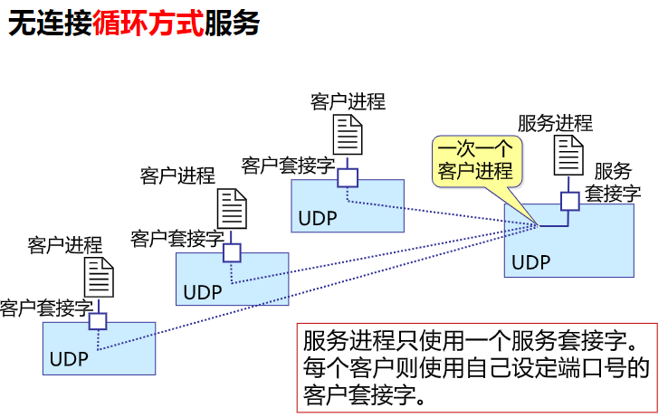
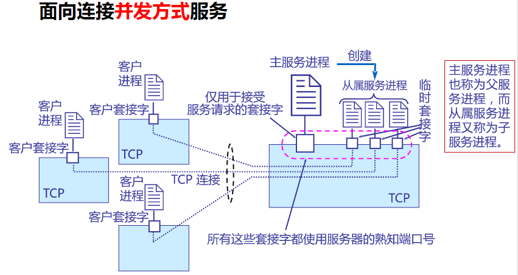

# 应用层概述与通信方式

> 应用层协议都是为了解决某一应用问题

## 1.概述

进程之间的通信

进程：运行于主机内

* 同一个主机内进程间的通信通常采用操作系统所定义的进程间通信方式
* 处于不同主机内进程间通信通常采用网络交换信息的方式

套接字（sockets）

## 2.应用通信方式

### 2.1 CS（client/server）方式

应用层的许多协议是基于C/S方式，例如在移动互联网上，每个应用app都是一个客户端

### 2.2 BS（browser/server）方式

BS可以看作CS方式的特例，即客户软件改为游览器了，该方式采取游览器请求，服务器响应的工作模式

网页web服务

三层架构：

* 数据层
* 处理层
* 表现层

特点：

* 界面统一，使用简单，易于维护
* 可扩展性好
* 信息共享度高

### 2.3 P2P（peer to peer）对等方式

对等方式是指两个进程在通信时并不区分服务的请求放和服务的提供方，任何人都是服务器也都是用户，只要两个主机都运行P2P软件，他们就可以进行平等，对等的通信，并且不需要一直在线的服务端

举例：bt下载

## 3.服务器进程工作方式

* 应用数据传输需要的两种方式：TCP，UDP
* 接受请求的方式：
  * 循环方式：
    * 一次只运行一个服务进程，按请求的先后顺序依次做出响应（阻塞方式）
    * 无连接循环方式服务：使用UDP服务进程通常都工作在循环方式
  * 并发方式：
    * 可同时运行多个服务进程（非阻塞方式）
    * 面向连接的并发方式：使用TCP服务进程通常都是工作在并发服务方式
