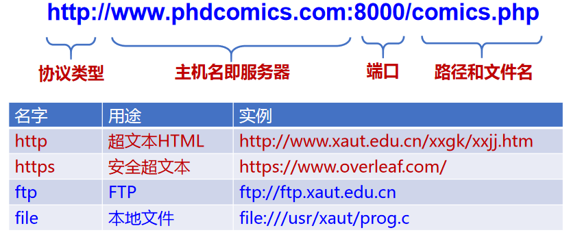

# web与HTTP

## 1.万维网

万维网(World Wide Web, WWW)

* 是Internet中由许多互相链接的资源组成的全球信息资源库，是一种信息共享服务(web服务)。
* HTTP服务器和客户端，以及它们之间执行的HTTP协议

### 1.1 万维网的对象：

* 静态对象与静态网页：HTML，XML，PHP
* 动态对象与动态网页：PHP/JSP+MySQL
* 链接：超链接

### 1.2 万维网的寻址

统一资源定位符URL

### 1.3 万维网的传输

HTTP（HyperText Transfer Protocol）

* HTTP 客户端和HTTP服务器共同构成了万维网的基本组件
* 传输层使用TCP协议，80端口
* HTTP为无状态协议，服务器端不保留之前请求的状态信息

## 2.HTTP协议

### 2.1 传送过程

* 非持久连接
  * HTTP/1.0
  * 每次连接需要经历TCP慢启动阶段
* 持久连接
  * HTTP/1.1，为持久连接
  * 支持流水线机制
  * 降低了响应时间

### 2.2 报文结构

方法：

* get：从服务器获取指定资源
* post：常在用户提交表单时使用
* head：请求服务器可响应但不返回请求的对象
* put：用户把对象上传到指定web服务器指定路径
* delete：允许删除web服务器的URL字段中定义的文件

状态码：

* `1xx` 类状态码属于**提供信息**，是协议处理中的一种中间状态，实际用到的比较少。
* `2xx` 类状态码表示服务器**成功**处理了客户端的请求，也是我们最愿意看到的状态。

  - 「**200 OK**」是最常见的成功状态码，表示一切正常。如果是非 `HEAD` 请求，服务器返回的响应头都会有 body 数据。
  - 「**204 No Content**」也是常见的成功状态码，与 200 OK 基本相同，但响应头没有 body 数据。
  - 「**206 Partial Content**」是应用于 HTTP 分块下载或断点续传，表示响应返回的 body 数据并不是资源的全部，而是其中的一部分，也是服务器处理成功的状态。
* `3xx` 类状态码表示客户端请求的资源发生了变动，需要客户端用新的 URL 重新发送请求获取资源，也就是**重定向**。

  - 「**301 Moved Permanently**」表示永久重定向，说明请求的资源已经不存在了，需改用新的 URL 再次访问。
  - 「**302 Found**」表示临时重定向，说明请求的资源还在，但暂时需要用另一个 URL 来访问。
  - 301 和 302 都会在响应头里使用字段 `Location`，指明后续要跳转的 URL，浏览器会自动重定向新的 URL。
  - 「**304 Not Modified**」不具有跳转的含义，表示资源未修改，重定向已存在的缓冲文件，也称缓存重定向，也就是告诉客户端可以继续使用缓存资源，用于缓存控制。
* `4xx` 类状态码表示客户端发送的**报文有误**，服务器无法处理，也就是错误码的含义。

  - 「**400 Bad Request**」表示客户端请求的报文有错误，但只是个笼统的错误。
  - 「**403 Forbidden**」表示服务器禁止访问资源，并不是客户端的请求出错（无权限请求）。
  - 「**404 Not Found**」表示请求的资源在服务器上不存在或未找到，所以无法提供给客户端。
* `5xx` 类状态码表示客户端请求报文正确，但是**服务器处理时内部发生了错误**，属于服务器端的错误码。

  - 「**500 Internal Server Error**」与 400 类型，是个笼统通用的错误码，服务器发生了什么错误，我们并不知道。
  - 「**501 Not Implemented**」表示客户端请求的功能还不支持，类似“即将开业，敬请期待”的意思。
  - 「**502 Bad Gateway**」通常是服务器作为网关或代理时返回的错误码，表示服务器自身工作正常，访问后端服务器发生了错误。
  - 「**503 Service Unavailable**」表示服务器当前很忙，暂时无法响应客户端，类似“网络服务正忙，请稍后重试”的意思。

### 2.3 状态维护

* cookies机制：

  * 基于客户端保存状态
* session机制：

  * 基于服务端保存状态，通常也需要cookie
  * 交互流程：
    * HTTP在响应的首部行里使用一个关键字头set-cookie：选择的，cookie号具有唯一性
    * 后继的HTTP请求中使用服务器响应分配的cookie：
    * cookie文件保存在用户的主机中，内容是服务器返回的一些附加信息，由用户主机中的浏览器管理
    * Web服务器建立后端数据库，记录用户信息，cookie作为关键字
    * 例如：
      Set-Cookie: SID=31d4d96e407aad42;Path=/;Domain=example.com
      Cookie: SID=31d4d96e407aad42
* 区别：

  Cookie是在客户端存储用户信息，它的工作原理是客户端第一次请求服务器时，服务器首先会创建一个cookie，包含用户的信息，然后发送到客户端，以后每次客户端请求都会携带cookie，服务器通过cookie中的数据来区分不同的用户。Session是在服务端存储用户信息，它的工作原理是首次请求时，服务器会创建一个session，同时也会创建一个特殊的Cookie，每次客户端请求时都会携带该Cookie，服务器通过Cookie的value（sessionId）寻找Session对象、从而区分不同用户。Session的数据安全性较高，但会占用服务器资源；Cookie存储在客户端，安全性较差，但能减轻服务器性能压力
