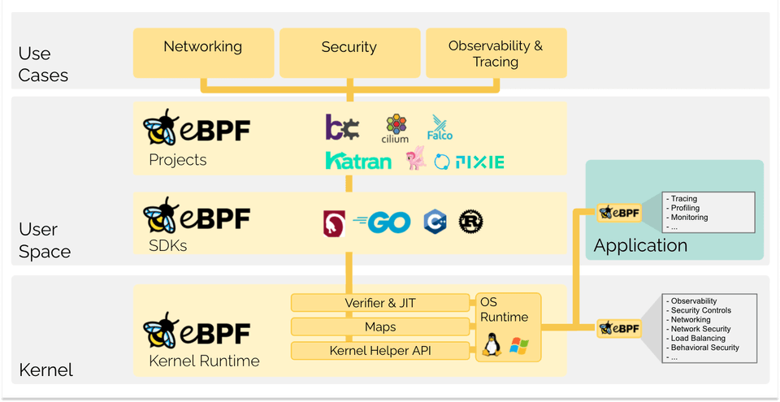

# 概述

## 1.简介

eBPF 是扩展 Berkeley Packer Filter 的缩写。它充当 Linux 内核中的接口，允许开发人员注入代码以与内核交互

eBPF 最初作为数据包跟踪器发布，2014 年扩展并集成到 Linux 内核中。虽然它主要帮助跟踪任务，但还具有很多功能，包括允许用户空间应用程序执行内核空间中的程序

eBPF 提供了一种在内核空间中以字节码形式运行用户程序的途径，通常由 BCC（ 编写 python 程序 ）、Bpftrace（ Linux eBPF 的高级跟踪语言 ）或 libbpf（C/C++ 库）等框架来编写 eBPF 程序

## 2.映射 maps

映射为 eBPF 程序提供了一种相互通信（内核空间）以及与用户空间通信的方式

## 3.验证器 verifier

确保安全执行，避免字节码在内核空间运行时导致损坏内存、泄露敏感信息、核崩溃或导致内核挂起/死锁

## 4.KFuncs

v5.13 开始，KFunc 称为内核函数，是帮助函数的替代品，是一种提供类似功能的新方法

但 KFuncs 是不稳定的，与帮助函数不同，kfuncs 没有 UAPI 保证。这意味着 kfuncs 在不同内核版本之间可能会改变或被移除