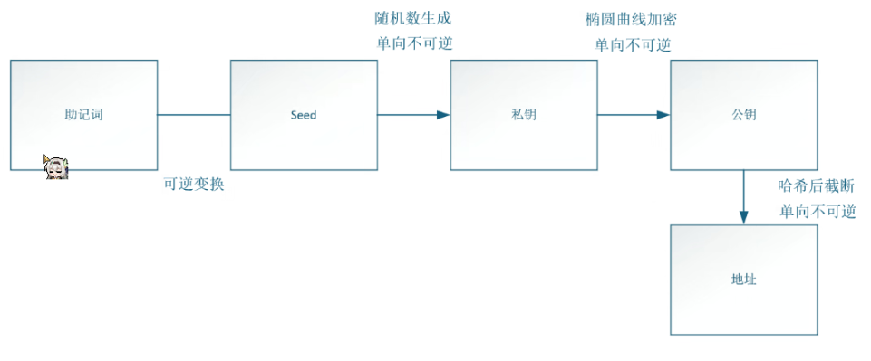

# 25.02.09 入门培训

> 引言：比特币（中本聪），技术支持--区块链。无可任第三方，发账广播，电子签名，账本（区块），共识机制
>
> 工具及其他：
>
> * chrome 插件：**metamask**(以太坊生态中常用的钱包，管理以太坊私钥）
> * 以太坊游览器：https://etherscan.io/
> * 水龙头，测试币：https://faucets.chain.link/
> * Remix：基于浏览器的 Solidity 编译器和集成开发环境 http://remix.ethereum.org/
> * 学习项目：https://github.com/AmazingAng/WTF-Solidity
> * HD（分层确定性 Hierarchical Deterministic）钱包生成器：https://github.com/talonlab/python-hdwallet，安装 pip3 install hdwallet

## 1.以太坊简介入门

以太坊(ethereum)是一个 **去中心化**、开源并且具备 **智能合约** 功能的公共区块链平台，满足图灵完备

密码基础：椭圆曲线 secp256k1

* 助记词：可记忆的单词的短语，用于记忆或恢复私钥，遵循 BIP-39 标准
* 私钥：用于生成公钥和地址。私钥是钱包的“主密码”，拥有私钥就拥有钱包的全部控制权
* 公钥：公开的，可以分享给其他人。用于加密消息和验证数字签名。
* 地址：公钥通过哈希算法生成的，用于标识钱包，接收加密货币

区块链交易中的明细：

* 交易哈希（Transaction Hash）：这个是在这个区块链上这笔交易的唯一 ID
* 区块（Block）：交易所在的区块高度
* 时间戳（Timestamp）：何时发生
* 发送者（From）
* 接受者（To）
* 价值（Value）
* 交易手续费（Transaction Fee）：付给矿工处理这笔交易的费用
* Gas 价格（Gas Price）：Gas 的价格，Gas 价格是交易中每个执行单元的花费（用 ether 和 gwei 做单位），Gas 价格越高，被写到区块中的机会越大

## 2.Remix

Solidity 编译器，用来编写和编译 Solidity 智能合约，文件后缀`.sol`

Solidity 语言编写的智能合约，需要编译为二进制代码，这样以太坊虚拟机 EVM 才能执行，语言风格也类似 java

COMPILER可以选择编译器的版本

智能合约运行流程：

以remix为例：ide中键入代码后，通过编译按钮来编译->编译成功后就可进行部署环节(需要合约地址)，部署成功后会出现合约实例->每次执行一个交易（不管是方式调用还是函数执行）的时候，在日志都会输出一条记录(同时可以调试)

## 3.靶场

https://ethernaut.openzeppelin.com/

知识点记录：

* fallback：
  * `receive()`函数只要给它合约转一笔账，所有者就变成自己了
  * 回退函数fallback()：不接受任何参数也不返回任何值的特殊函数；每当合约接收到以太币，且没有 receive 函数时，回退函数会被调用；
* Fal1out：
  * 直接调用function Fal1out() public payable
* CoinFlip：
  * 连续攻击十次即可，随机数不安全；太坊的区块更新时间大概为15s/perBlock
* Telephone：
* Token：
  * 溢出
* Delegation：
  * Delegation中创建了一个Delegate的实例。第一个合约中的pwn()只要一调用就能修改owner为自己
  * `delegatecall()`函数是极其危险的
* Force：
  * 在攻击合约有的前提下，让攻击合约自毁，在自毁函数中传入示例地址，就可以做到给示例地址转账的操作
* Vault：
  * 变量作用域：全局公有变量，全局私有变量，局部变量
  * 可见性类别：external，internal
