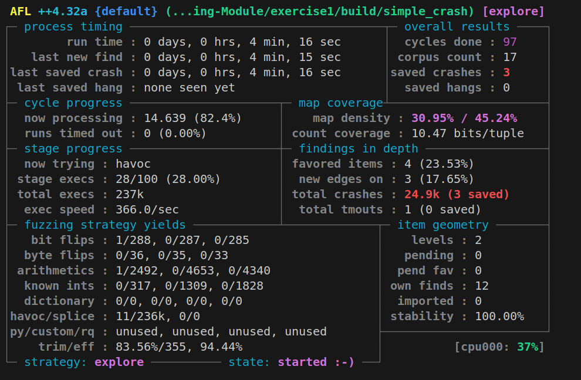
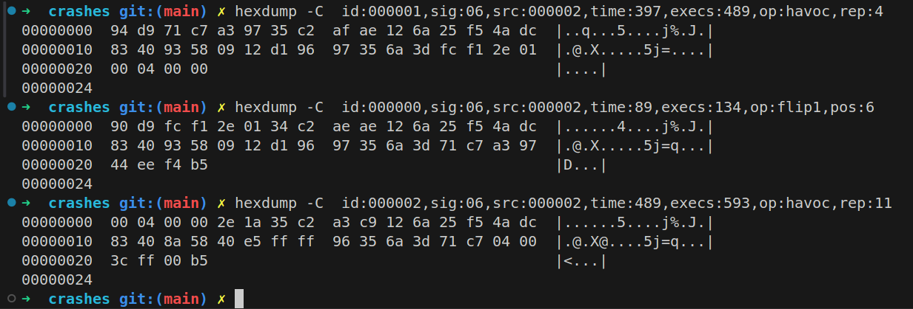
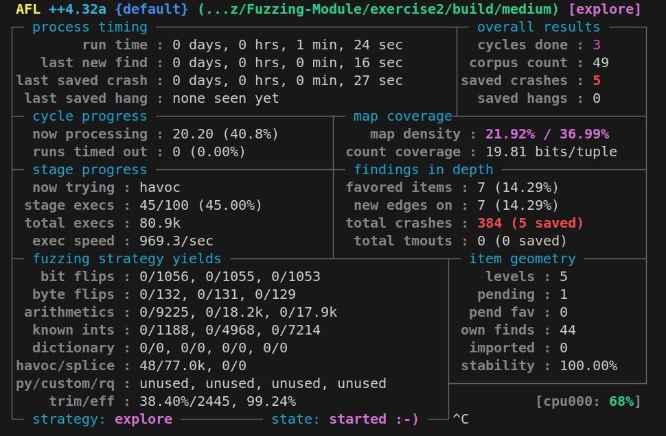
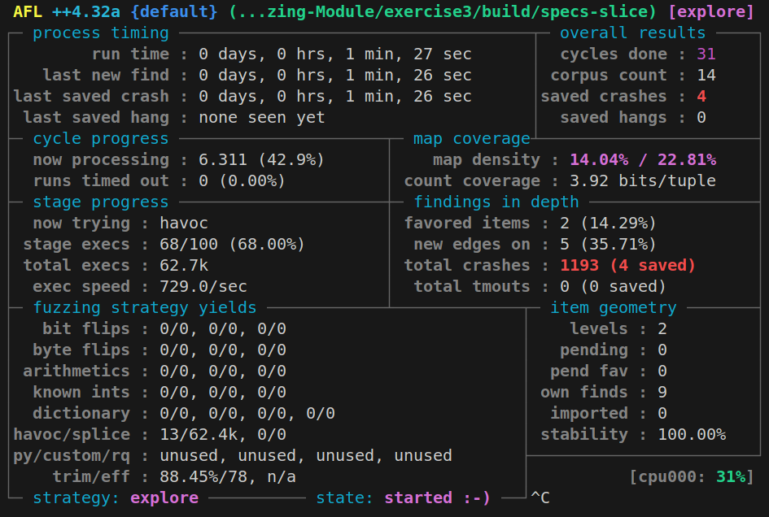

# Fuzzing-Module

## 1.基础

* 使用 `dd` 命令生成伪随机输入：
  * `dd if=/dev/urandom of=1.in bs=64 count=10`
  * if = 文件：从 <文件> 而非标准输入读取
  * of = 文件：写入到 <文件> 而非标准输出
  * bs = 字节数：一次读取和写入的字节数（默认：512）
  * count = N，只复制 N 个输入块
* afl-cc：是 afl-fuzz 的辅助应用程序，是 gcc 和 clang 的替代工具
  * 常用使用模式：`  CC=afl-cc CXX=afl-c++ ./configure --disable-shared`
  * CXX 变量名始终与 CC 变量名相同，只是在末尾添加了 ++
* cmake 工程生成 compile_commands.json：
  * `cmake -DCMAKE_EXPORT_COMPILE_COMMANDS=1`


## 2.exercise1

```shell
➜  exercise1 git:(main) mkdir build                          
➜  exercise1 git:(main) cd build    
➜  build git:(main) CC=$HOME/tool/AFLplusplus/afl-clang-fast CXX=$HOME/tool/AFLplusplus/afl-clang-fast++ cmake ..
➜  build git:(main) cd ..   
➜  exercise1 git:(main) mkdir seeds
➜  exercise1 git:(main) cd seeds; for i in {0..4}; do dd if=/dev/urandom of=seed_$i bs=64 count=10; done; cd ..
➜  exercise1 git:(main) ✗ cd build
➜  build git:(main) ✗ make
➜  build git:(main) ✗ afl-fuzz -i ../seeds -o ../output -m none -- /home/waiwai/fuzz/Fuzzing-Module/exercise1/build/simple_crash
```



生成的三种类型的 crash 数据：



对应源程序引发 abort()的情况：

* 输入的尾字符是 0
* 输入的首字符是 0
* 存在后一个数字是前一个数字+1


## 3.exercise2

```shell
➜  Fuzzing-Module git:(main) ✗ cd exercise2
➜  exercise2 git:(main) ✗ mkdir build; cd build
➜  build git:(main) ✗ CC=$HOME/tool/AFLplusplus/afl-clang-lto CXX=$HOME/tool/AFLplusplus/afl-clang-lto++ cmake .. 
➜  build git:(main) ✗ make
➜  build git:(main) ✗ cd ..; mkdir seeds; cd seeds
➜  seeds git:(main) ✗ for i in {0..4}; do dd if=/dev/urandom of=seed_$i bs=64 count=10; done; cd ..
➜  exercise2 git:(main) ✗ afl-fuzz -i ./seeds -o ./output -m none -- /home/waiwai/fuzz/Fuzzing-Module/exercise2/build/medium 
```




## 3.exercise3

```shell
➜  Fuzzing-Module git:(main) ✗ cd exercise3     
➜  exercise3 git:(main) ✗ mkdir build; cd build
➜  build git:(main) ✗ CC=$HOME/tool/AFLplusplus/afl-clang-lto CXX=$HOME/tool/AFLplusplus/afl-clang-lto++ cmake -DCMAKE_EXPORT_COMPILE_COMMANDS=1 ..
```

生成 compile_commands.json，导入 Sourcetrail

接下来是 slice fuzzing，即只针对特定部分进行 fuzzing

specs-slice.cpp：

```c
#include "specs.h"

int main(int argc, char** argv) {
    // In order to call any functions in the Specs class, a Specs
    // object is necessary. This is using one of the constructors
    // found in the Specs class.
    Specs spec(505, 110, 50);
    // By looking at all the code in our project, this is all the 
    // necessary setup required. Most projects will have much more
    // that is needed to be done in order to properly setup objects.

    // This section should be in your code that you write after all the 
    // necessary setup is done. It allows AFL++ to start from here in 
    // your main() to save time and just throw new input at the target.
    #ifdef __AFL_HAVE_MANUAL_CONTROL
        __AFL_INIT();
    #endif

    spec.choose_color();
    //spec.min_alt();

    return 0;
}
```

```shell
➜  build git:(main) ✗ make
➜  build git:(main) ✗ cd ..; mkdir seeds; cd seeds
➜  seeds git:(main) ✗  for i in {0..4}; do dd if=/dev/urandom of=seed_$i bs=64 count=10; done; cd ..
➜  exercise3 git:(main) ✗ afl-fuzz -i ./seeds -o ./output -m none -- /home/waiwai/fuzz/Fuzzing-Module/exercise3/build/specs-slice
```


