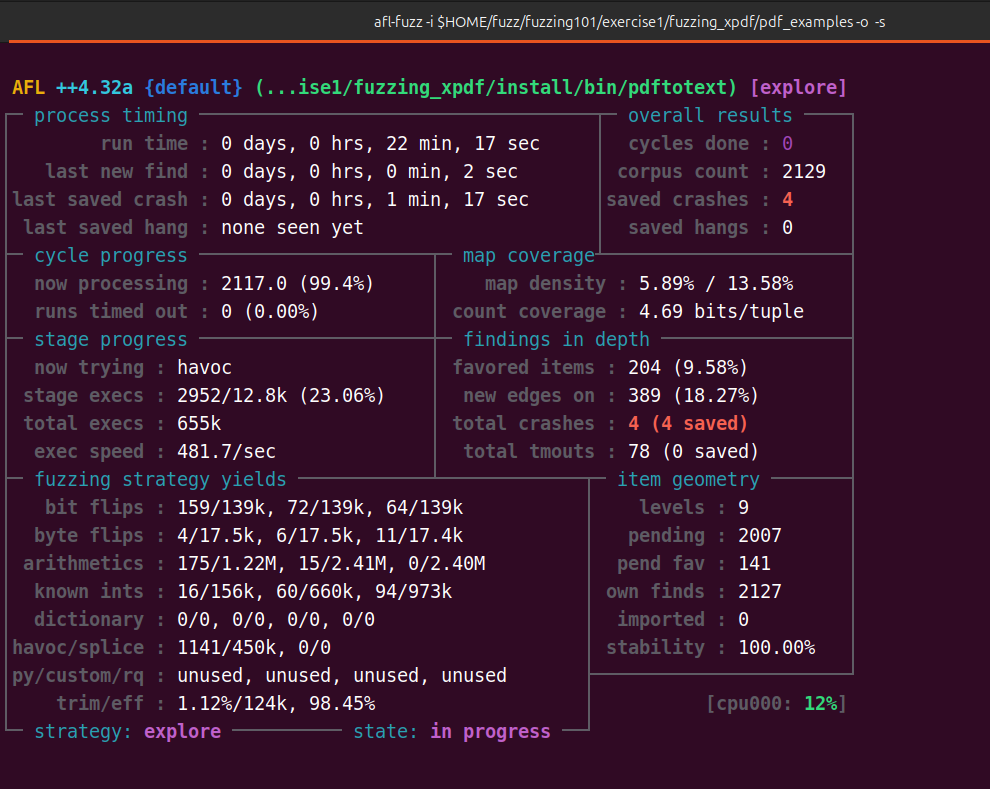
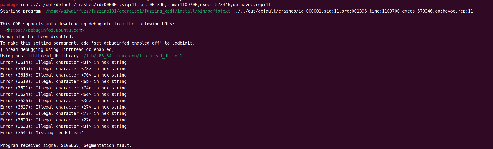
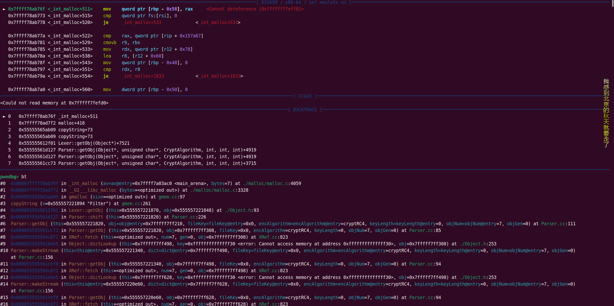
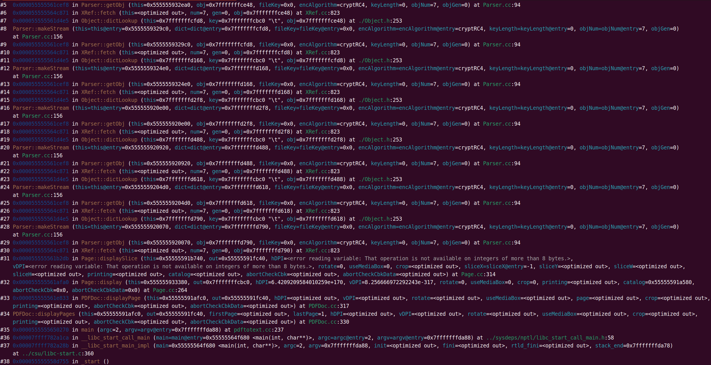

# Xpdf-CVE-2019-13288

## 1.漏洞简述

在 Xpdf 4.01.01 中 Parser.cc 中的 Parser::getObj() 函数可能会通过精心设计的文件导致无限递归（没有正确控制发生的递归量，从而消耗了过多的资源，例如分配的内存或程序堆栈），远程攻击者可以利用它进行 DoS 攻击


## 2.相关环境

下载编译：

```
wget https://dl.xpdfreader.com/old/xpdf-3.02.tar.gz
tar -xvzf xpdf-3.02.tar.gz
cd xpdf-3.02
sudo apt update && sudo apt install -y build-essential gcc
./configure --prefix="/home/waiwai/fuzz/fuzzing101/exercise1/fuzzing_xpdf/install"
make
make install
```

测试用例：

```
mkdir pdf_examples && cd pdf_examples
wget https://github.com/mozilla/pdf.js-sample-files/raw/master/helloworld.pdf
wget https://www.melbpc.org.au/wp-content/uploads/2017/10/small-example-pdf-file.pdf
```

AFL++安装：https://github.com/AFLplusplus/AFLplusplus/blob/stable/docs/INSTALL.md

清除之前编译的目标文件和可执行文件：

```shell
rm -r ./fuzzing_xpdf/install
cd ./fuzzing_xpdf/xpdf-3.02/
make clean
```

重新编译构建：

```shell
export LLVM_CONFIG="llvm-config-18"
CC=$HOME/tool/AFLplusplus/afl-clang-fast CXX=$HOME/tool/AFLplusplus/afl-clang-fast++ ./configure --prefix=/home/waiwai/fuzz/fuzzing101/exercise1/fuzzing_xpdf/install
make
make install
```

进行测试：`afl-fuzz -i $HOME/fuzz/fuzzing101/exercise1/fuzzing_xpdf/pdf_examples -o $HOME/fuzz/fuzzing101/exercise1/fuzzing_xpdf/out/ -s 123 -- $HOME/fuzz/fuzzing101/exercise1/fuzzing_xpdf/install/bin/pdftotext @@ $HOME/fuzz/fuzzing101/exercise1/fuzzing_xpdf/output`,等待崩溃后，可以在out目录下找到相关崩溃信息




## 3.分析

使用gdb调试文件，将crash的pdf文件作为参数输入，可以发现段崩溃了



`bt`查看调用堆栈，可以发现一直在递归调用`Parser::getObj()`



根据漏洞描述添加一个断点`b Parser::getObj`,一直`c`，那么调用链就可以很明显的出来了：




参考：https://www.ruanx.net/fuzzing101-wp-1/