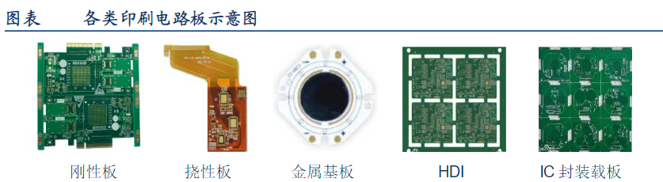

# 物联网硬件组成

## 1.印刷电路板PCB

Printed circuit board，主要功能是使各种电子元器组件通过电路进行连接，起到导通和传输的作用，是电子产品的关键电子互连件

板子本身的基板是由绝缘隔热、并不易弯曲的材质所制作成.在表面可以看到的细小线路材料是铜箔，原本铜箔是覆盖在整个板子上的，而在制造过程中部份被蚀刻处理掉，留下来的部份就变成网状的细小线路了.这些线路被称作导线

PCB上的绿色或是棕色，是阻焊漆的颜色.这层是绝缘的防护层，可以保护铜线，也可以防止零件被焊到不正确的地方。在阻焊层上另外会印刷上一层丝网印刷面。通常在这上面会印上文字与符号(大多是白色的)，以标示出各零件在板子上的位置

## 2.存储芯片

芯片识别网站：https://www.21icsearch.com/；http://www.datasheetlocator.com/zh/

### 2.1 ROM芯片

简单的ROM芯片是只读的固态半导体，断电后所存的数据不会丢失

逐步发展：PROM,EPROM,EEPROM，FLASH-ROM

### 2.2 RAM芯片（静态RAM，动态RAM）

断电后所存的数据会丢失

### 2.3 Flash芯片（SPI/NAND/eMMC）

闪存，快闪，可擦除可编辑，断点不会丢失，按照扇区进行操作

Flash分类：

- NOR Flash
- CFI Flash
- SPI Flash
- NAND Flash
- MLC Flash
- SLC Flash
- TLC Flash
- TFNAND
- EMMC

## 3.电子元器

二极管，三极管，电阻，电解电容，贴片电容，贴片电阻等

## 4.调试接口

UART、JTAG、I2C、SPI等

## 5.模块

蓝牙模块，WiFi模块等

