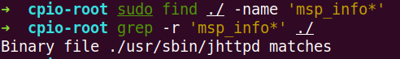

#  CVE-2024-7436 命令注入

## 1.漏洞描述

在 D-Link DI-8100 16.07 中发现了一个被归类为严重的漏洞。影响 msp_info.htm 文件中的 msp_info_htm 功能。对参数 cmd 的操作会导致命令注入。攻击可能是远程发起的。这个漏洞已经向公众披露，可能会被利用。标识符 VDB-273521 被分配给此漏洞


## 2.固件分析

下载网址：https://www.dlink.com.cn/techsupport/ProductInfo.aspx?m = DI-8100

下载 A1 版本固件，后缀为 trx

固件未加密，binwalk 可直接解压

固件使用的是 mips32 位小端


firmAE 可直接进行模拟：


## 3.漏洞分析

### 3.1 msp_info_htm 

漏洞描述是影响 msp_info.htm 文件中的 msp_info_htm 功能，找这个文件没看见，但是可以在 jhttpd 文件中匹配到字符，jhttpd 是一个 web 服务，可以在仿真系统的进程当中看到




ida 逆向分析 jhttpd 程序，关注 msp_info_htm()函数对 cmd 参数的处理：可以很明显的看到 v28 传给 system 的过程当中没有进行任何过滤 ，漏洞点也就是在这里，传参的时候可能存在命令执行

现在，我们需要分析一下 wys 命令是干什么的，同时还需要确定 httpd_get_parm 函数不会过滤我们的参数值


可以直接在仿真终端运行一下 wys 命令，也可以逆向分析一下（反汇编代码挺简单的），就是对传入的参数进行处理


分析 httpd_get_parm 函数，采取 gdb-multiarch 调试

load.sh:

```shell
set architecture mips 
set endian little
target remote 192.168.0.1:1337
b *0x044D74C #断点在 msp_info_htm()函数处
```

访问 http://192.168.0.1/msp_info.htm 网址，程序才会运行到上面的断点处，因为是直接访问该网站的，所以当程序执行到这里时也就是给 parm 赋值为 0，但后面会跳转到 label_17 直接返回，并且执行完程序，游览器这边会回显给我们没有 flag，根据逆向分析，这里应该是给 flag 传值


构造正确的请求：

在 URL 编码中，换行符被表示为 "%0A" 或 "%0D%0A"。"%0A" 表示换行符（LF，Line Feed），"%0D%0A" 表示回车换行符（CRLF，Carriage Return Line Feed），空格编码 "%20"

```
GET /msp_info.htm?flag=cmd&cmd=;busybox%20ls HTTP/1.1

Host: 192.168.0.1

Accept-Language: en-US,en;q=0.9

Upgrade-Insecure-Requests: 1

User-Agent: Mozilla/5.0 (X11; Linux x86_64) AppleWebKit/537.36 (KHTML, like Gecko) Chrome/133.0.0.0 Safari/537.36

Accept: text/html,application/xhtml+xml,application/xml;q=0.9,image/avif,image/webp,image/apng,*/*;q=0.8,application/signed-exchange;v=b3;q=0.7

Accept-Encoding: gzip, deflate, br

Cookie: wys_userid=admin,wys_passwd=520E1BFD4CDE217D0A5824AE7EA60632

Connection: keep-alive
```

此时断在了给 parm 赋值的时候，可以看见 s0 寄存器指向输入的参数


第二次 flag = cmd 进入其中进行处理 httpd_get_parm 处理，可以看到返回的 v0 是我们 cmd 的值


但其实在 msp_info_htm 函数中，不止 cmd 参数可以利用，qos 参数同样可以利用，其他的参数都是要求相等才进入 if 里面，但 qos 相等则是不进入 if，继续向下执行，同时，这里的 v4 是对 iface 参数值的解析


### 3.2 upgrade_filter_asp

其实这个固件的漏洞点不止这一处，我们对 system 函数交叉引用：


可以发现 upgrade_filter_asp()函数中同样未对 parm 进行过滤


验证一下：


### 3.3 调用链分析

gdb 直接附加上 jhttpd 进程，可以看见目前一直处于轮询的一个状态

而异步非阻塞的 httpd_poll（轮询）和其他类似的 HTTP 服务器端点可能会触发对 http_recv 的内部调用以获取客户端发送过来的内容长度等信息


main 函数中也可以看到先初始化，然后进行 httpd_poll()


可以看见 httpd_poll()中的 httpd_do_recv(), 但实际上是跳转到((void (__fastcall *)(int))v8)(v6)，执行的还是 httpd_do_recv()


httpd_do_recv()函数里面又调用了 recv()函数，可以看到是来自 socket 的连接，执行完后 a1 修改成了 get


而 recv()下面又正好进行了一个 get 和 post 请求的判断，get 请求跳转到 label35


label35 又会跳转到 httpd_dowith_get()函数进行下一步处理


v7 是一个重要的变量，可以看到他是我们访问的网站文件，那么他是进入 sub_40C860(v7)函数进行处理


sub_40C860()函数中主要是对 v2 进行处理，也就是 s0 寄存器，可以看到，是我们网址后面跟着的参数


httpd_dowith_get()后面会进行一个过滤空格，并且还有一个 httpd_formdata_parse()格式化函数，格式化之后，是把 flag = cmd 单独提出来了


再下面的 httpd_do_wwwparm()就是对 http 请求报文的处理

httpd_send_file()就是开始真正处理了，里面会有 httpd_check_user()

` *(_BYTE *)(a1 + 27) == 1 && *(_DWORD *)(a1 + 103104) >= a2` 都无法满足，只能是 v5 = 0


在 httpd_user_auth_cookie()中会取出 cookie 并进行校验


没有登录过，jhttpd还处于轮询状态，但我就已经可以看到bss段admin用户的密码的哈希值了，有些疑惑


最终 httpd_check_user() 返回的是 0


最终是跳转到 v17 也就是 msp_info_htm()了


## 4.总结

由于该漏洞并不是未授权接口，所以必须得有cookie才能够利用

从开发的方面来讲，参数值获取的时候一定要设置好过滤，另外，尽量自行封装system这种危险的函数，不要直接调用，封装的里面也是可以加过滤的
