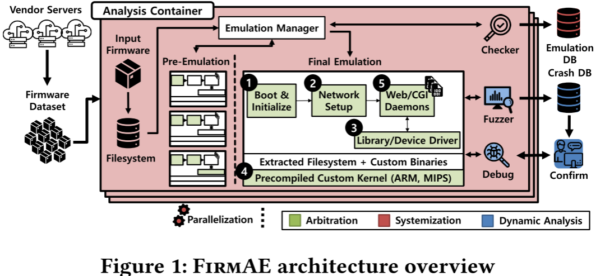

# FirmAE论文

## 1.FirmAE之前的工作

固件仿真的挑战：非标准化的开发过程以及仿真环境与物理环境之间的差异。example：主设备与其外设之间的通信通常使用内存映射IO (MMIO)操作，具有预定义的内存地址。然而，这些地址的范围在不同的设备上有很大的不同

之前流行的是 Firmadyne，采用全系统仿真，但不太现实，而且仿真成功率不高

Firmadyne框架：解压缩固件映像之后，Firmadyne使用定制的Linux内核和库来模拟它，这些内核和库是预先构建的，支持各种硬件特性，如NVRAM

Firmadyne模拟：目标映像两次:第一次模拟记录有用的信息，而第二次利用已记录的信息。因此，定制的内核包括一个驱动程序，该驱动程序挂钩主要的系统调用来记录有用的信息

FirmAE的工作：并不旨在消除真实环境和仿真环境之间的差异，而是旨在运行固件的web服务器并正确地为web接口服务，因为仿真的目标不是构建一个与物理设备相同的环境，而是创建一个有利于动态分析的环境

## 2.研究方法

仿真存在的问题：

* web 服务：就算能够启动 ping 通，也不一定网络配置正确，可以执行相关漏洞
* 内核启动问题 panic

仿真失败的五大类问题：

* 引导启动：启动顺序不正确/缺少文件
* 网络：网络接口不匹配或配置不当
* 非易失性 RAM 问题：
  * 二进制程序试图从 NVRAM 中读取配置数据，由于二进制文件在 qemu 中运行，而不是在目标设备上运行，因此显然没有要读取的 NVRAM
  * 嵌入式应用程序通常通过共享库与 NVRAM 交互。该库又与包含设备当前配置设置的 MTD 分区接口交互。如果没有 NVRAM 配置数据，许多程序将无法正常运行，所以需要拦截 NVRAM 库调用并返回有效数据，以便在 qemu 中正确执行应用程序
* 内核：不支持的硬件或功能
* other

通过分析仿真失败案例来系统化启发式方法 ==> arbitrated emulation 仲裁仿真

根据需要，可以以各种方式实现干预，并且将其注入仿真过程的适当步骤中，即仲裁点。通过分析给定高层行为模型的违规案例，注入到适当的仲裁点。然后，在这些仲裁点注入干预措施

## 3.实现架构

所定义的仿真目标的实现属性：

* 在没有任何内核panic的情况下启动
* 主机的网络可达性
* 动态分析的web服务可用性

收集系统日志-->仿真（预仿真，最终仿真）

数据集的划分：AnalysisSet、LatestSet和CamSet，用AnalysisSet来分析仿真失败案例。通过分析它们，发现了几个可以帮助提高仿真率的仲裁点

采取并行化仿真评估，使用docker容器隔离网络环境避免冲突，方便大规模仿真验证工具的可用性	

**仿真失败问题对应的五大仲裁：**

* **Boot arbitrations：**
  * 内核会通过检查预定义的路径(如/sbin/init、/etc/init和/bin/init)来尝试查找这个程序然而，一些固件镜像有自定义的路径来初始化程序，这样内核就无法执行程序而崩溃。例如：NETGEAR，TP-Link上有些使用preinit。采取的解决方法：在启动过程开始时创建了一个干预，它从映像的内核中提取有用的信息 的字符串是在开发阶段预先定义的，因此它自然会嵌入到内核映像中。这些信息可能包括初始化程序路径、控制台类型、根目录、根文件系统类型或内存大小
  * 缺少文件或目录，当内部程序访问这些路径时，它们会崩溃，并且模拟停止，这个直接创建就好了，但是后面也可能存在各种冲突的问题
* **Network arbitrations：**
  * QEMU要求主机创建一个额外的网络接口TAP。这个TAP接口连接到客户机系统中的一个网络接口。然后，主机和来宾通过它进行通信。但是正确配置TAP接口并非易事，因为应该使用与目标网络接口类型对应的特定选项来设置它。这种网络接口类型可以是以太网、无线LAN(WLAN)、网桥或虚拟LAN(VLAN)，所以需要对目标固件先进行一次仿真
  * IP混叠
  * 此外，一些镜像试图将它们的web服务器绑定到一个不存在的网络接口，结果崩溃
  * 仿真环境中没有DHCP服务器
  * 它们也可以从外部DHCP服务器检索IP地址，以便将其WAN接口连接到Internet
  * VLAN设置不足
  * iptables中的过滤
* **NVRAM arbitrations：**
  * nvram_get()和nvram_set()等与NVRAM相关的函数
* **Kernel arbitrations：**
  * 嵌入式设备中的许多程序通过内核中的设备驱动程序与外设协作
  * 许多内核模块是通过共享库访问的，拦截共享库
* **Other arbitrations：**
  * web服务器未运行
  * 超时问题，合理的设置超时时间

## 4.存在的问题

尽管针对仲裁仿真的启发式方法在当前固件映像上的表现优于其他作品，但是开发的启发式方法是经经验地处理故障案例，所以系统化仲裁仿真只能处理观察到的案例，可能不适用于新设备和新配置